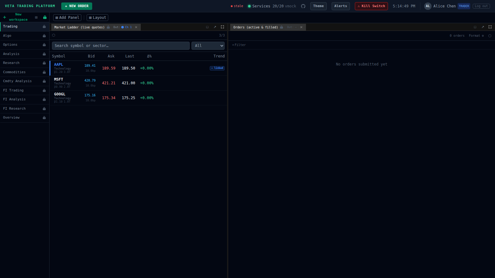

# VETA Trading Platform

A near real-world equities and fixed income trading platform for paper trading and learning market dynamics. 30+ microservices, 9 algo strategies, pre-trade risk controls, and realistic desk segregation — all connected by a Redpanda message bus.

  <a href="https://milesburton.github.io/veta-trading-platform/"><strong>View Documentation</strong></a>
  &nbsp;&middot;&nbsp;
  <a href="https://veta-trading.fly.dev/">Live Demo</a>
  &nbsp;&middot;&nbsp;
  <a href="https://milesburton.github.io/veta-trading-platform/guides/overview/">Getting Started</a>
  &nbsp;&middot;&nbsp;
  <a href="https://milesburton.github.io/veta-trading-platform/platform/screenshots/">Screenshots</a>

  

