# VETA Trading Platform

[](LICENSE)
[](https://github.com/milesburton/veta-trading-platform/actions/workflows/ci.yml)
[](https://github.com/milesburton/veta-trading-platform/actions/workflows/deploy.yml)
[](https://github.com/milesburton/veta-trading-platform/actions/workflows/ci.yml)
[](https://github.com/milesburton/veta-trading-platform/actions/workflows/ci.yml)
[](https://github.com/milesburton/veta-trading-platform/actions/workflows/ci.yml)
[](https://github.com/milesburton/veta-trading-platform/actions/workflows/ci.yml)
[](https://github.com/milesburton/veta-trading-platform/actions/workflows/ci.yml)

**Live demo:** https://veta-trading.fly.dev/ (Note this will be transiently online as the project matures)

VETA is a near real world equities and fixed income trading platform. It will enable you to "paper trade" using one of the algo services which is intended to help you learn market dynamics.

## Demo personas

The login page has a "Demo personas" panel at the bottom. Click any card to
pre-fill the sign-in form and log in with one click. Every trader is modeled
after a real-world desk: **exactly one primary desk, exactly one trading
style**. Cross-asset-class traders do not exist — regulatory segregation
(Chinese walls) and product specialisation make them unrealistic. Multi-desk
oversight is modeled through the separate `desk-head` role with **read-only**
cross-desk access.

| User | Role | Desk | Style | Purpose |
|------|------|------|-------|---------|
| alice | trader | Equity cash | High touch | Canonical — manual ticket, click-to-submit |
| bob | trader | Equity cash | Low touch | Canonical — VWAP/POV/TWAP algo flow |
| carol | trader | FI govies | FI voice | Canonical — RFQ, yield curve, duration ladder |
| grace | trader | Equity derivs | Derivs high touch | Manual options with vol surface + greeks |
| henry | trader | FI credit | FI voice | Credit RFQs via sales workbench |
| james | trader | Equity cash | High touch | Senior — large tickets, dark pool, ICEBERG/SNIPER |
| sofia | trader | Equity cash | Low touch | Junior trainee — 1k share cap, LIMIT/TWAP only |
| omar | trader | Equity derivs | Derivs low touch | Vol-targeting algo strategies |
| priya | trader | Equity derivs | Derivs high touch | Structured payoffs, volatility arb |
| luca | trader | FX cash | FX electronic | High-notional cash FX with dark pool |
| yuki | trader | FX cash | High touch | FX desk head — manual EUR/USD, USD/JPY quotes |
| rajesh | trader | Commodities | Commodities voice | Oil, metals, agriculture RFQs |
| frank | **desk-head** | Equity cash + Equity derivs + FI rates | Oversight | Read-only cross-desk supervision |
| compliance | compliance | All | — | Read-only audit, session replay, trade review |
| admin | admin | — | — | Mission Control, load test, LLM subsystem, RBAC |

Trading style is enforced hard by the dashboard: low-touch traders literally
cannot open the manual Order Ticket, high-touch traders cannot open the Algo
Monitor, FI voice traders cannot open the equity blotter, derivatives traders
get the vol surface / greeks / scenario matrix panels that other styles don't.
Default workspaces follow the style too — high-touch lands on Trading,
low-touch on Algo, FI voice on FI Trading, etc.

The default demo passcode is `veta-dev-passcode` (configurable via the
`OAUTH2_SHARED_SECRET` env var on the user-service).

## Platform components

This platform consists of:
* React based front end using Tailwind
* Observability service to retain logging throughout the platform
* Authentication and authorisation service
* 9 (currently) algo services (POV, TWAP, VWAP, Iceberg and so on)
* Signal engine driven from live market data
* Analytics engine to perform "What-If" scenarios
* Fake exchange to generate market data combined with real market data
* LLM service using OLLAMA to provide possible market signals (though this is advisory only)
* Order Management System
* Journalling system using PostgreSQL
* Market Data Adapter service to control incoming real world and imitation data
* Session replay service powered by [rrweb](https://www.rrweb.io/) for recording and playing back user sessions

The platform requires approximately 10-12GB of memory depending on load. It's not overly CPU hungry however that will diverge depending on the number of orders are on the market.

Both the application and dev container are docker based. Using VSC or IntellJ you can clone the repository. The MOTD has a number of helpful commands to get you started.

## Running

```sh
# Browser (dev server)
cd frontend && npm run dev

# Electron (desktop, hot reload)
cd frontend && npm run electron:dev

# Electron (production build)
cd frontend && npm run electron:build
```

## Screenshots

> Auto-generated from the live UI on every commit to `main`.

| Trading Dashboard | Order Ticket |
|---|---|
|  | 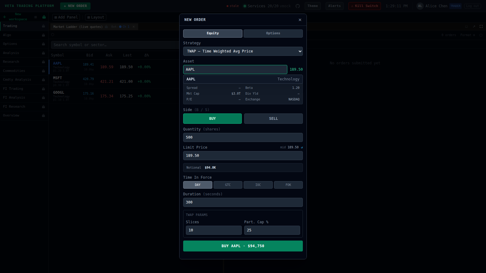 |

| Order Blotter | Algo Workspace |
|---|---|
| 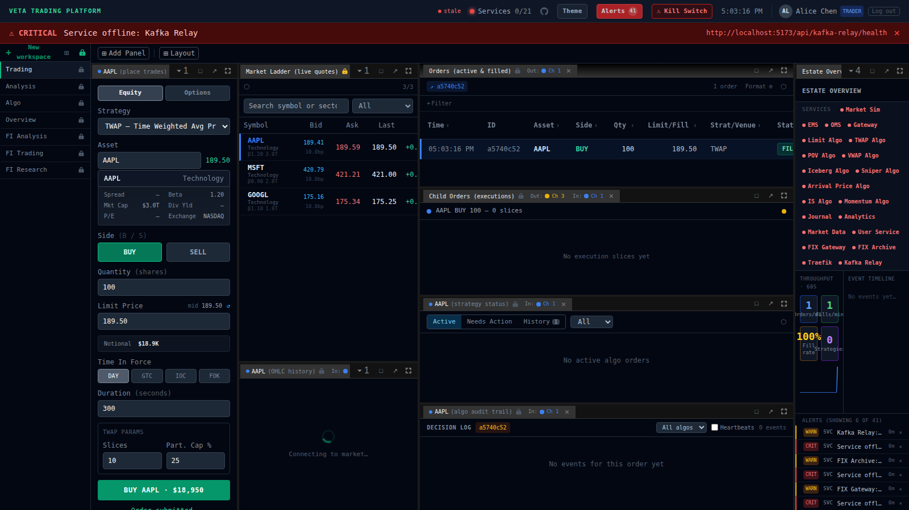 | 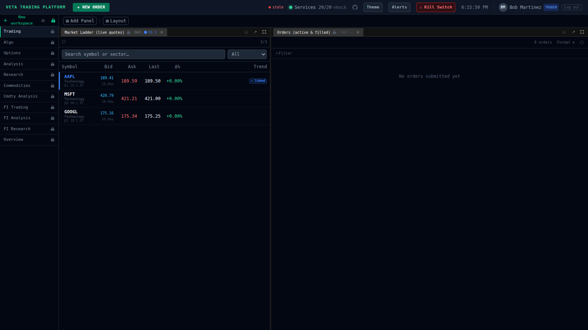 |

| Fixed Income | Option Pricing |
|---|---|
| 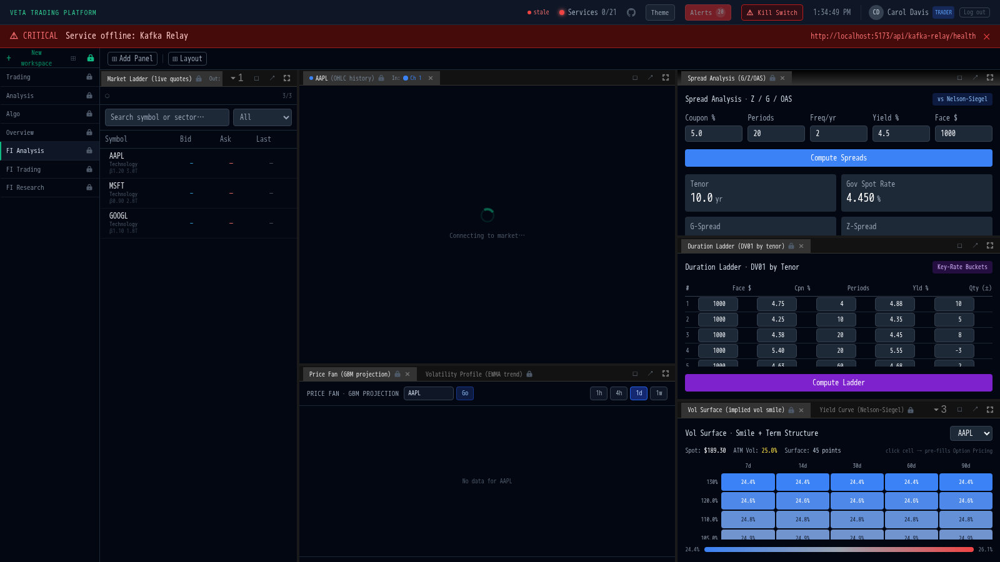 | 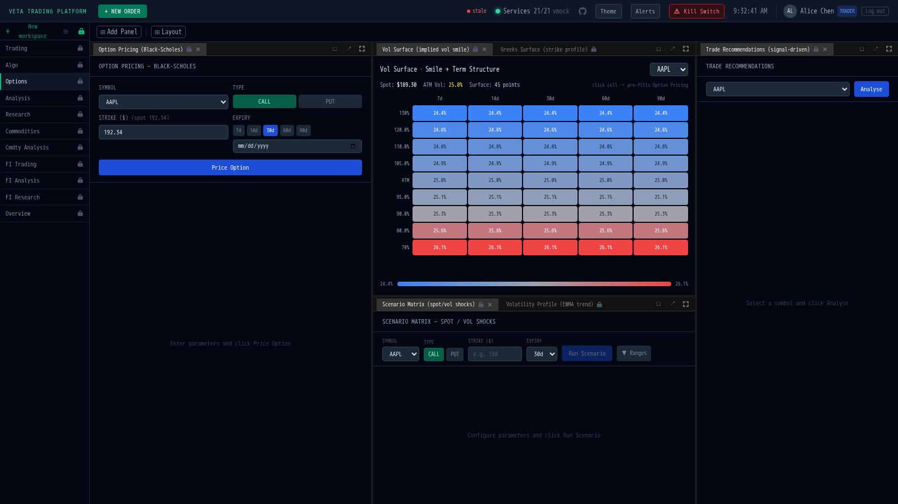 |

| Market Heatmap | Kill Switch |
|---|---|
| 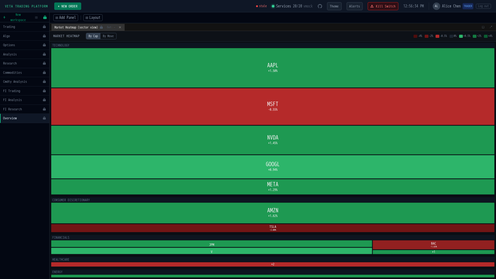 | 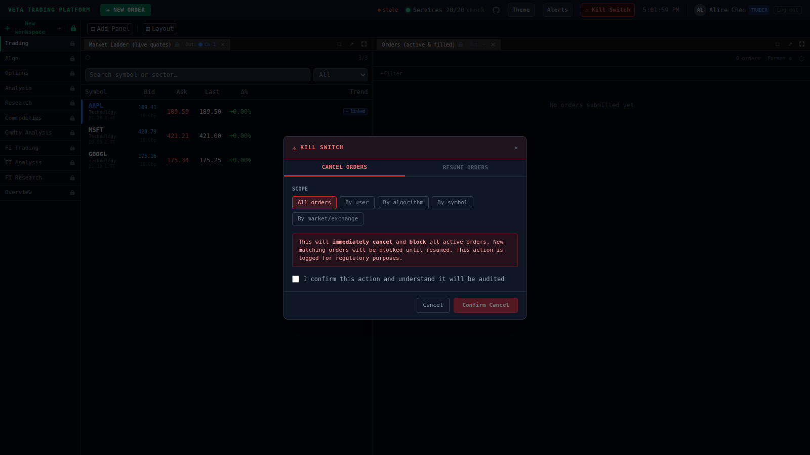 |

| Column Formatting | Mission Control |
|---|---|
| 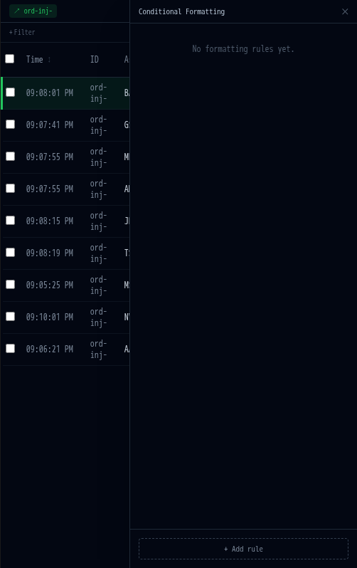 | 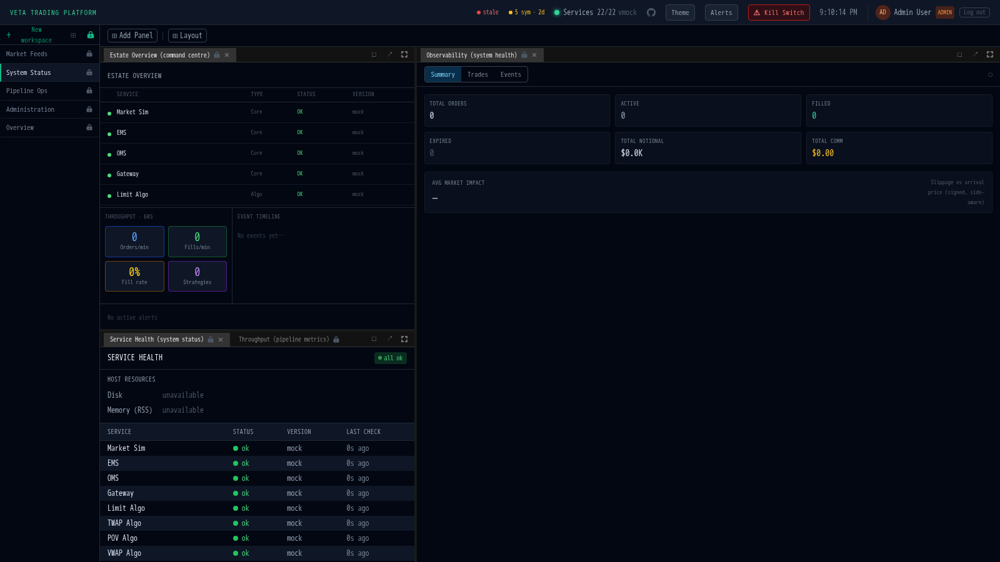 |

| Session Replay | |
|---|---|
| 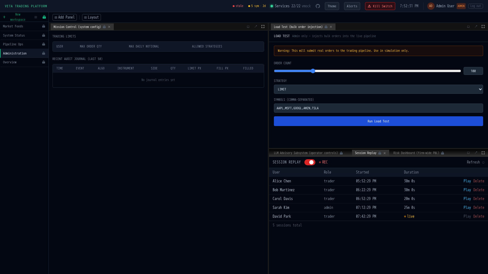 | |

## Desktop (Electron)

> Auto-generated from the packaged Electron build on every commit to `main`.

| Trading Dashboard | Main Window (with pop-out open) |
|---|---|
| 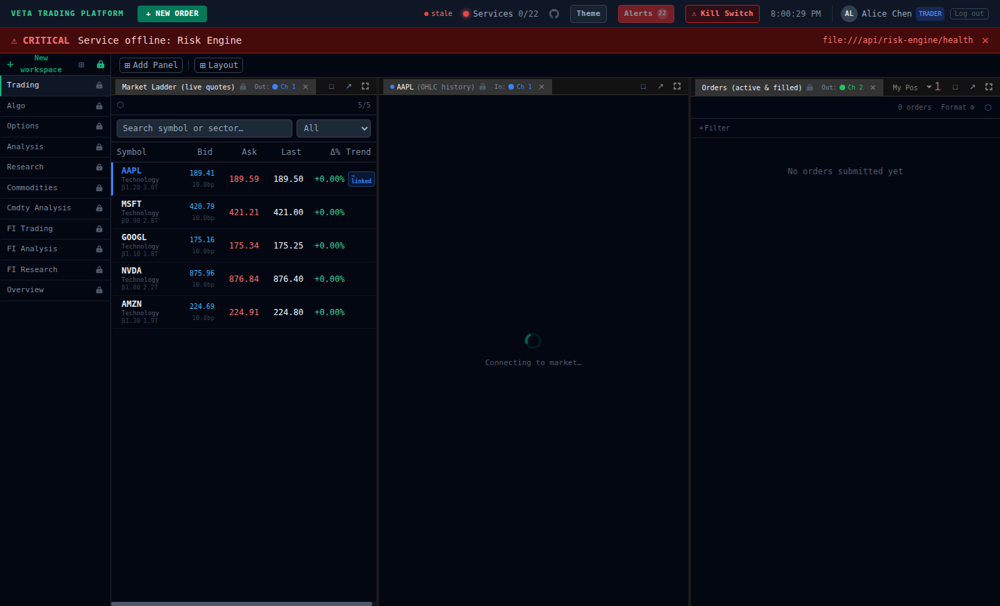 | 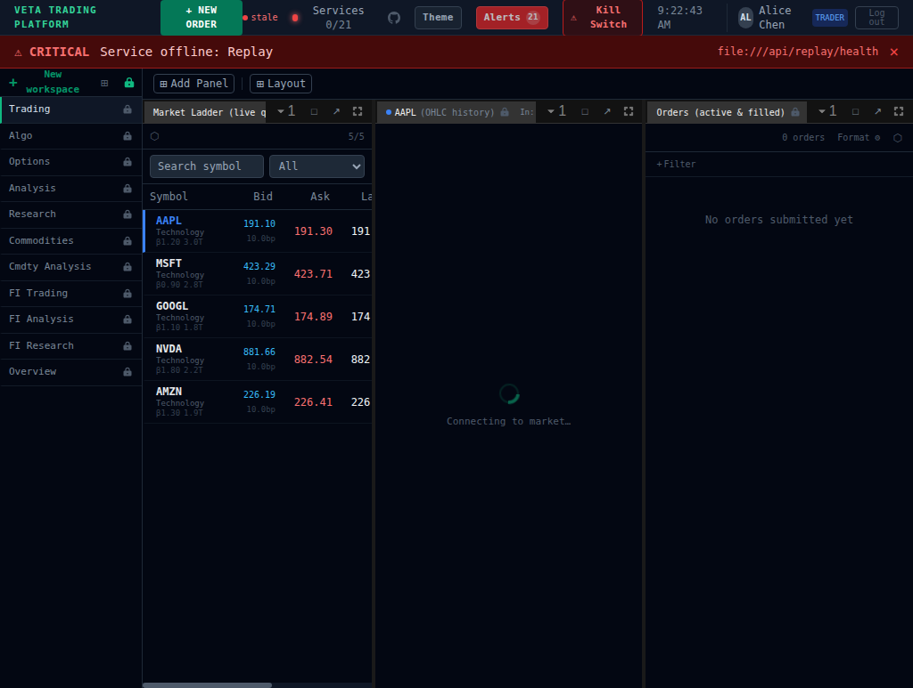 |

| Linked Pop-out Panel | |
|---|---|
| 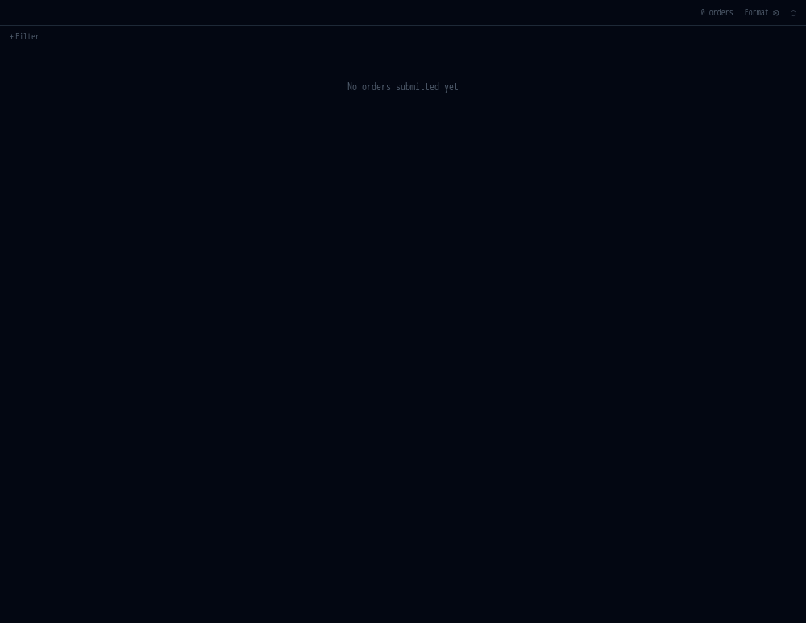 | |
