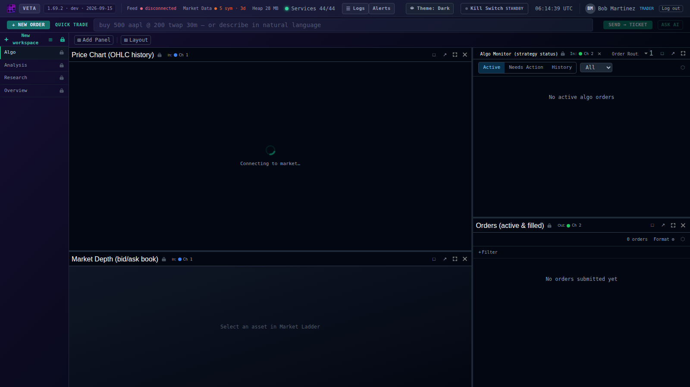
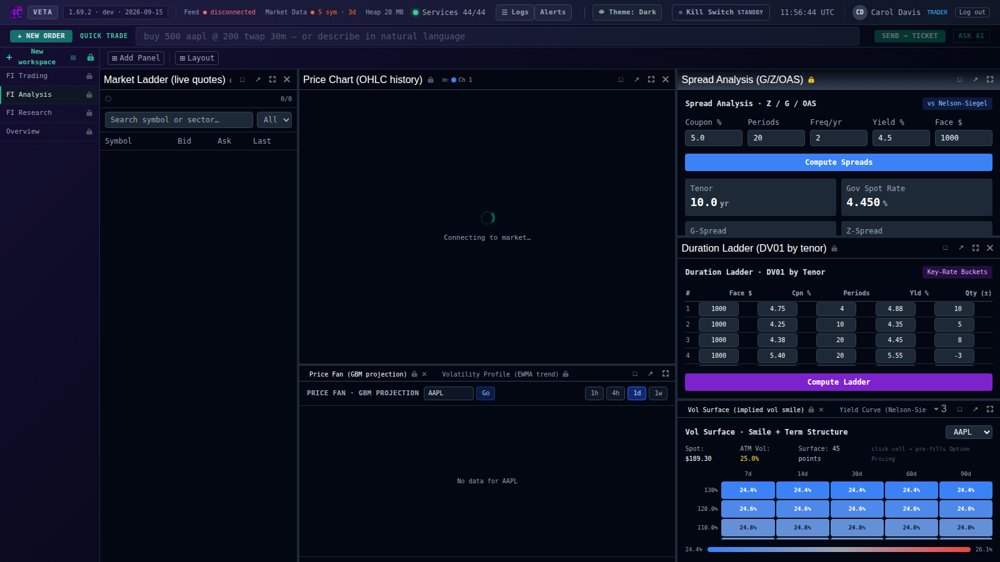
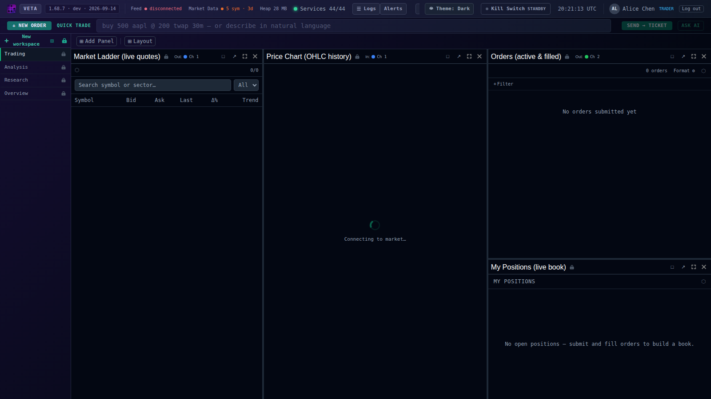

# VETA Trading Platform

[](LICENSE)
[](https://github.com/milesburton/veta-trading-platform/actions/workflows/ci.yml)
[](https://github.com/milesburton/veta-trading-platform/actions/workflows/pages.yml)
[](https://github.com/milesburton/veta-trading-platform/actions/workflows/release-please.yml)
[](https://github.com/milesburton/veta-trading-platform/actions/workflows/ci.yml)
[](https://github.com/milesburton/veta-trading-platform/actions/workflows/ci.yml)
[](https://github.com/milesburton/veta-trading-platform/actions/workflows/ci.yml)
[](https://github.com/milesburton/veta-trading-platform/actions/workflows/ci.yml)
[](https://github.com/milesburton/veta-trading-platform/actions/workflows/ci.yml)
[](https://github.com/milesburton/veta-trading-platform/actions/workflows/ci.yml)
[](https://github.com/milesburton/veta-trading-platform/actions/workflows/ci.yml)
[](https://github.com/milesburton/veta-trading-platform/actions/workflows/ci.yml)
[](https://github.com/milesburton/veta-trading-platform/actions/workflows/gitleaks.yml)
[](https://github.com/milesburton/veta-trading-platform/actions/workflows/codeql.yml)

A simulation-first equities and fixed-income trading platform for paper trading and market-structure analysis. Built around realistic desk segregation, nine execution algorithms, and a pre-trade risk engine that gates every order.

<p align="center">
  <a href="https://milesburton.github.io/veta-trading-platform/"><strong>Documentation</strong></a>
  &nbsp;&middot;&nbsp;
  <a href="https://veta.mnetcs.com/">Live demo</a>
  &nbsp;&middot;&nbsp;
  <a href="https://milesburton.github.io/veta-trading-platform/guides/quick-start/">Quick start</a>
  &nbsp;&middot;&nbsp;
  <a href="https://veta.mnetcs.com/grafana/">Grafana</a>
</p>

<p align="center">
  <a href="https://milesburton.github.io/veta-trading-platform/platform/screenshots/">
    
    
  </a>
  <br />
  <a href="https://milesburton.github.io/veta-trading-platform/platform/screenshots/">
    
    
  </a>
</p>

<p align="center"><sub>Screenshots are regenerated by Playwright on every push to <code>main</code>. See the <a href="https://milesburton.github.io/veta-trading-platform/platform/screenshots/">full gallery</a>.</sub></p>

## Read the docs

The canonical documentation lives at **[milesburton.github.io/veta-trading-platform](https://milesburton.github.io/veta-trading-platform/)** and is published on every merge to `main`. The links below are entry points by audience.

### Getting started

- [Overview](https://milesburton.github.io/veta-trading-platform/guides/overview/): what the platform is and what is included.
- [Quick start](https://milesburton.github.io/veta-trading-platform/guides/quick-start/): run the stack locally in under five minutes.
- [Demo personas](https://milesburton.github.io/veta-trading-platform/guides/personas/): every seeded user, their desk, and what they can access.

### Using the platform (traders, analysts, admins)

- [Placing orders](https://milesburton.github.io/veta-trading-platform/user-guide/placing-orders/), [managing orders](https://milesburton.github.io/veta-trading-platform/user-guide/managing-orders/), [algo trading](https://milesburton.github.io/veta-trading-platform/user-guide/algo-trading/), [risk controls](https://milesburton.github.io/veta-trading-platform/user-guide/risk-controls/).
- [Market monitoring](https://milesburton.github.io/veta-trading-platform/user-guide/market-monitoring/), [finding instruments](https://milesburton.github.io/veta-trading-platform/user-guide/finding-instruments/), [fixed income](https://milesburton.github.io/veta-trading-platform/user-guide/fixed-income/).
- [Admin tools](https://milesburton.github.io/veta-trading-platform/user-guide/admin-tools/).

### How the platform is built (engineers)

- [Architecture overview](https://milesburton.github.io/veta-trading-platform/platform/architecture/), [edge architecture](https://milesburton.github.io/veta-trading-platform/platform/edge-architecture/), [service map](https://milesburton.github.io/veta-trading-platform/platform/services/).
- [Algo strategies](https://milesburton.github.io/veta-trading-platform/platform/algos/), [risk controls](https://milesburton.github.io/veta-trading-platform/platform/risk/), [risk architecture](https://milesburton.github.io/veta-trading-platform/platform/risk-architecture/), [scenarios](https://milesburton.github.io/veta-trading-platform/platform/scenarios/).

### Running the platform (operations)

- [Operations strategy](https://milesburton.github.io/veta-trading-platform/platform/operations-strategy/), [observability](https://milesburton.github.io/veta-trading-platform/platform/observability/), [Mission Control](https://milesburton.github.io/veta-trading-platform/mission-control/).
- [Supporting services](https://milesburton.github.io/veta-trading-platform/platform/supporting-services/): Traefik, synthetic probe, auto-pull, tunnel, k6, db-migrate, Redpanda console.
- [Security posture](https://milesburton.github.io/veta-trading-platform/platform/security/), [threat model](https://milesburton.github.io/veta-trading-platform/platform/threat-model/), [professional standards](https://milesburton.github.io/veta-trading-platform/platform/professional-standards/).

### Contributing (developers)

- [Coding approach](https://milesburton.github.io/veta-trading-platform/development/coding-approach/), [project structure](https://milesburton.github.io/veta-trading-platform/development/structure/), [contributing](https://milesburton.github.io/veta-trading-platform/development/contributing/).
- [Testing taxonomy](https://milesburton.github.io/veta-trading-platform/development/testing/): unit, integration (Testcontainers), Playwright E2E, Electron, smoke, visual anomalies.
- [CI / CD](https://milesburton.github.io/veta-trading-platform/development/ci-cd/), [deployment](https://milesburton.github.io/veta-trading-platform/development/deployment/), [shared modules](https://milesburton.github.io/veta-trading-platform/development/shared-modules/), [roadmap](https://milesburton.github.io/veta-trading-platform/development/roadmap/).

### Reference

- [Glossary](https://milesburton.github.io/veta-trading-platform/reference/glossary/), [SRE terminology](https://milesburton.github.io/veta-trading-platform/reference/sre-terminology/), [trading styles](https://milesburton.github.io/veta-trading-platform/reference/trading-styles/).
- [API gateway routes](https://milesburton.github.io/veta-trading-platform/reference/api-gateway/), [RBAC and permissions](https://milesburton.github.io/veta-trading-platform/reference/rbac/), [panel reference](https://milesburton.github.io/veta-trading-platform/reference/panels/).
- [Tech stack](https://milesburton.github.io/veta-trading-platform/reference/tech-stack/) (auto-generated), [migrations](https://milesburton.github.io/veta-trading-platform/reference/migrations/) (auto-generated), [performance](https://milesburton.github.io/veta-trading-platform/reference/performance/).

## Quick start

```sh
# 1. Clone and open in a Dev Container (VS Code or JetBrains).
git clone git@github.com:milesburton/veta-trading-platform.git
cd veta-trading-platform

# 2. Inside the container, start the stack.
docker compose up -d

# 3. Run the frontend dev server.
cd frontend && npm run dev

# 4. Sign in at http://localhost:5173/ as any persona, passcode: veta-dev-passcode
```

Full instructions are in the [Quick start](https://milesburton.github.io/veta-trading-platform/guides/quick-start/) page.

## Discord log and feedback

[Join the Discord](https://discord.gg/tSGgsKnz) for release notes, the platform alerts feed, and bug submission.

## Project changelog

[CHANGELOG.md](CHANGELOG.md) is generated by Release Please from Conventional Commits.

## Licence

[MIT](LICENSE).
