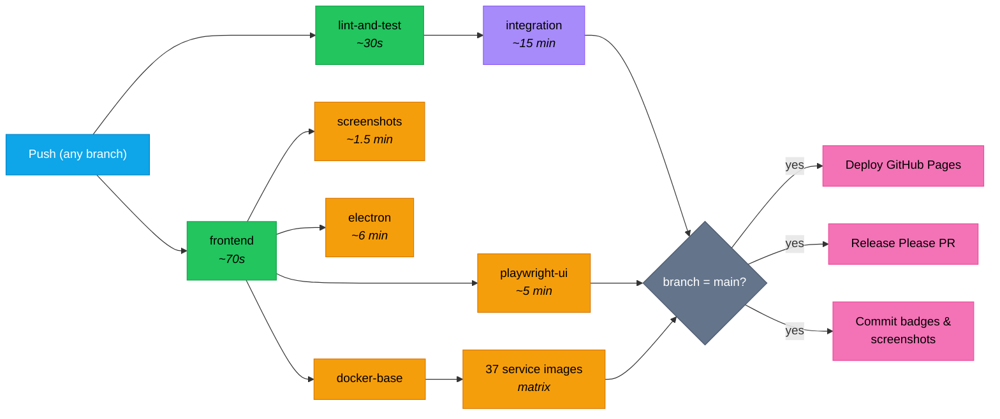

Every push to any branch triggers the CI workflow. Pushes to `main` additionally trigger GitHub Pages and are picked up by the server's systemd `veta-auto-pull` timer (every 5 minutes) via the `:latest` Docker images pushed to GHCR. The entire pipeline runs in parallel where possible.

## Pipeline diagram



Integration covers service contracts, algo strategies (retry), the intelligence pipeline, journal HTTP, market-data HTTP, and smoke tests (87+). Playwright, screenshots, Electron, and Docker builds run in parallel with integration. They only wait on the frontend job, not the 15-minute integration suite.

## Parallelisation

Playwright, screenshots, Electron, and Docker builds run **in parallel with** integration tests. They only depend on the frontend job (~70 seconds), not the 15-minute integration suite. This saves around 10 to 12 minutes off the critical path.

GitHub Pro provides 20 concurrent jobs. We use up to 40 matrix slots (37 Docker builds run in a matrix) but they queue efficiently.

## What each job does

### lint-and-test (~30 seconds)

- `deno lint`: 113 backend files
- `deno task check`: type-check 56 entry points
- `deno task test:coverage`: 230+ unit tests with lcov output
- Generates `docs/badges/backend-tests.json` with test count

### frontend (~70 seconds)

- `npx @biomejs/biome check src/`: lint 221 files
- `tsc --noEmit`: type-check
- `npm run test:coverage`: 797+ unit tests with v8 coverage
- Generates `docs/badges/frontend-tests.json` and `docs/badges/coverage.json`

### integration (~15 minutes)

- Starts PostgreSQL, Redpanda, and all 30+ services
- Runs database migrations (0001 to 0013)
- Waits for all services to be healthy (port polling)
- Waits for market-sim to produce prices
- Waits for risk-engine to have prices tracked
- Configures risk-engine limits for test throughput
- Runs 5 integration test suites + smoke tests
- Generates `docs/badges/integration-tests.json`
- Generates `docs/badges/smoke-tests.json`

### playwright-ui (sharded, target under 5 minutes wall-clock)

- Runs the full Playwright E2E suite in 2 parallel shards
- Installs Chromium once per shard
- Runs 89+ E2E tests headless against Vite dev server
- GatewayMock provides deterministic backend responses
- Generates `docs/badges/e2e-tests.json`

### docker-services (~3 to 5 minutes per image, parallel)

- Builds 37 individual service Docker images
- Pushes to GHCR (`ghcr.io/milesburton/veta-trading-platform/<service>:latest`)
- Matrix build: all 37 run simultaneously

### screenshots (~1.5 minutes, path-conditional)

- `Capture UI screenshots` (main only): runs `screenshots.spec.ts` against every dashboard workspace and persona, then commits any changed PNGs to `docs/screenshots/` with `[skip ci]`. These are the images the docs site and README embed.
- `Capture panel walkthrough screenshots` (main only): same idea, scoped to `docs/panel-walkthrough/screenshots/` for the panel-by-panel walkthrough docs.
- `PR screenshot diff` (pull requests only): runs the same capture on the PR branch, then runs `git diff -- docs/screenshots/` against whatever is already committed in `docs/screenshots/` on that branch (not a fresh checkout of `main`, so a stale branch can show a misleading diff). Posts a `📸 UI screenshots` comment on the PR listing every file that changed. Nothing is committed; this is informational for the reviewer.
- `PR visual anomalies`: a separate, non-gating check. Flags DOM overflow and axe-core accessibility violations across a set of scripted scenarios, posting its own comment. Distinct from the screenshot diff above.

Because of this, contributors do not need to attach screenshots to a PR by hand. A UI-affecting change gets one automatically. The known flake is the "fixed income workspace" scenario (`Compute Spreads` button in `screenshots.spec.ts`, timing out on a `TimeoutError: locator.click`); treat a lone failure there as unrelated to your change unless you touched that panel.

## Deployment on change

The production server is the only deployment target. The application is served at the deployment URL and Grafana via a secure tunnel from the edge server.

### Server

- systemd `veta-auto-pull.timer` polls `origin/main` every 5 minutes
- When a new SHA is detected, the server clones the repo, syncs `compose.yml` + overlays, runs `deploy.sh`
- `deploy.sh` runs `docker compose up -d`; GHCR images are pulled by the daemon
- Typical lag: around 5 minutes after Docker build completes

### GitHub Pages

- Triggers on changes to `docs/**`
- Builds the Astro + Starlight site (`npm run build` ~4 seconds)
- Copies screenshots into the build
- Deploys via `actions/deploy-pages@v4`

## Badge generation

Every CI run on `main` generates JSON badge files committed to `docs/badges/`:

| Badge | Source | Format |
| --- | --- | --- |
| Backend tests | `deno task test:coverage` output | `"230 passed"` |
| Frontend tests | `npm run test:coverage` output | `"797 passed"` |
| Integration tests | `deno task test:testcontainers` output | `"87 passed"` |
| Smoke tests | `smoke.tc.test.ts` + `smoke.full.tc.test.ts` run output | `"67 passed"` |
| E2E tests | Playwright output | `"89 passed"` |
| Coverage | `coverage-summary.json` | `"42.5%"` |

Badges are shields.io endpoint badges reading from the raw GitHub file URL.

## Merge gate

Branch protection on `main` requires the following CI checks to pass before a PR can merge:

- `Detect changed paths`
- `Lint, type-check, unit tests`
- `Frontend lint & type-check`
- `Integration tests`
- `Playwright UI tests`

These are the five always-running gating jobs. Path-conditional jobs (`Build base image`, `Capture UI screenshots`, `PR screenshot diff`, the per-service `Build *` matrix, the `Publish *` jobs) are intentionally **not** in the required set — they're either main-only or path-gated, and requiring a skipped check would deadlock merges.

The full ruleset:

```bash
gh api repos/:owner/:repo/branches/main/protection --jq '.required_status_checks.contexts'
```

To update which checks are required, the same endpoint accepts a `PUT` with the new context list. There's a CODEOWNERS-style review gate too — `required_pull_request_reviews` requires one approval before merging, which `trusted-automerge` provides automatically.

## Run the CI checks locally

GitHub Actions is the source of truth for merge gates, but the same checks can be run from the workstation before pushing. The workflow is split across backend and frontend roots, so the local commands mirror that split:

```bash
# Backend checks
deno task lint
deno task check
deno task test

# Frontend checks
cd frontend
npm run lint
npm run typecheck
npm run test:coverage
npm run test:ui

# Cross-repo checks
cd ..
npm run fallow:audit
npm run fallow:health
npm run fallow:dead-code
npm run quality:git
```

If you want a closer approximation of the GitHub Actions runner itself, use a local workflow runner such as `act` and point it at `.github/workflows/ci.yml`. The repo does not require `act` for day-to-day development, so the script-based checks above are the supported baseline.

## Troubleshooting CI failures

### First check: is GitHub itself broken?

When CI suddenly regresses from steady-green to red across multiple unrelated PRs in a short window, **check GitHub's status before touching any code**. A green-to-red transition that hits jobs you didn't change is almost always an upstream incident, not a regression.

Every CI run starts with a `GitHub status (advisory)` job that hits `githubstatus.com`'s unresolved-incidents API. If anything is open, the job emits a yellow `::warning::` annotation visible at the top of the run summary. The job never blocks the merge; it exists purely to surface the upstream state.

To check manually:

```bash
curl -s https://www.githubstatus.com/api/v2/incidents/unresolved.json \
  | jq '.incidents[] | {name, status, impact, created_at}'
```

Things GitHub's status page reports as "operational" can still be silently degraded. Two specific symptoms map to specific incidents:

| Symptom | Likely incident |
| --- | --- |
| `Error response from daemon: Get "https://ghcr.io/v2/": denied: denied` on `docker login` | App installation token auth |
| `failed to fetch oauth token: denied: denied` inside `buildx` (pull or push) | App installation token auth |
| `Bad credentials` from `peter-evans/find-comment`, `dorny/paths-filter`, or other API-calling actions | App installation token auth |
| `fatal: could not read Username for 'https://github.com'` on `actions/checkout` for a `pull_request` event | App installation token auth, or a checkout wrapper stripping the implicit `token` input |

For all of these, **the right response is rerun**, not mitigation:

```bash
gh run rerun <run-id> --failed
```

Mitigations like retry wrappers, throttles, or version pins added under incident conditions tend to be wrong by the time the incident clears. We learned this in May 2026 after shipping four CI patches in a single afternoon chasing what turned out to be a GitHub auth incident; one of those patches (a `wretry.action` wrap around `actions/checkout`) actively broke PR-event auth and had to be reverted.

### When it really is us

If the status page is clean and the failures correlate with a specific PR or service, the failure is real. Common patterns:

- **One service consistently fails to build but others pass**: check that service's `Dockerfile` and the runtime dependencies in `deno.json` or `frontend/package.json` haven't drifted.
- **`Detect changed paths` fails with a JSON parse error**: the `paths-filter` step never ran and `fromJSON(...)` saw an empty string. Check the preceding `actions/checkout` step.
- **`Deploy gate` Playwright test times out at 60s**: usually CI runner slowness, but check the trace artifact under `gate-diagnostics` for what state the page actually reached. Real backend regressions show up as Playwright passing but the test asserting wrong content; CI-load failures show the dashboard rendered but the test gave up.
- **`Publish *-algo :latest (gated)` fails after `Deploy gate` passed**: a GHCR push flake. Rerun. If it persists across reruns, check whether GHCR has the previous image tag (rare cache-state issue).

### Stuck check suites

The auto-merge waits on *all* check suites GitHub knows about, not just the required ones. If a third-party GitHub App is installed and stops reporting (e.g. expired token, the app was removed but the check_suite remained queued), every PR shows `mergeable_state: BLOCKED` indefinitely. Diagnose with:

```bash
gh api "repos/:owner/:repo/commits/$(gh pr view <N> --json headRefOid --jq .headRefOid)/check-suites" \
  --jq '.check_suites[] | {app: .app.name, status, conclusion}'
```

Anything `status: queued, conclusion: null` from an app you don't actively use is the blocker. Either uninstall the app at `Settings, Integrations`, or `gh pr merge --admin` to bypass the stuck check while waiting for the cleanup.

## Bot PAT for auto-merge

[`.github/workflows/trusted-automerge.yml`](https://github.com/milesburton/veta-trading-platform/blob/main/.github/workflows/trusted-automerge.yml) auto-approves and squash-merges trusted PRs. The `gh pr merge` step authenticates with a fine-grained personal access token stored as the `BOT_PAT` repo secret.

This matters because GitHub's built-in `GITHUB_TOKEN` has an anti-loop limitation: **commits made by `GITHUB_TOKEN` do not fire downstream `on: push` workflows**. Without a PAT, every bot-driven merge to `main` would land silently: no `ci.yml` run, no docker image build, and no auto-pull picks it up because the SHA-comparison still works but the new image never gets built. The PAT bypasses the limitation because it is a user credential, so the merge commit looks like a normal push.

The same secret is also used by [`ci.yml`](https://github.com/milesburton/veta-trading-platform/blob/main/.github/workflows/ci.yml) for the checkout step of every job that pushes back to `main` (coverage badges, screenshot captures). Those checkouts run on `push` events only; on `pull_request` events the workflow falls back to `GITHUB_TOKEN`, because PR runs never push and so never need the PAT. A dead `BOT_PAT` therefore breaks `push`-event checkout with `fatal: could not read Username for 'https://github.com'` while leaving `pull_request`-event runs green.

### What the PAT must allow

- Repository access: **this repo only**
- Permissions:
  - `Contents`: Read and write, required to create the merge commit and to check out in `push`-event badge jobs
  - `Pull requests`: Read and write, required to enable auto-merge
  - `Metadata`: Read-only, mandatory boilerplate
- Expiration: a no-expiry token avoids the silent annual breakage; if you set an expiry, put a reminder to rotate before it lapses.

### Symptoms of a broken PAT

A fine-grained PAT can fail for reasons that are not obvious from the token page:

- Auth errors appear in the auto-merge workflow run and in `push`-event `ci.yml` checkout steps, while `pull_request`-event CI stays green. The failure therefore looks like it only affects merges and badges.
- An auth failure is not always a permission failure. A token missing a required permission can surface the same error as an invalid value, so do not assume the value is dead just because authentication failed.
- The token page can look healthy (valid, no expiry) while the value stored in the secret is stale. Regenerating a fine-grained token mints a new value and invalidates the old one, but it does not update the secret. The secret keeps the previous value until you re-save it.
- To tell a stale value from a missing permission, regenerate the token and re-save the secret first (this clears the most common cause), then re-check the required permissions if the error persists.

### Rotating the PAT

When `BOT_PAT` is approaching expiry, or when the symptoms above appear:

1. GitHub, then Settings, Developer settings, Personal access tokens, Fine-grained tokens, open the token. Confirm the permissions match the list above before regenerating.
2. Regenerate the token (or generate a new one with the scopes above) and copy the new value. GitHub shows it once.
3. Repo, then Settings, Secrets and variables, Actions, click `BOT_PAT`, Update value, paste, save. Re-save even if the displayed token looks unchanged: the secret holds its own copy of the value, and that copy is what GitHub authenticates.
4. Paste the value with no trailing space or newline; stray whitespace causes auth to fail on its own.
5. No workflow change needed; the secret name stays the same.
6. Verify by re-running the last auto-merge workflow run and a `push`-event CI run; both should clear the auth errors.
7. Revoke any superseded token from the same fine-grained tokens page.

### Manual escape hatch

If the PAT is ever broken or revoked, [`ci.yml`](https://github.com/milesburton/veta-trading-platform/blob/main/.github/workflows/ci.yml) accepts `workflow_dispatch` so you can re-trigger CI on any commit without depending on the auto-merge:

```sh
gh workflow run ci.yml --ref main
```

## Release management

- **Release Please** auto-generates version bump PRs from conventional commits
- **Dependabot** auto-merges patch-level npm dependency updates
- **Changelog** auto-generated from commit messages
