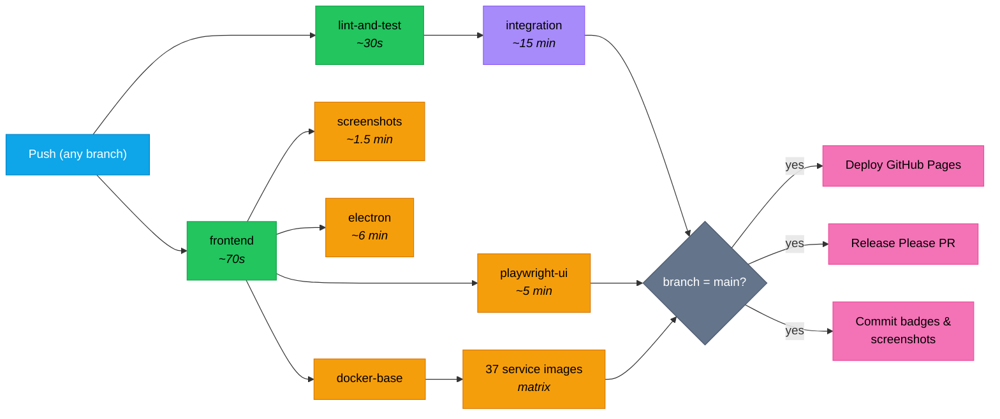

Every push to any branch triggers the CI workflow. Pushes to `main` additionally trigger GitHub Pages and are picked up by the homelab's systemd `veta-auto-pull` timer (every 5 minutes) via the `:latest` Docker images pushed to GHCR. The entire pipeline runs in parallel where possible.

## Pipeline diagram



Integration covers service contracts, algo strategies (retry), the intelligence pipeline, journal HTTP, market-data HTTP, and smoke tests (87+). Playwright/screenshots/Electron/Docker builds run in parallel with integration — they only wait on the frontend job, not the 15-minute integration suite.

## Parallelisation

Playwright, screenshots, Electron, and Docker builds run **in parallel with** integration tests. They only depend on the frontend job (~70 seconds), not the 15-minute integration suite. This saves ~10-12 minutes off the critical path.

GitHub Pro provides 20 concurrent jobs — we use up to 40 matrix slots (37 Docker builds run in a matrix) but they queue efficiently.

## What each job does

### lint-and-test (~30 seconds)

- `deno lint` — 113 backend files
- `deno task check` — type-check 56 entry points
- `deno task test:coverage` — 230+ unit tests with lcov output
- Generates `docs/badges/backend-tests.json` with test count

### frontend (~70 seconds)

- `npx @biomejs/biome check src/` — lint 221 files
- `tsc --noEmit` — type-check
- `npm run test:coverage` — 797+ unit tests with v8 coverage
- Generates `docs/badges/frontend-tests.json` and `docs/badges/coverage.json`

### integration (~15 minutes)

- Starts PostgreSQL, Redpanda, and all 30+ services
- Runs database migrations (0001–0013)
- Waits for all services to be healthy (port polling)
- Waits for market-sim to produce prices
- Waits for risk-engine to have prices tracked
- Configures risk-engine limits for test throughput
- Runs 5 integration test suites + smoke tests
- Generates `docs/badges/integration-tests.json`

### playwright-ui (~5 minutes)

- Installs Chromium
- Runs 89+ E2E tests headless against Vite dev server
- GatewayMock provides deterministic backend responses
- Generates `docs/badges/e2e-tests.json`

### docker-services (~3-5 minutes per image, parallel)

- Builds 37 individual service Docker images
- Pushes to GHCR (`ghcr.io/milesburton/veta-trading-platform/<service>:latest`)
- Matrix build: all 37 run simultaneously

## Deployment on change

The homelab is the only deployment target. The application is served at [`https://veta.mnetcs.com/`](https://veta.mnetcs.com/) and Grafana at [`https://veta.mnetcs.com/grafana/`](https://veta.mnetcs.com/grafana/) via a reverse SSH tunnel from an OVH dedicated server.

### Homelab

- systemd `veta-auto-pull.timer` polls `origin/main` every 5 minutes
- When a new SHA is detected, the homelab clones the repo, syncs `compose.yml` + overlays, runs `deploy.sh`
- `deploy.sh` runs `docker compose up -d`; GHCR images are pulled by the daemon
- Typical lag: ~5 minutes after Docker build completes

### GitHub Pages

- Triggers on changes to `docs/**`
- Builds the Astro + Starlight site (`npm run build` ~4 seconds)
- Copies screenshots into the build
- Deploys via `actions/deploy-pages@v4`

## Badge generation

Every CI run on `main` generates JSON badge files committed to `docs/badges/`:

| Badge | Source | Format |
|-------|--------|--------|
| Backend tests | `deno task test:coverage` output | `"230 passed"` |
| Frontend tests | `npm run test:coverage` output | `"797 passed"` |
| Integration tests | `deno task test:testcontainers` output | `"87 passed"` |
| E2E tests | Playwright output | `"89 passed"` |
| Coverage | `coverage-summary.json` | `"42.5%"` |

Badges are shields.io endpoint badges reading from the raw GitHub file URL.

## Bot PAT for auto-merge

[`.github/workflows/trusted-automerge.yml`](https://github.com/milesburton/veta-trading-platform/blob/main/.github/workflows/trusted-automerge.yml) auto-approves and squash-merges trusted PRs. The `gh pr merge` step authenticates with a fine-grained personal access token stored as the `BOT_PAT` repo secret.

This matters because GitHub's built-in `GITHUB_TOKEN` has an anti-loop limitation: **commits made by `GITHUB_TOKEN` don't fire downstream `on: push` workflows**. Without a PAT, every bot-driven merge to `main` would land silently — no `ci.yml` run, no docker image build, no auto-pull picks it up because the SHA-comparison still works but the new image never gets built. The PAT bypasses the limitation because it's a user credential, so the merge commit looks like a normal push.

### What the PAT must allow

- Repository access: **this repo only**
- Permissions:
  - `Contents`: Read and write — required to create the merge commit
  - `Pull requests`: Read and write — required to enable auto-merge
  - `Metadata`: Read-only — mandatory boilerplate
- Expiration: rotate annually. When the token expires, auto-merge silently starts failing with auth errors; check the `trusted-automerge` workflow run output if merges suddenly stop landing.

### Rotating the PAT

When the existing `BOT_PAT` is approaching expiry:

1. GitHub → Settings → Developer settings → Personal access tokens → Fine-grained tokens → Generate new token (same scopes as above).
2. Repo → Settings → Secrets and variables → Actions → click `BOT_PAT` → Update value.
3. No workflow change needed; the secret name stays the same.
4. Revoke the old token from the same fine-grained tokens page.

### Manual escape hatch

If the PAT is ever broken or revoked, [`ci.yml`](https://github.com/milesburton/veta-trading-platform/blob/main/.github/workflows/ci.yml) accepts `workflow_dispatch` so you can re-trigger CI on any commit without depending on the auto-merge:

```sh
gh workflow run ci.yml --ref main
```

## Release management

- **Release Please** auto-generates version bump PRs from conventional commits
- **Dependabot** auto-merges patch-level npm dependency updates
- **Changelog** auto-generated from commit messages
