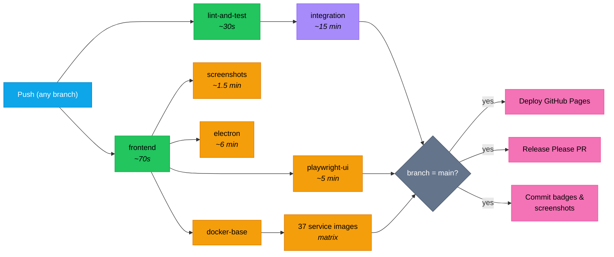

Every push to any branch triggers the CI workflow. Pushes to `main` additionally trigger GitHub Pages and trigger Watchtower on the homelab via the `:latest` Docker images pushed to GHCR. The Fly.io deployment is currently disabled (manual-dispatch only — see [Fly.io](#flyio) below). The entire pipeline runs in parallel where possible.

## Pipeline diagram



Integration covers service contracts, algo strategies (retry), the intelligence pipeline, journal HTTP, market-data HTTP, and smoke tests (87+). Playwright/screenshots/Electron/Docker builds run in parallel with integration — they only wait on the frontend job, not the 15-minute integration suite.

## Parallelisation

Playwright, screenshots, Electron, and Docker builds run **in parallel with** integration tests. They only depend on the frontend job (~70 seconds), not the 15-minute integration suite. This saves ~10-12 minutes off the critical path.

GitHub Pro provides 20 concurrent jobs — we use up to 40 matrix slots (37 Docker builds run in a matrix) but they queue efficiently.

## What each job does

### lint-and-test (~30 seconds)

- `deno lint` — 113 backend files
- `deno task check` — type-check 56 entry points
- `deno task test:coverage` — 230+ unit tests with lcov output
- Generates `docs/badges/backend-tests.json` with test count

### frontend (~70 seconds)

- `npx @biomejs/biome check src/` — lint 221 files
- `tsc --noEmit` — type-check
- `npm run test:coverage` — 797+ unit tests with v8 coverage
- Generates `docs/badges/frontend-tests.json` and `docs/badges/coverage.json`

### integration (~15 minutes)

- Starts PostgreSQL, Redpanda, and all 30+ services
- Runs database migrations (0001–0013)
- Waits for all services to be healthy (port polling)
- Waits for market-sim to produce prices
- Waits for risk-engine to have prices tracked
- Configures risk-engine limits for test throughput
- Runs 5 integration test suites + smoke tests
- Generates `docs/badges/integration-tests.json`

### playwright-ui (~5 minutes)

- Installs Chromium
- Runs 89+ E2E tests headless against Vite dev server
- GatewayMock provides deterministic backend responses
- Generates `docs/badges/e2e-tests.json`

### docker-services (~3-5 minutes per image, parallel)

- Builds 37 individual service Docker images
- Pushes to GHCR (`ghcr.io/milesburton/veta-trading-platform/<service>:latest`)
- Matrix build: all 37 run simultaneously

## Deployment on change

### Fly.io

**Disabled on push.** The homelab is the canonical deployment target right now (solar-powered, plenty of resources, no per-machine memory cap). The Fly workflow file is kept so the deploy recipe stays self-documenting; manual deploys via `gh workflow run deploy.yml --ref main` still work for emergencies. To re-enable on every main push, restore the `push: branches: main` trigger in [`.github/workflows/deploy.yml`](https://github.com/milesburton/veta-trading-platform/blob/main/.github/workflows/deploy.yml).

When enabled, the workflow:

1. Runs tests (lint-and-test + frontend)
2. `flyctl deploy` builds the monolith Dockerfile with `VITE_COMMIT_SHA` and `VITE_BUILD_DATE`
3. 3-attempt retry with 30-second backoff on failure
4. Version verification: polls `/health` until the deployed SHA matches
5. Full smoke test suite runs against the live deployment
6. Concurrency control: only one deploy runs at a time (`concurrency: fly-deploy`)

### Homelab

- Watchtower polls GHCR every 5 minutes
- When a new `:latest` image is detected, the container auto-restarts
- Typical lag: ~5 minutes after Docker build completes

### GitHub Pages

- Triggers on changes to `docs/**`
- Builds the Astro + Starlight site (`npm run build` ~4 seconds)
- Copies screenshots into the build
- Deploys via `actions/deploy-pages@v4`

## Badge generation

Every CI run on `main` generates JSON badge files committed to `docs/badges/`:

| Badge | Source | Format |
|-------|--------|--------|
| Backend tests | `deno task test:coverage` output | `"230 passed"` |
| Frontend tests | `npm run test:coverage` output | `"797 passed"` |
| Integration tests | `deno task test:testcontainers` output | `"87 passed"` |
| E2E tests | Playwright output | `"89 passed"` |
| Coverage | `coverage-summary.json` | `"42.5%"` |

Badges are shields.io endpoint badges reading from the raw GitHub file URL.

## Bot PAT for auto-merge

[`.github/workflows/trusted-automerge.yml`](https://github.com/milesburton/veta-trading-platform/blob/main/.github/workflows/trusted-automerge.yml) auto-approves and squash-merges trusted PRs. By default it uses GitHub's built-in `GITHUB_TOKEN`, which has a known limitation: **commits made by `GITHUB_TOKEN` don't fire downstream `on: push` workflows**. GitHub's anti-loop policy treats them as bot-internal events.

The visible symptoms are:

- The auto-merge succeeds, the merge commit lands on `main`, but `Deploy to Fly.io`, the coverage-badges commit, and the on-push CI run for `main` never fire.
- Integration tests / lint / unit tests still ran on the PR before merge — the PR-level CI is unaffected — but `main`'s status check trail is empty for that SHA.

The PR-level CI runs are good enough for code correctness, but the missing main-push workflows leave stale badges and skip optional jobs that only fire on main. To close the gap, swap the workflow's token reference from `GITHUB_TOKEN` to a personal access token with `Contents: write` and `Pull requests: write` scopes on this repo.

### Setup

1. **Create a fine-grained PAT.** GitHub → Settings → Developer settings → Personal access tokens → Fine-grained tokens → Generate new token.
   - Repository access: this repo only.
   - Permissions:
     - `Contents`: Read and write
     - `Pull requests`: Read and write
     - `Metadata`: Read-only (mandatory)
   - Expiration: pick a date you'll remember to rotate; 1 year is reasonable for a hobby project.
2. **Add it as a repo secret.** GitHub → repo Settings → Secrets and variables → Actions → New repository secret. Name it `BOT_PAT`.
3. **Edit `trusted-automerge.yml`** to use the secret:
   ```yaml
   - name: Enable auto-merge once checks pass
     env:
       GH_TOKEN: ${{ secrets.BOT_PAT }}    # was: ${{ secrets.GITHUB_TOKEN }}
       PR_URL: ${{ github.event.pull_request.html_url }}
     run: |
       gh pr merge "$PR_URL" --auto --squash --delete-branch || \
       gh pr merge "$PR_URL" --auto --merge --delete-branch
   ```
4. **Verify.** Open any small PR, let auto-merge run, then check that the merge commit on main fires both CI and Deploy GitHub Pages. If they don't, the token scopes are wrong (most common cause: forgot `Contents: write`).

### Manual escape hatch (no PAT)

Until the PAT is configured, [`ci.yml`](https://github.com/milesburton/veta-trading-platform/blob/main/.github/workflows/ci.yml) accepts `workflow_dispatch` so you can re-trigger CI on any commit:

```sh
gh workflow run ci.yml --ref main
```

Same for `deploy.yml` if a Fly deploy is needed despite [#84](https://github.com/milesburton/veta-trading-platform/pull/84) disabling the `push` trigger.

## Release management

- **Release Please** auto-generates version bump PRs from conventional commits
- **Dependabot** auto-merges patch-level npm dependency updates
- **Changelog** auto-generated from commit messages
