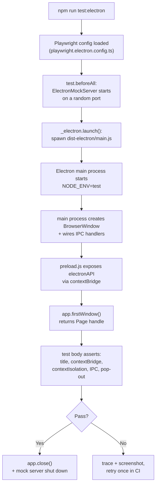

This suite covers the renderer-to-main process boundary in the packaged Electron app: the `contextBridge` API surface, IPC handler wiring, window lifecycle, and `contextIsolation` enforcement. Regressions are security-relevant. The bridge is the only sanctioned path from renderer JavaScript to Node APIs, and a leaked Node global widens the blast radius of any future renderer XSS.

Trading flows are not re-tested here. The web [Playwright E2E suite](../playwright/) covers them once against the same Chromium engine that Electron ships. This suite focuses on behaviour that is only true under Electron.

**Location:** `frontend/tests-electron/`
**Config:** [`frontend/playwright.electron.config.ts`](https://github.com/milesburton/veta-trading-platform/blob/main/frontend/playwright.electron.config.ts)
**Run:** `cd frontend && npm run test:electron`
**Prerequisite:** `npm run electron:build` (produces `dist/` and `dist-electron/`)

## What it verifies

1. **Window opens** with the correct title.
2. **Startup overlay** is displayed on launch (the loading screen shown while the dashboard mounts).
3. **Dashboard mounts** after startup completes.
4. **contextBridge API**: `window.electronAPI` is exposed to the renderer with exactly the methods the main process intends to share.
5. **contextIsolation is enforced**: no Node.js globals (`require`, `process`, `__dirname`) leak into the renderer. A renderer-side XSS therefore cannot `require("fs")` and read the user's disk.
6. **IPC handlers**: minimize, maximize, and close calls reach the main process and act on the BrowserWindow.
7. **Pop-out windows** open for `localhost` URLs (used by the detached order-ticket window).

## How it launches

Playwright's `_electron` fixture (from `playwright`, not `@playwright/test`) launches the compiled `dist-electron/main.js`:

```typescript
import { _electron as electron } from "playwright";

const app = await electron.launch({
  args: ["--no-sandbox", "--disable-gpu", "dist-electron/main.js"],
  env: { NODE_ENV: "test" },
});

const window = await app.firstWindow();
await expect(window).toHaveTitle(/VETA/);
```

`NODE_ENV=test` disables the dev-tools toggle and the auto-update check. `ELECTRON_RUN_AS_NODE` is explicitly unset; if it leaks through from the parent process, Electron starts as a Node shell rather than a desktop app and tests fail in confusing ways.

## Test execution flow



Workers are set to 1 because only one packaged app instance can run at a time without port collisions. `app.firstWindow()` waits for the renderer to mount before the test body runs, so per-test setup is implicit.

## Mocking the backend

`tests-electron/helpers/ElectronMockServer.ts` boots a small HTTP server inside the test that the Electron app talks to instead of the real backend. This keeps the suite independent of whether the homelab is up. The mock server is narrower than `GatewayMock` from the Playwright suite; Electron tests verify desktop-specific plumbing rather than UI flows.

## Config

- **Workers:** 1. Electron tests run serially because only one packaged app instance can run at a time without port collisions.
- **Test timeout:** 60s per test (cold-start can be slow).
- **Global timeout:** 10 minutes overall (xvfb startup plus cold start dominates CI time).
- **Retries:** 1 in CI, 0 locally.
- **Trace:** `on-first-retry`. **Screenshot:** `only-on-failure`.

## What is not here

Trading flows are not duplicated from the web Playwright suite. Electron is the same Chromium renderer with extra plumbing; doubling up trade-flow tests would double maintenance for no extra signal.

Features that depend on `electronAPI` (pop-out windows, native menus, native notifications) are tested here because they do not exist in the browser.

## Adding a test

1. Create `tests-electron/my-feature.spec.ts`.
2. Use the standard `@playwright/test` `test()`. The role fixtures from the web suite do not apply; Electron has its own setup.
3. Launch the app in a `test.beforeAll` and close it in `test.afterAll`. Per-test cold start would balloon the suite duration.
4. If you need backend behaviour the mock server does not expose yet, extend `ElectronMockServer`. Do not reach across to `GatewayMock`; the two suites are intentionally separate.
