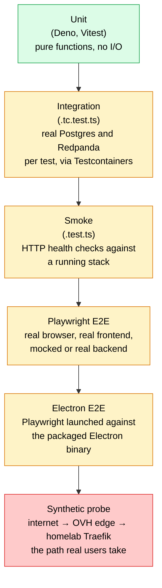
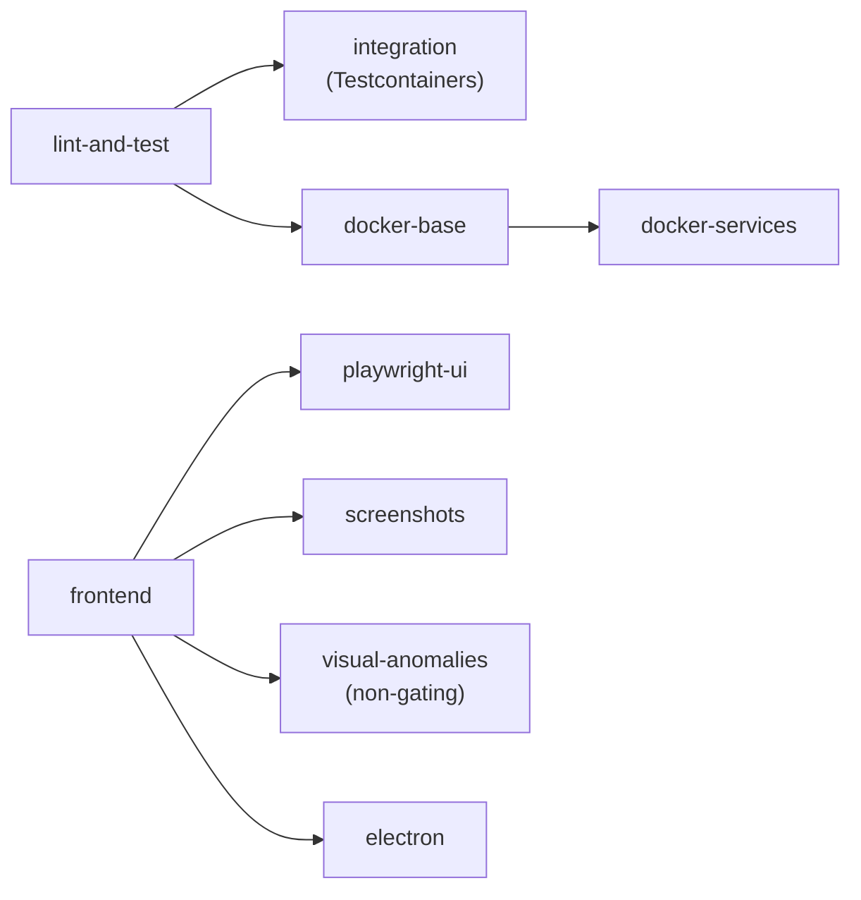

import { CardGrid, LinkCard } from "@astrojs/starlight/components";

VETA has eight test suites. Each addresses a distinct failure class: unit suites cover logic primitives, integration covers service boundaries, E2E covers UI composition, smoke covers deployment plumbing, and the synthetic probe covers public reachability. The taxonomy below is organised by failure class rather than by tooling.

## At a glance

| Suite | What it catches | Where it runs | Speed |
|-------|-----------------|---------------|-------|
| [Backend unit](./unit/) | Pure-logic bugs in algos, OMS, FIX, schemas | Pre-commit, CI | &lt;30s |
| [Frontend unit](./unit/#frontend) | Component + Redux + hook regressions | Pre-commit, CI | ~20s |
| [Integration (Testcontainers)](../testcontainers/) | Service-boundary contract breaks | CI | ~5min |
| [Playwright E2E](./playwright/) | UI flows that span the whole stack | CI | ~3min |
| [Electron E2E](./electron/) | Desktop-app-specific behaviour (IPC, contextBridge) | CI | ~1min |
| [Smoke](./smoke/) | Service reachability through production-equivalent ingress | Pre-commit (auto-skip), post-deploy | &lt;10s |
| [Visual anomalies](./visual-anomalies/) | DOM overflows + a11y violations (non-gating) | CI (informational) | ~1min |
| [Synthetic probe](../../platform/supporting/synthetic-probe/) | Live deployment is reachable from the internet | Every 60s from OVH edge | continuous |
| [k6 load testing](../../platform/supporting/k6-load-testing/) | Throughput regressions, latency p99 drift | On demand | varies |

The pre-commit hook ([.husky/pre-commit](https://github.com/milesburton/veta-trading-platform/blob/main/.husky/pre-commit)) runs lint + type-check + unit + smoke + integration in nine steps. Smoke + integration auto-skip when services aren't running locally so the hook stays fast for tight edit loops.

## How the suites fit together



Lower entries depend on more of the system being real. The position of a failing suite localises the fault: a probe failure with green unit tests indicates a deployment or ingress regression; a unit failure with a green probe indicates a regression not yet shipped.

## Where to start

<CardGrid>
  <LinkCard
    title="Pre-commit gate"
    href="../../development/contributing/"
    description="Nine checks run locally on each commit. Smoke and integration auto-skip when local services are offline; remaining checks complete in ~30s."
  />
  <LinkCard
    title="Backend unit tests"
    href="./unit/"
    description="53 files, ~470 Deno.test cases covering algos, OMS, EMS, schemas, and analytics."
  />
  <LinkCard
    title="Frontend unit tests"
    href="./unit/#frontend"
    description="163 files, ~1825 Vitest cases covering components, Redux slices, hooks, panel registry, and layout models."
  />
  <LinkCard
    title="Playwright E2E"
    href="./playwright/"
    description="16 spec files using AppPage, GatewayMock, and role-scoped fixtures (traderTest, algoTest, fiTest, adminTest)."
  />
</CardGrid>

## Coverage

Coverage is generated on every push to `main` and surfaced as badges in the README:

- **Frontend**: V8 provider via Vitest. Reports `text-summary`, `lcov`, and `json-summary`. Thresholds: 80% statements, branches, functions, lines, enforced by [vitest.config.ts](https://github.com/milesburton/veta-trading-platform/blob/main/frontend/vitest.config.ts).
- **Backend**: Deno's native `--coverage` flag. Exported as lcov via `deno coverage --lcov > coverage.lcov`.
- **Badge**: `docs/badges/coverage.json` is auto-committed by the CI job that runs coverage.

To run coverage locally:

```sh
# backend
deno task test:coverage

# frontend
cd frontend && npm run test:coverage
```

## CI pipeline shape



Playwright, screenshots, Electron, and visual-anomalies run in parallel with the integration job rather than after it. The synthetic probe and load tests are not part of the merge pipeline; they run continuously and on demand respectively.

See [CI / CD](../ci-cd/) for the full GitHub Actions workflow.
