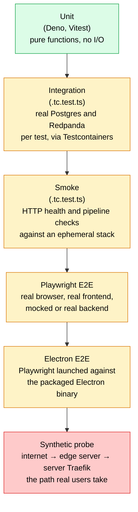
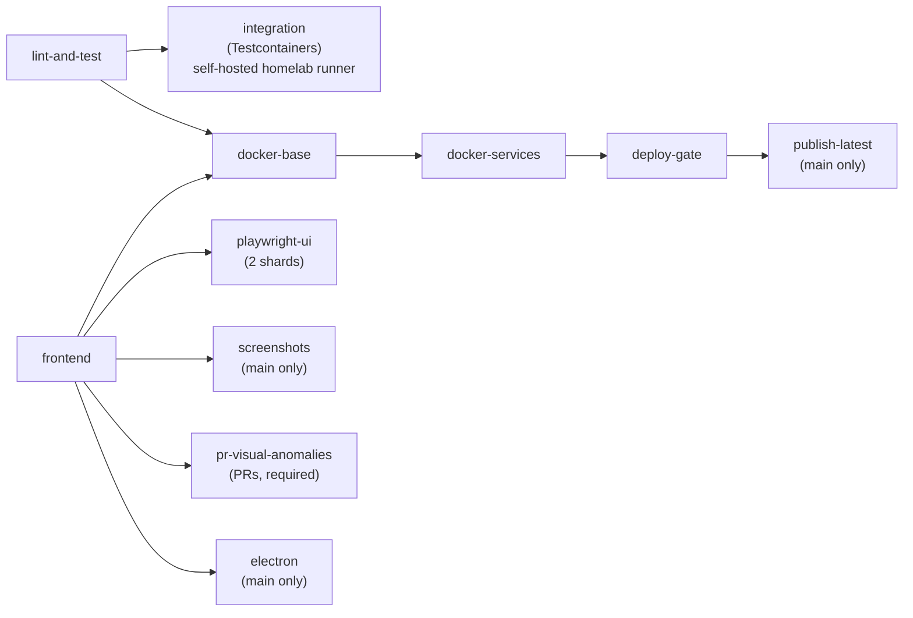

import { CardGrid, LinkCard } from "@astrojs/starlight/components";
import testInventory from "@docs/data/test-inventory.json";

VETA has eleven test suites. Each addresses a distinct failure class: unit suites cover logic primitives, integration covers service boundaries, E2E covers UI composition, smoke covers deployment plumbing, the synthetic probe covers public reachability, and performance covers throughput regressions. The taxonomy below is organised by failure class rather than by tooling.

## At a glance

| Suite                                                         | What it catches                                            | Where it runs           | Speed      |
| --- | --- | --- | --- |
| [Backend unit](./unit/)                                       | Pure-logic bugs in algos, OMS, FIX, schemas                | Pre-commit, CI          | &lt;30s    |
| [Frontend unit](./unit/#frontend)                             | Component + Redux + hook regressions                       | Pre-commit, CI          | ~20s       |
| [Integration (Testcontainers)](./testcontainers/)            | Service-boundary contract breaks                           | CI on `main` and Docker-affecting PRs (self-hosted homelab runner, non-blocking) | ~15min |
| [Playwright E2E](./playwright/)                               | UI flows that span the whole stack                         | CI                      | ~3min      |
| [Electron E2E](./electron/)                                   | Desktop-app-specific behaviour (IPC, contextBridge)        | CI on `main`            | ~1min      |
| [Smoke](./smoke/)                                             | Service reachability and core pipeline wiring              | CI, inside the integration job | ~90s |
| [Visual anomalies](./visual-anomalies/)                       | DOM overflows + a11y violations                            | CI on PRs (required check) | ~1min   |
| [Synthetic probe](../../platform/supporting/synthetic-probe/) | Live deployment is reachable from the internet             | Every 60s from edge server | continuous |
| [Performance](../../analytics/performance/)                   | Throughput regressions, latency p99 drift                  | On demand               | varies     |
| [k6 load testing](./k6-load-testing/)                        | Sustained throughput under realistic order flow scenarios  | On demand               | varies     |
| [Continuous load generator](./loadgen/)                       | Always-on synthetic trade flow on the production server    | Production only         | continuous |

The pre-commit hook ([.husky/pre-commit](https://github.com/milesburton/veta-trading-platform/blob/main/.husky/pre-commit)) runs thirteen steps: lint, type-check and unit tests for both backend and frontend, integration tests, migration safety, Prometheus rule checks, docs drift and validation, a private-IP scan, and an advisory Fallow audit. Integration auto-skips when services aren't running locally so the hook stays fast for tight edit loops. Smoke runs in CI as part of the testcontainers suite rather than at pre-commit.

## How the suites fit together


```mermaid
graph TD
    UNIT["Unit<br/>(Deno, Vitest)<br/>pure functions, no I/O"]:::fast
    INT["Integration<br/>(.tc.test.ts)<br/>real Postgres and Redpanda<br/>per test, via Testcontainers"]:::mid
    SMOKE["Smoke<br/>(.tc.test.ts)<br/>HTTP health and pipeline checks<br/>against an ephemeral stack"]:::mid
    PW["Playwright E2E<br/>real browser, real frontend,<br/>mocked or real backend"]:::mid
    EL["Electron E2E<br/>Playwright launched against<br/>the packaged Electron binary"]:::mid
    PROBE["Synthetic probe<br/>internet → edge server → server Traefik<br/>the path real users take"]:::slow

    UNIT --> INT --> SMOKE --> PW --> EL --> PROBE

    classDef fast fill:#dcfce7,stroke:#16a34a,color:#000
    classDef mid fill:#fef3c7,stroke:#d97706,color:#000
    classDef slow fill:#fecaca,stroke:#dc2626,color:#000
```

Lower entries depend on more of the system being real. The position of a failing suite localises the fault: a probe failure with green unit tests indicates a deployment or ingress regression; a unit failure with a green probe indicates a regression not yet shipped.

## Where each suite runs across the dev lifecycle


```mermaid
graph LR
    subgraph LOCAL["Local pre-commit hook"]
        L1["lint + type-check"]
        L2["unit (backend + frontend)"]
        L3["(smoke runs in CI only)"]
        L4["integration<br/>(auto-skip if stack offline)"]
    end

    subgraph PR["Pull request CI"]
        P1["lint + type-check"]
        P2["unit"]
        P3["integration<br/>(Testcontainers, non-blocking)"]
        P4["Playwright E2E"]
        P6["visual-anomalies<br/>(required)"]
        P7["PR screenshot diff"]
    end

    subgraph MAIN["On merge to main"]
        M1["all PR checks"]
        M2["coverage badges, screenshots<br/>auto-committed"]
        M3["container images<br/>published to GHCR"]
        M4["Electron E2E"]
    end

    subgraph DEPLOY["Homelab deploy (post-push)"]
        D1["systemd auto-pull<br/>(every 5 min)"]
        D2["docker compose up -d"]
        D3["docker compose healthchecks<br/>(gates rollout)"]
        D4["post-deploy probe<br/>(GitHub Actions)"]
    end

    subgraph PROD["Live production"]
        R1["synthetic probe<br/>(every 60s from edge server)"]
    end

    LOCAL --> PR --> MAIN --> DEPLOY --> PROD

    classDef local fill:#dcfce7,stroke:#16a34a,color:#000
    classDef ci fill:#fef3c7,stroke:#d97706,color:#000
    classDef deploy fill:#fecaca,stroke:#dc2626,color:#000
    classDef prod fill:#e0e7ff,stroke:#4f46e5,color:#000

    class L1,L2,L3,L4 local
    class P1,P2,P3,P4,P6,P7,M1,M2,M3,M4 ci
    class D1,D2,D3,D4 deploy
    class R1 prod
```

Each suite has a defined trigger. The pre-commit hook is the first line; integration auto-skips locally to keep the hook fast, but runs in CI without the auto-skip. Smoke runs in CI behind the testcontainers gate rather than at pre-commit. The post-deploy probe runs after a deploy lands and checks the public URL; it reports rather than gates, because the new code is already live by then.

## Where to start

<CardGrid>
  <LinkCard
    title="Pre-commit gate"
    href="../../development/contributing/"
    description="Thirteen checks run locally on each commit. Integration auto-skips when local services are offline."
  />
  <LinkCard
    title="Backend unit tests"
    href="./unit/"
    description={`${testInventory.backend.unit.files} files, ${testInventory.backend.unit.cases} Deno.test cases covering algos, OMS, EMS, schemas, and analytics.`}
  />
  <LinkCard
    title="Frontend unit tests"
    href="./unit/#frontend"
    description={`${testInventory.frontend.unit.files} files, ${testInventory.frontend.unit.cases} Vitest cases covering components, Redux slices, hooks, panel registry, and layout models.`}
  />
  <LinkCard
    title="Playwright E2E"
    href="./playwright/"
    description={`${testInventory.frontend.playwright.files} spec files using AppPage, GatewayMock, and role-scoped fixtures (traderTest, algoTest, fiTest, adminTest).`}
  />
</CardGrid>

## Coverage

Coverage is generated on every push to `main` and surfaced as badges in the README:

- **Frontend**: V8 provider via Vitest. Reports `text-summary`, `lcov`, and `json-summary`. Thresholds: 80% statements, branches, functions, lines, enforced by [vitest.config.ts](https://github.com/milesburton/veta-trading-platform/blob/main/frontend/vitest.config.ts).
- **Backend**: Deno's native `--coverage` flag. Exported as lcov via `deno coverage --lcov > coverage.lcov`.
- **Badges**: `docs/badges/backend-coverage.json`, `frontend-coverage.json`, `combined-coverage.json` and `overall-coverage.json` are auto-committed by the `coverage-badges` job on `main`.

To run coverage locally:

```sh
# backend
deno task test:coverage

# frontend
cd frontend && npm run test:coverage
```

## CI pipeline shape


```mermaid
graph LR
    LT["lint-and-test"] --> INT["integration<br/>(Testcontainers)<br/>self-hosted homelab runner"]
    LT --> DB["docker-base"]
    FE["frontend"] --> DB
    DB --> DS["docker-services"] --> DG["deploy-gate"] --> PL["publish-latest<br/>(main only)"]
    FE --> PW["playwright-ui<br/>(2 shards)"]
    FE --> SS["screenshots<br/>(main only)"]
    FE --> VA["pr-visual-anomalies<br/>(PRs, required)"]
    FE --> EL["electron<br/>(main only)"]
```

Playwright, screenshots, Electron, and visual-anomalies run in parallel with the integration job rather than after it. Every job in this diagram runs on a GitHub-hosted `ubuntu-latest` runner except `integration`, which runs on a self-hosted runner on the homelab (see [CI / CD](../ci-cd/#integration-15-minutes) for why). The synthetic probe and load tests are not part of the merge pipeline; they run continuously and on demand respectively.

See [CI / CD](../ci-cd/) for the full GitHub Actions workflow.
