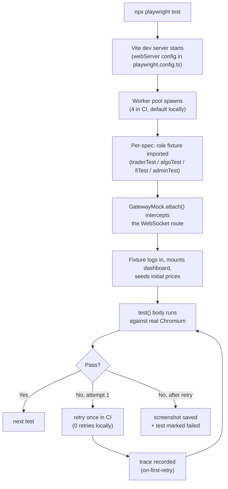

import testInventory from "@docs/data/test-inventory.json";

Playwright covers the composition layer: UI components rendered inside the real layout engine (flexlayout-react), Redux state hydrated from WebSocket messages, and routing under a real browser history stack. Failures here are typically integration bugs: a correctly-tested component placed in a context where its props arrive in the wrong order, or a panel hidden by a parent container at certain viewport widths. Unit tests cannot reach these because they exercise components in isolation.

Tests drive a real Chromium instance against the real frontend. The gateway is mocked with `GatewayMock` in most specs to keep results deterministic. See [Testcontainers](../../testcontainers/) for the suite that exercises the live stack.

**Location:** `frontend/tests/`
**Config:** [`frontend/playwright.config.ts`](https://github.com/milesburton/veta-trading-platform/blob/main/frontend/playwright.config.ts)
**Run:** `cd frontend && npx playwright test`
**Spec count:** {testInventory.frontend.playwright.files} files

## What's covered

| Spec | What it exercises |
|------|-------------------|
| `auth.spec.ts` | Login, session refresh, logout, OAuth callback |
| `orders.spec.ts` | Order ticket to blotter to fills, rejection paths |
| `algo-orders.spec.ts` | TWAP, VWAP, POV, Iceberg, Sniper submission and child orders |
| `market-data.spec.ts` | Live prices, charts, heatmap, depth ladder |
| `fixed-income.spec.ts` | FI persona, FI-specific panels, bond pricing |
| `intelligence.spec.ts` | Analyst persona, LLM advisory, recommendation engine |
| `session-replay.spec.ts` | rrweb recording and admin playback |
| `observability.spec.ts` | Logs drawer, alert centre, kill switch |
| `panels.spec.ts` | Panel picker, add/remove panels, persistence |
| `panel-walkthrough.spec.ts` | Touches every panel to confirm none crashes |
| `dashboard-drag.spec.ts` | flexlayout-react drag/drop, tab moves |
| `workflows.spec.ts` | Multi-step persona scenarios |
| `connection-recovery.spec.ts` | Gateway disconnect and reconnect handling |
| `ui.spec.ts` | Themes, header chrome, build-info chip |
| `visual-anomalies.spec.ts` | DOM overflows and axe-core (see [Visual anomalies](../visual-anomalies/)) |
| `screenshots.spec.ts` | Captures published screenshots for the docs site |

## How a Playwright test executes



Tests run independently. Each spawns its own `GatewayMock`, so message-shape changes in one spec do not bleed into another.

### Local vs CI

| Aspect | Local | CI |
|---|---|---|
| Vite dev server | spawned by Playwright | spawned by Playwright |
| Workers | default (CPU-detected) | 4 |
| Retries | 0 | 1 |
| Trace | `on-first-retry` (never recorded locally without `--retries 1`) | recorded on first retry, uploaded as artefact |
| Browser | Chromium | Chromium (headless) |

## Custom fixtures (by role)

The suite exports four role-specific fixtures from [`tests/helpers/fixtures.ts`](https://github.com/milesburton/veta-trading-platform/blob/main/frontend/tests/helpers/fixtures.ts):

```typescript
import { traderTest as test } from "./helpers/fixtures.ts";

test("trader can submit a limit order", async ({ app, gateway, ticket, blotter }) => {
  await ticket.fill({ asset: "AAPL", side: "BUY", qty: 100, price: 185 });
  await ticket.submit();
  await blotter.expectOrderRow("AAPL", "BUY", 100);
});
```

Available fixtures:

- **`traderTest`**: logs in as the default cash-equity trader, mounts the trader dashboard, returns `app`, `gateway`, `ticket`, `blotter`.
- **`algoTest`**: logs in as algo trader with TWAP/VWAP permissions.
- **`fiTest`**: logs in as fixed-income trader, mounts FI workspace.
- **`adminTest`**: logs in as admin, mounts admin dashboard with Mission Control panels.

Each fixture handles auth, layout reset, and initial price seeding before yielding the test context.

## Page objects

`tests/helpers/pages/` holds one class per major panel:

- **`AppPage`**: login, navigation, dashboard-ready waits.
- **`OrderTicketPage`**: fill fields, select strategy, submit, assert disabled states.
- **`OrderBlotterPage`**: find rows, assert order states, cancel rows.
- **`MarketLadderPage`**: depth-ladder interactions.

Page objects own selectors so that when a `data-testid` changes only one file needs updating. They also own async sequencing so tests do not accumulate ad-hoc `waitForSelector` calls.

## GatewayMock

[`tests/helpers/GatewayMock.ts`](https://github.com/milesburton/veta-trading-platform/blob/main/frontend/tests/helpers/GatewayMock.ts) is a WebSocket route handler that intercepts the gateway connection and replays scripted messages. User shapes are sourced from `authFixtures.ts`, re-exported from `GatewayMock` to avoid duplicate type definitions in test code.

Typical use inside a test:

```typescript
await gateway.sendMarketUpdate({ AAPL: 186.0 });
await gateway.acknowledgeOrder({ orderId: "o-1", state: "OPEN" });
await gateway.sendFill({ orderId: "o-1", qty: 50, price: 186.0 });
```

To exercise the live gateway instead, omit `GatewayMock.attach()`; the dev server will proxy traffic to a running backend.

## Config

- **Browser:** Chromium only. The packaged Electron app uses the same engine, so cross-browser parity is not a requirement.
- **Retries:** 1 in CI, 0 locally.
- **Workers:** 4 in CI. Specs are independent; each constructs its own `GatewayMock`.
- **Test timeout:** 30s.
- **Tracing:** `on-first-retry`. The trace zip uploads as a CI artefact on retry.
- **Screenshot:** `only-on-failure`.

The Vite dev server starts automatically before tests run.

## Test selection

Specs are grouped by fixture (`traderTest`, `algoTest`, `fiTest`, `adminTest`) rather than by tag. No `@flaky` or `@a11y` tags are used.

```sh
npx playwright test --grep "trader"   # specs that import traderTest
```

To run a single spec:

```sh
npx playwright test orders.spec.ts
```

## Adding a test

1. Create `tests/my-flow.spec.ts`.
2. Import the appropriate role fixture: `import { traderTest as test } from "./helpers/fixtures.ts";`.
3. Use the destructured `{ app, gateway, ticket, blotter }`. Do not re-implement auth.
4. If the test touches a panel that does not have a page object yet, write one in `tests/helpers/pages/`. Convention: methods return `Promise<this>` for chaining, selectors live as private readonly fields, every public method waits for its target before acting.
5. If the test needs gateway behaviour `GatewayMock` does not support yet, add a method there rather than calling `page.route()` inline. Centralised mock behaviour prevents specs from diverging on message shapes.
