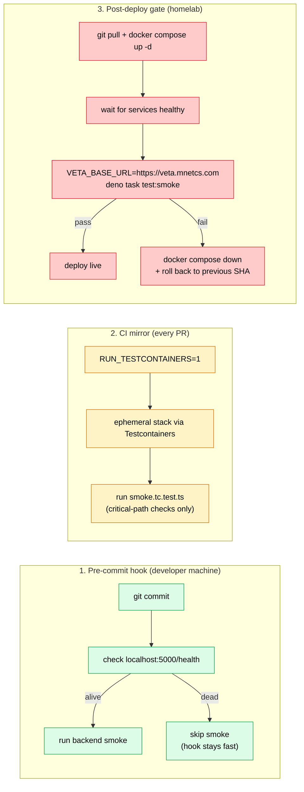

import testInventory from "@docs/data/test-inventory.json";

Smoke tests cover the deployment layer: Traefik routing, OAuth client configuration, environment variables in the systemd unit, gateway-to-service connectivity. These failures do not appear in source-controlled code and therefore cannot be caught by any other suite. Smoke runs against the live stack and verifies each service is reachable through its production-equivalent ingress path.

Smoke does not assert correctness of business logic; that is the job of [unit](../unit/) and [integration](../../testcontainers/) tests. It asserts only that requests reach handlers and return well-formed responses. The homelab deploy script gates rollout on smoke success and rolls back on failure.

The platform has two distinct smoke suites: one backend, one frontend. They run at different lifecycle points.

## Where smoke runs



Each lifecycle point answers a different question. Pre-commit catches "did I break the local stack". The CI mirror catches "would this break the stack as wired in production". The post-deploy gate catches "is the actual production deployment serving traffic right now". The same source file (`smoke.test.ts`) runs in all three contexts; only the target URLs differ.

## Backend smoke

**File:** [`backend/src/tests/smoke.test.ts`](https://github.com/milesburton/veta-trading-platform/blob/main/backend/src/tests/smoke.test.ts)
**Run:** `deno task test:smoke`
**Checks:** {testInventory.backend.smoke.cases} cases across all {testInventory.platform.supervisordServices} services in `supervisord.conf`

The backend smoke suite walks every service URL and asserts:

- `/health` returns 200 with the expected JSON shape (`status`, `version`, `uptime`).
- Service-specific endpoints (`/prices` for market-sim, `/orders` for OMS, `/strategies` for algo services, etc.) reach their handlers without 5xx errors.
- WebSocket gateways accept connections and emit at least one frame within 5 seconds.

It targets a real running stack: local dev compose, the homelab, or a remote URL via `VETA_BASE_URL`:

```sh
deno task test:smoke                              # localhost
VETA_BASE_URL=https://veta.mnetcs.com deno task test:smoke
```

When `VETA_BASE_URL` is set, the URL mapping switches from `http://localhost:5xxx` to public paths like `/api/oms` so the same suite works against Traefik-fronted deployments.

### Where it runs

- **Pre-commit hook** ([.husky/pre-commit](https://github.com/milesburton/veta-trading-platform/blob/main/.husky/pre-commit), step `[7/9]`): runs if a stack is detected on localhost, otherwise auto-skips so the hook stays fast.
- **Post-deploy gate** on the homelab: after `git pull && docker compose up -d` the deploy script runs smoke against the freshly-restarted stack. A failure rolls the deploy back.
- **CI testcontainers mirror** (`smoke.tc.test.ts`): {testInventory.backend.testcontainers.perFile["smoke.tc.test.ts"]} critical-path checks against an ephemeral testcontainers stack. Runs in CI when `RUN_TESTCONTAINERS=1`.

The Testcontainers variant ([`smoke.tc.test.ts`](https://github.com/milesburton/veta-trading-platform/blob/main/backend/src/tests/smoke.tc.test.ts)) is a curated subset of the full smoke suite, including only checks that do not require external API credentials. It mirrors the post-deploy gate inside CI, catching the same class of bug (a service unreachable from its peers) without needing the homelab to be reachable from the CI runner.

## Frontend deploy-gate smoke

**File:** [`frontend/tests/gate/smoke.spec.ts`](https://github.com/milesburton/veta-trading-platform/blob/main/frontend/tests/gate/smoke.spec.ts)
**Run:** `cd frontend && npx playwright test --config playwright.gate.config.ts`
**Checks:** {testInventory.frontend.gateSmoke.cases} end-user-flow assertions

The frontend smoke is a small Playwright suite that runs against a deployed environment, not the dev stack. It verifies the user-visible surface is wired up:

1. Login page renders (homepage is reachable, no 502).
2. `/sessions/me` returns 401 for an anonymous request (the user-service is routable through the gateway and is gating on auth).
3. After OAuth login, the dashboard mounts and the gateway-proxied market-sim `/prices` endpoint returns price data within 30s (the full happy path works).
4. A WebSocket to the gateway emits at least one `marketUpdate` frame within 10s (real-time data is flowing).

This is the gate that decides whether a deploy is good. If the backend smoke passes but this fails, the deployment's plumbing (Traefik routes, OAuth client config, WebSocket upgrade headers) is wrong: the services are up but the user-facing path is broken.

## Pre-commit auto-skip behaviour

The pre-commit hook checks whether `http://localhost:5000/health` responds with HTTP 200 before running smoke. If not, it prints `Services not fully running - skipping smoke tests.` and continues. Two reasons:

- **Tight edit loop:** iterating on a backend file without the stack running would otherwise spuriously fail every commit.
- **CI safety net:** the `lint-and-test` CI job spins up the full stack with docker-compose before running smoke, so the local auto-skip does not hide regressions; they are caught one push later.

The same skip applies to integration tests at step `[8/9]`.

## Scope

Smoke does not verify trading logic, P&L math, FIX message shapes, or any business behaviour. Those are covered by [unit](../unit/) and [integration](../../testcontainers/) tests. Smoke is the layer that verifies delivery: that the unit-tested code reached production unmangled.

A smoke failure means the deploy is broken. A unit or integration failure means the code is broken. The runbooks for these two are different.
