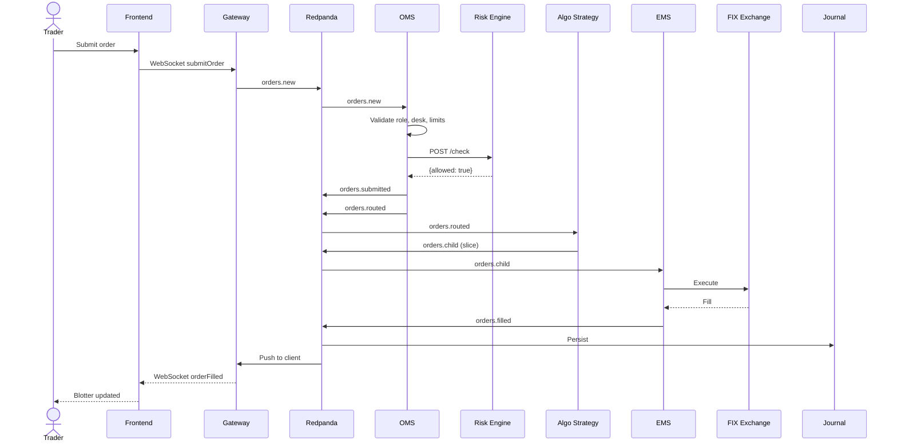

VETA is a multi-service trading platform connected by a **Redpanda message bus** (Kafka-compatible). The React frontend talks to a single **API Gateway** — the only service the browser can reach. Everything else communicates via bus topics.

## System architecture

```mermaid
graph TB
    subgraph Client["Client Layer"]
        FE["React Frontend<br/><i>Vite / Electron</i>"]:::client
    end

    subgraph Gateway["API Gateway :5011"]
        GW["Gateway (BFF)<br/><i>WebSocket hub + HTTP proxy</i>"]:::gateway
    end

    subgraph Bus["Redpanda Message Bus :9092"]
        KAFKA["Kafka-compatible pub/sub"]:::bus
    end

    subgraph Trading["Order Management"]
        OMS["OMS :5002<br/><i>Validation + routing</i>"]:::trading
        EMS["EMS :5001<br/><i>Execution + FIX bridge</i>"]:::trading
        RISK["Risk Engine :5032<br/><i>6 pre-trade checks</i>"]:::risk
    end

    subgraph Algos["Algo Strategies"]
        LIMIT["LIMIT :5003"]:::algo
        TWAP["TWAP :5004"]:::algo
        POV["POV :5005"]:::algo
        VWAP["VWAP :5006"]:::algo
        ICEBERG["ICEBERG :5021"]:::algo
        SNIPER["SNIPER :5022"]:::algo
        AP["ARRIVAL_PRICE :5023"]:::algo
        MOM["MOMENTUM :5025"]:::algo
        IS["IS :5026"]:::algo
    end

    subgraph Market["Market Data"]
        MSIM["Market Sim :5000<br/><i>GBM price engine</i>"]:::market
        MDS["Market Data :5015<br/><i>Alpha Vantage / Polygon</i>"]:::market
        MDA["Adapters :5016<br/><i>Earnings + economic</i>"]:::market
    end

    subgraph Analytics["Analytics & Intelligence"]
        ANA["Analytics :5014<br/><i>Black-Scholes / Monte Carlo</i>"]:::analytics
        FE_ENG["Feature Engine :5017"]:::analytics
        SIG["Signal Engine :5018"]:::analytics
        REC["Recommendation :5019"]:::analytics
        SCEN["Scenario Engine :5020"]:::analytics
    end

    subgraph Persistence["Data Stores"]
        JOURNAL["Journal :5009<br/><i>PostgreSQL</i>"]:::storage
        FIXARC["FIX Archive :5012<br/><i>Execution reports</i>"]:::storage
        USER["User Service :5008<br/><i>OAuth2 + RBAC</i>"]:::storage
        REPLAY["Session Replay :5031<br/><i>rrweb recordings</i>"]:::storage
    end

    subgraph Microstructure["Market Microstructure"]
        FIXEX["FIX Exchange :9880<br/><i>Matching engine</i>"]:::fix
        DARK["Dark Pool :5027"]:::fix
        CCP["CCP :5028<br/><i>Central clearing</i>"]:::fix
        RFQ["RFQ :5029<br/><i>Request for quote</i>"]:::fix
    end

    subgraph Support["Support Services"]
        NEWS["News :5013<br/><i>Sentiment scoring</i>"]:::support
        LLM["LLM Advisory :5024<br/><i>Ollama</i>"]:::support
        OBS["Observability :5007"]:::support
    end

    FE <-->|"WebSocket + HTTP"| GW
    GW <-->|"pub/sub"| KAFKA
    KAFKA --- OMS
    OMS -->|"POST /check"| RISK
    OMS -->|"orders.routed"| KAFKA
    KAFKA --- LIMIT & TWAP & POV & VWAP & ICEBERG & SNIPER & AP & MOM & IS
    KAFKA --- EMS
    EMS --- FIXEX
    KAFKA --- JOURNAL & FIXARC
    GW -->|"auth validate"| USER
    KAFKA --- MSIM
    KAFKA --- ANA & FE_ENG & SIG & REC & SCEN
    KAFKA --- NEWS & LLM & OBS
    KAFKA --- DARK & CCP & RFQ
    KAFKA --- MDS & MDA
    KAFKA --- REPLAY

    classDef client fill:#818cf8,stroke:#6366f1,color:#fff
    classDef gateway fill:#f59e0b,stroke:#d97706,color:#000
    classDef bus fill:#64748b,stroke:#475569,color:#fff
    classDef trading fill:#22c55e,stroke:#16a34a,color:#000
    classDef risk fill:#ef4444,stroke:#dc2626,color:#fff
    classDef algo fill:#38bdf8,stroke:#0ea5e9,color:#000
    classDef market fill:#a78bfa,stroke:#8b5cf6,color:#000
    classDef analytics fill:#fb923c,stroke:#f97316,color:#000
    classDef storage fill:#2dd4bf,stroke:#14b8a6,color:#000
    classDef fix fill:#f472b6,stroke:#ec4899,color:#000
    classDef support fill:#94a3b8,stroke:#64748b,color:#000
```

### Colour key

| Colour | Group | Services |
|--------|-------|----------|
| 🟣 Purple | Client | React Frontend |
| 🟡 Amber | Gateway | API Gateway (BFF) |
| 🟢 Green | Trading | OMS, EMS |
| 🔴 Red | Risk | Risk Engine |
| 🔵 Blue | Algos | 9 algo strategies |
| 🟣 Violet | Market Data | Market Sim, Market Data, Adapters |
| 🟠 Orange | Analytics | Analytics, Feature/Signal/Recommendation/Scenario engines |
| 🟢 Teal | Storage | Journal, FIX Archive, User Service, Session Replay |
| 🩷 Pink | Microstructure | FIX Exchange, Dark Pool, CCP, RFQ |
| ⚪ Grey | Support | News, LLM Advisory, Observability |

## Order flow

## Bus topics

| Category | Topics |
|----------|--------|
| Trading | `orders.new`, `orders.submitted`, `orders.routed`, `orders.child`, `orders.filled`, `orders.expired`, `orders.rejected`, `orders.cancelled` |
| Algo | `algo.heartbeat` |
| FIX | `fix.execution` |
| News | `news.feed`, `news.signal` |
| Intelligence | `market.features`, `market.signals`, `market.recommendations` |

## Authentication

Sessions are stored as `veta_user` HTTP-only cookies set by the User Service via OAuth2 authorization-code flow with PKCE. The Gateway validates this cookie on every request (cached 10 seconds). The OMS independently fetches limits from the User Service (cached 30 seconds).

Roles: `trader`, `desk-head`, `risk-manager`, `admin`, `compliance`, `sales`, `external-client`, `viewer`. Only `trader` can submit orders.

See [RBAC & Permissions](/veta-trading-platform/reference/rbac/) and [Trading Styles](/veta-trading-platform/reference/trading-styles/) for details.
