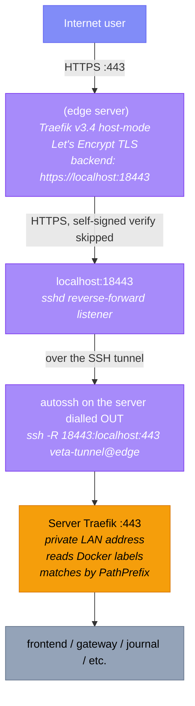

The server sits on a private LAN with no inbound NAT. Public traffic
reaches it via a **secure tunnel** that the server dials *out* to
the edge server. The edge server terminates TLS, forwards into the
tunnel, and the server's internal Traefik routes to services from there.

This page documents the full chain end-to-end. For day-to-day operation
of the trading services see [Architecture](../architecture). For the
liveness probe that watches this chain see
[Synthetic probe](../supporting/synthetic-probe).

## The chain



## Edge server

A single dedicated edge server (`<edge-server>`). VETA is one of several tenants. The synthetic
probe also runs here (see [Synthetic probe](../supporting/synthetic-probe)).

Source: [`edge/`](https://github.com/milesburton/veta-trading-platform/tree/main/edge)

### Traefik configuration

Static config in [`edge/traefik.yml`](https://github.com/milesburton/veta-trading-platform/blob/main/edge/traefik.yml):

- `:80` web entrypoint redirects everything to `:443`
- `:443` websecure entrypoint
- Dashboard disabled (`api.dashboard: false`)
- ACME `letsencrypt` resolver using HTTP-01 challenge on `:80`
- `serversTransport.insecureSkipVerify: true` (see below)

Dynamic config in [`edge/dynamic.yml`](https://github.com/milesburton/veta-trading-platform/blob/main/edge/dynamic.yml):

- Single router: ``Host(`veta.mnetcs.com`)`` to backend `https://localhost:18443`
- Rate-limit middleware: 60 req/avg, 120 burst, sourced from client IP
  (`ipStrategy.depth: 0` trusts no proxies; correct when Cloudflare
  proxy is in DNS-only mode)
- Security-headers middleware: HSTS preload, CSP, frame-deny, etc.
- Offline-holding-page middleware: catches 5xx and 404 from the backend
  and serves a fallback page (see below)

### Offline holding page

When the secure tunnel is down, the server's backend returns a 5xx, or the
homelab Traefik is up but has no backend containers registered to route to
(a plain 404 through a live tunnel), the edge Traefik redirects the visitor
to a "VETA is temporarily offline" page instead, using Traefik's built-in
`errors` middleware:

```yaml
services:
  veta-status-fallback:
    loadBalancer:
      servers:
        - url: "http://127.0.0.1:8081"

middlewares:
  offline-holding-page:
    errors:
      status:
        - "404"
        - "500-599"
      statusRewrites:
        "404": 302
        "500-599": 302
      service: veta-status-fallback
      query: "/"
```

404 is caught alongside 5xx because a live tunnel with a healthy homelab
Traefik but zero application containers running (all services stuck in a
failed `Created` state, only infrastructure like Postgres/Redpanda up)
produces Traefik's own "no matching router" 404, a normal HTTP response,
not a connection failure. That reached a real browser once (2026-08-11)
before this was added. This is safe to catch broadly here since the app
is a SPA with no routes that should genuinely 404 for an end user.

The fallback target is the [status page](/veta-trading-platform/status/) published as
part of this Astro docs site — it deploys to GitHub Pages independently of the
server, so it stays reachable exactly when the primary origin is not.

Two separate problems had to be solved to make this actually redirect a
real browser, not just look correct in a spot-check:

**1. `errors` proxies a body, it does not redirect on its own.** There is no
config option for it to emit a 3xx directly
([traefik/traefik#9356](https://github.com/traefik/traefik/issues/9356),
closed unimplemented). Proxying the status page's HTML directly under
`veta.mnetcs.com` was tried first and does not work: the page's CSS/JS/image
references are host-relative (correct for a site that must work from either
`milesburton.com` or the raw `github.io` domain), so they resolve against
`veta.mnetcs.com` when proxied in place and 502 too, leaving an unstyled page.
The fix is one extra, minimal container — `status-redirect` in
[`edge/compose.yml`](https://github.com/milesburton/veta-trading-platform/blob/main/edge/compose.yml),
a stock `nginx:1.27-alpine` running
[`edge/status-redirect.conf`](https://github.com/milesburton/veta-trading-platform/blob/main/edge/status-redirect.conf)
whose only job is `return 302` to the real status page URL. `errors` proxies
to this nginx instead of the docs site directly.

**2. `errors` preserves the *original* status code by default.** Proxying to
the nginx redirect above is not sufficient on its own: without
`statusRewrites`, the client receives the triggering request's original 5xx
status with the fallback's `Location` header attached — and browsers do not
act on a `Location` header unless the status is 3xx, so nothing visibly
happens; the visitor still sees a blank error. This is documented, intentional
Traefik behaviour prior to `statusRewrites`
([traefik/traefik#10720](https://github.com/traefik/traefik/issues/10720)),
and `statusRewrites` itself only exists from **Traefik v3.4** onward
(added in [#11520](https://github.com/traefik/traefik/pull/11520)) — this is
why the edge box runs v3.4.5 rather than v3.3. Both failure modes shipped to
production once each during rollout before being caught; if this section is
ever simplified, keep the `statusRewrites` line.

This is a browser-facing convenience only — it changes nothing about the
underlying failure modes below, and does not paper over the tunnel or backend
actually needing to be restored.

### Why `insecureSkipVerify: true` is correct here

The destination is `localhost:18443`, reached only via the SSH reverse
tunnel from the server. The server Traefik presents a self-signed cert
on `:443`, and the SSH transport provides the real security. Cert
verification at this hop would be meaningless (it'd require shipping the
server's CA to the edge server) and would not improve security.

Do not "fix" this without redesigning the tunnel.

## The secure tunnel

Maintained by `autossh` running on the server. The connection is
*dialled out from the server*, so nothing inbound to the home router is
ever needed.

### How it works

```bash
# Runs as veta-tunnel.service on the server:
autossh -M 0 -N \
  -o ServerAliveInterval=30 -o ServerAliveCountMax=3 \
  -o ExitOnForwardFailure=yes \
  -o IdentitiesOnly=yes \
  -i /etc/veta-tunnel/id_ed25519 \
  -R 18443:localhost:443 \
  veta-tunnel@<edge-server>
```

The `-R 18443:localhost:443` reverse-forward tells the edge SSH daemon
to listen on `localhost:18443` and forward any connection to the
server's `:443`. `autossh` restarts the underlying `ssh` if it
exits (network blip, edge server reboot, etc.).

### Restricted tunnel user on the edge server

The server's public key on the edge server lives under user `veta-tunnel` with a
single `authorized_keys` entry:

```
restrict,port-forwarding,permitlisten="18443" ssh-ed25519 AAAAC3N...
```

- `restrict` denies pty / X11 / agent / user-rc / exec by default
- `port-forwarding` re-enables the one capability we need
- `permitlisten="18443"` allows reverse-forwarding only to port 18443

If the server is ever compromised, the worst an attacker can do via this
key is hold port 18443 open on the edge server. No shell, no other
forwards. They'd see the inbound HTTPS connections proxied through the
tunnel, but that's the public traffic anyway.

For install instructions see
[veta-tunnel.service](../supporting/veta-tunnel).

## Server Traefik

Once the request crosses the tunnel and arrives at the server's :443
port, the **server Traefik** routes it to one of ~30 backend services
based on PathPrefix labels on each Docker container.

Notably the server Traefik does not match on Host headers. Anything
that reaches its :443 entrypoint is treated as VETA traffic. This is safe
because nothing else can reach :443 on the server (private LAN, no
inbound NAT).

The server Traefik shares its docker network with two off-repo compose
projects. See
[Traefik](../supporting/traefik) for the routing detail.

## DNS

The DNS zone is managed via Cloudflare in **DNS-only mode**
(grey cloud) for the deployment URL. The rate-limit middleware on the
edge Traefik trusts no proxies (`ipStrategy.depth: 0`), so enabling the
orange cloud would collapse all visitors' apparent IPs to Cloudflare
edge nodes and break per-IP rate limiting.

## Failure modes the synthetic probe catches

- **Edge Traefik dead**: all HTTPS connections fail at TLS handshake
- **Secure tunnel down**: edge Traefik returns 502 (no backend listening on
  `localhost:18443`)
- **Server Traefik dead**: edge Traefik can connect through the tunnel
  but the request hangs or returns connection-reset
- **Server gateway / user-service dead**: tunnel works, Traefik routes,
  service returns 5xx or doesn't respond

Of these, "secure tunnel down" and "server gateway / user-service dead" both
present to a browser as a 5xx from `veta-origin`, so both are caught by the
[offline holding page](#offline-holding-page) above — the probe still alerts
on the underlying failure, but visitors see the status page instead of a bare
502 while it's investigated.

Each of these surfaces within 3 probe cycles (~3 min) as a webhook
alert. See [Synthetic probe](../supporting/synthetic-probe) for the alert
plumbing.

## Failure modes the synthetic probe does **not** catch

- **TLS cert near expiry but not yet expired**: Let's Encrypt auto-renews;
  add a separate monitor if this becomes a concern
- **DDoS exhausting rate-limit buckets**: the probe shares the rate-limit
  bucket with everyone else on its IP; it would fail along with real users
  but the alert would still fire
- **Slow-but-not-dead**: the probe has a 10s per-step timeout; a service
  responding in 8s would pass

## Threat-model implications

The edge server is the only public-internet-facing component of VETA. Once
something is reachable through it, it's reachable from the entire
internet. No LAN-only assumption applies past this point.

Concrete implications:

- The `veta-tunnel` user has `/bin/false` as shell and restricted
  `authorized_keys`; it cannot open a shell or forward arbitrary ports.
- UFW on the edge server is not yet configured; relies on the absence of
  other listeners on `:80`/`:443` and the host's default firewall posture.
  Add UFW rules before going wider than friends-and-family.
- A separate security audit (deferred) should walk the gateway's auth
  surface before broadcasting the URL publicly.

See [Security posture](../security/) and
[Threat model](../threat-model/).

## Install / rebuild

If the edge server is rebuilt from scratch, follow these in order:

1. Clone repo to the edge server, install Traefik via `edge/compose.yml`
   (see [edge install](../supporting/traefik/)).
2. Provision a dedicated `veta-tunnel` user on the edge server with restricted
   `authorized_keys` (see [veta-tunnel.service](../supporting/veta-tunnel)).
3. Generate the tunnel keypair on the server and install
   `veta-tunnel.service` there (same page as step 2).

After ~30 s the tunnel is up and the deployment URL is live.

For the server side of deployment (auto-pull, prune, etc.) see:

- [veta-auto-pull](../supporting/veta-auto-pull): main to server continuous deploy
- [veta-host-prune](../supporting/veta-host-prune): weekly Docker prune
- [Synthetic probe](../supporting/synthetic-probe): outside-in liveness check
