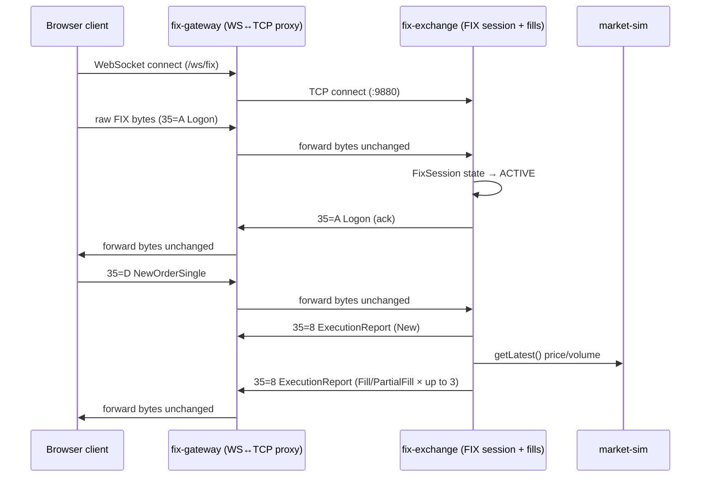
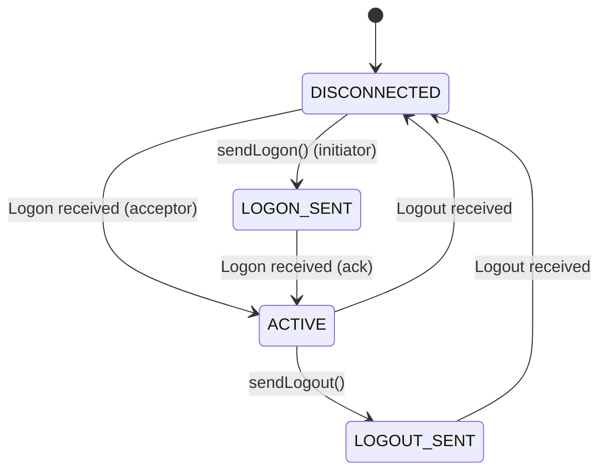

## Overview

VETA runs a small, self-contained FIX 4.4 stack as a second, parallel order-entry path
alongside the HTTP/OMS path used by the rest of the platform. It is three independent
services:

1. **`fix-gateway`** — a WebSocket-to-TCP proxy. It has no knowledge of FIX message
   content; it exists so a browser client can hold a TCP-like connection without a raw
   TCP socket.
2. **`fix-exchange`** — the actual FIX endpoint. It owns FIX session state (logon,
   heartbeat, sequence numbers) and processes `NewOrderSingle`, synthesizing fills from
   the live market-sim price feed.
3. **`fix-archive`** — a Postgres-backed store with an HTTP query API for FIX execution
   reports.



**This is deliberately not the architecture a production FIX gateway would have.** There
is no message translation layer, no dictionary validation at the gateway, and no
persistence of every message in transit. It is scoped to be a realistic-enough FIX 4.4
wire protocol for a client to practise against, backed by a simulated fill engine that
shares logic with `ems-server.ts`'s participation-cap model. See
[Known gaps](#known-gaps-and-not-yet-implemented) below for what a closer-to-production
version would need.

## Wire format

Standard FIX tag=value format with `0x01` (SOH) as the field separator, implemented in
`backend/src/fix/fix-parser.ts`:

```
8=FIX.4.4␁9=<BodyLength>␁35=<MsgType>␁...␁10=<CheckSum>␁
```

- `BodyLength` (tag 9) is computed as the byte length of everything between the tag-9
  field and the tag-10 field, per spec.
- `CheckSum` (tag 10) is the sum of all preceding bytes modulo 256, zero-padded to 3
  digits.
- `encode()`/`decode()` are pure functions with no external state — `decode()` returns a
  `Map<number, string>` of every tag present, `encode()` takes an ordered array of body
  tags and prepends/appends the header and checksum.

### Tag dictionary

`backend/src/fix/fix-dictionary.ts` defines a **minimal subset** of FIX 4.4 tags — only
what the session layer and `NewOrderSingle`/`ExecutionReport` flow need. There is no
tag-level validation (unknown tags are neither rejected nor stripped; `decode()` simply
includes whatever tags were present).

| Tag | Name | Used for |
| --- | --- | --- |
| 8 | BeginString | Always `FIX.4.4` |
| 9 | BodyLength | Computed by `encode()` |
| 35 | MsgType | See message types below |
| 34 | MsgSeqNum | Tracked per session by `FixSession` |
| 49 / 56 | SenderCompID / TargetCompID | Exchange's own SenderCompID is fixed (`EXCHANGE`); TargetCompID resolves per-connection to the counterparty's SenderCompID once Logon succeeds — see [counterparty identity](#counterparty-identity-and-venue-routing) |
| 52 | SendingTime | Set by `utcTimestamp()` on every outbound message |
| 108 | HeartBtInt | Defaults to 30s |
| 98 | EncryptMethod | Always `0` (none) — this is a simulator, not a production link |
| 112 | TestReqID | Round-tripped for heartbeat liveness checks |
| 7 / 16 | BeginSeqNo / EndSeqNo | Used in ResendRequest / gap-fill |
| 36 | NewSeqNo | Used in SequenceReset |
| 11 | ClOrdID | Client order ID, echoed on every ExecutionReport |
| 55 / 54 / 38 / 44 / 40 / 59 | Symbol / Side / OrderQty / Price / OrdType / TimeInForce | Order fields |
| 17 / 150 / 39 | ExecID / ExecType / OrdStatus | Execution report fields |
| 151 / 14 / 6 / 32 / 31 | LeavesQty / CumQty / AvgPx / LastQty / LastPx | Fill quantities |
| 100 / 21 / 1 | ExDestination / HandlInst / Account | ExDestination validated against a venue-capabilities registry; HandlInst read and logged only (this simulator always auto-executes); Account flows through to the ExecutionReport and `fix.execution` — see [counterparty identity](#counterparty-identity-and-venue-routing) |

### Supported message types

| MsgType | Name | Direction | Handled by |
| --- | --- | --- | --- |
| A | Logon | Both | `FixSession` |
| 5 | Logout | Both | `FixSession` |
| 0 | Heartbeat | Both | `FixSession` |
| 1 | TestRequest | Both | `FixSession` (liveness probe) |
| 2 | SequenceReset | Both | `FixSession` (gap-fill) |
| 3 | ResendRequest | Both | `FixSession` |
| D | NewOrderSingle | Inbound only | `fix-exchange.ts`'s `handleApplicationMessage` |
| 8 | ExecutionReport | Outbound only | `fix-exchange.ts` |

Every other `MsgType` value is accepted at the parser level but produces no application
response — `handleApplicationMessage` returns immediately if `msgType !== NewOrderSingle`
(`fix-exchange.ts`). There is no `OrderCancelRequest`, `OrderCancelReplaceRequest`, or
`OrderCancelReject` handling despite tags/constants existing for some of these in earlier
drafts of the dictionary; a cancel sent today is silently ignored.

## Session management

`FixSession` (`backend/src/fix/fix-session.ts`) is a small state machine independent of
transport — it is constructed once per TCP connection in `fix-exchange.ts` and driven by
raw bytes via `handleInbound()`.



`fix-exchange.ts` always plays the acceptor role — every inbound TCP connection starts a
fresh `FixSession` in `DISCONNECTED` and transitions straight to `ACTIVE` on receiving the
client's Logon.

### Sequence numbers and gap-fill

- Inbound and outbound `MsgSeqNum` are tracked independently (`inSeq`/`outSeq`), starting
  at 1.
- If an inbound message's sequence number is **greater** than expected, `FixSession`
  sends a `ResendRequest` covering the gap and does not process the out-of-order message
  further.
- On receiving a `ResendRequest`, the session does not actually resend prior messages (it
  keeps no message history) — it responds with a `SequenceReset`/gap-fill jumping straight
  to the requested end sequence. This is sufficient to keep both sides' counters in sync
  but means a client that genuinely needs replay of missed application messages cannot get
  them from `fix-exchange` itself.
- `SequenceReset` on the inbound side simply overwrites `inSeq` to the new value with no
  further checks.

### Heartbeat and liveness

`startHeartbeat(intervalSecs)` runs on a `setInterval` at the negotiated `HeartBtInt`. Each
tick: if a `TestRequest` sent on the previous tick was never acknowledged, the session logs
a timeout and disconnects; otherwise it sends a fresh `TestRequest` and waits for the next
tick to check the reply arrived. There is no separate "send Heartbeat at half the interval"
behavior — liveness is entirely TestRequest/Heartbeat-response driven, once per
`heartBtInt`.

## fix-exchange: order handling and simulated fills

`fix-exchange.ts` listens on TCP `:9880` (configurable via `FIX_EXCHANGE_PORT`) and a
separate plain-HTTP health endpoint on `:9879` (hardcoded as `FIX_EXCHANGE_PORT - 1`).

On a `NewOrderSingle`, three gates run in order before any fill logic — the first to
reject sends an `ExecutionReport` with `ExecType=Rejected`/`OrdStatus=Rejected` and a
`Text` reason, and stops processing:

1. **Venue routing.** If `ExDestination` is set, it is resolved against a backend port of
   the frontend's `venue-capabilities.ts` registry (`backend/src/fix/venue-registry.ts`)
   and validated against the order's `OrdType`/`OrderQty` — e.g. a market order routed to
   IEX, or a quantity below a dark venue's minimum, is rejected here. An absent
   `ExDestination` is always valid (venue routing is optional, not required).
2. **Market-hours gate** (ADR 0003 Phase 6). Rejects if the current `sessionPhase` —
   read from the same `marketClient` connection used for fills, no separate connection —
   is `HALTED` or `CLOSED`. An order received before the first market-sim tick arrives
   (`sessionPhase` still `undefined`) is treated as open, not rejected.
3. **Pre-trade risk check** (see [ADR 0004](../decisions/0004-fix-risk-check-without-oms-integration/)),
   only when `RISK_ENGINE_ENABLED` is not `"false"`. Calls risk-engine's `POST /check`
   directly — the same endpoint and request shape `oms-server.ts` already uses — with the
   counterparty's `SenderCompID` standing in for `userId`. Fails closed: any risk-engine
   error (timeout, non-2xx, malformed body, network failure) rejects the order rather than
   letting it through unchecked.
4. Only after all three pass: sends an `ExecutionReport` with `ExecType=New`,
   `OrdStatus=New`, `LeavesQty=<full order qty>`.

Then, for an accepted order:

1. Waits a randomized 10–50ms to simulate exchange latency.
2. Reads the current mid-price and volume for the order's symbol from
   `marketClient.getLatest()` — a live WebSocket connection to `market-sim`, the same
   `@veta/market-client` library every algo strategy and `ems-server.ts` use.
3. Synthesizes up to 3 partial fills via `computeFill()` (`backend/src/fix/fill-math.ts`),
   which caps each fill at `tickVolume × EMS_PARTICIPATION_CAP` (default 20%) and applies a
   market-impact price adjustment of `(filledQty / 1000) × EMS_IMPACT_PER_1000_BPS` basis
   points, worse for the order's side. This mirrors the participation-cap fill model used
   elsewhere in the platform's EMS (`ems/fill-math.ts`), but is a separate implementation,
   not a shared one.
4. Sends one `ExecutionReport` per fill slice (`ExecType=PartialFill` until the last,
   `Fill` on the slice that exhausts the order), with a 50–150ms gap between partials, and
   publishes a matching row to the Kafka topic `fix.execution` after each one — see
   [fix-archive](#fix-archive).

There is **no order book and no counterparty matching** — every fill is synthesized
against a snapshot price, not matched against another FIX client's resting order. Two
FIX clients trading the same symbol at the same time do not interact with each other.

## Counterparty identity and venue routing

Every FIX session still authenticates as the same exchange-side identity
(`SenderCompID=EXCHANGE`), but the counterparty side is no longer hardcoded. A Logon's
`SenderCompID` is checked against a static, env-configured counterparty table
(`backend/src/fix/counterparties.ts`, `FIX_COUNTERPARTIES=id:secret;id:secret`) —
unrecognized SenderCompIDs get a `Logout` in reply and the session never reaches `ACTIVE`.
Once accepted, the exchange addresses all further replies to that counterparty's
`SenderCompID` as `TargetCompID`, rather than a fixed `GATEWAY`.

This is intentionally scoped to "is this a provisioned counterparty," not a full
password-verified handshake — the minimal FIX 4.4 dictionary this exchange implements has
no `RawData`/`Password` tags (96/554) to check a credential against. Adding real
credential verification on Logon would need those tags added first.

The counterparty table starts as a static map, not a Postgres table, matching the
project's general pattern of starting simple and promoting to a real table only once
something besides Logon needs to query it.

`GET /sessions` on `fix-exchange`'s health port (`FIX_EXCHANGE_PORT - 1`) lists every
currently-connected TCP session: its remote address, resolved counterparty (`null` until
Logon succeeds), `FixSession` state, connect time, and open-order count. Entries are held
in an in-memory `Map` keyed by remote address, registered on connect and removed once the
connection's read loop exits — there is no persistence, so a `fix-exchange` restart clears
the list (the sessions themselves are gone too, so this matches reality). Proxied through
the gateway as `/api/fix-exchange/sessions`, gated to the same
`risk-manager`/`compliance`/`oncall`/`admin` roles as `fix-archive`, and surfaced in the
**FIX Sessions** dashboard panel (`fix-sessions`, in the System Status workspace) alongside
a recent-executions view backed by `fix-archive`'s `/executions`.

## fix-archive

A Postgres-backed HTTP service (`fix_archive.executions` table) exposing:

- `GET /health` — includes a live row count.
- `GET /executions?symbol=&from=&to=&limit=` — filtered, time-ranged query, newest first.
- `GET /executions/:execId` — single execution lookup.

Writes are batched: it consumes the Kafka topic `fix.execution` and flushes up to 50
pending rows every 50ms in a single transaction, upserting on `exec_id` so a repeated
partial-fill update (same `execId`, later `ordStatus`/`leavesQty`) overwrites in place
rather than duplicating rows. `fix-exchange.ts` is now one of four producers to this
topic, alongside `rfq-service.ts`, `dark-pool-server.ts`, and `ems-server.ts` — all four
send the same flat shape, including a nullable `account` field (migration
`0024_fix_archive_account.sql`) carrying through a NewOrderSingle's `Account` tag when
present.

## Known gaps and not-yet-implemented

This is an honest list, not aspirational — each item below is confirmed absent from the
current implementation, not merely undocumented. None of this is a defect relative to
what the platform currently promises: the FIX stack is explicitly a minimal,
self-contained simulator, not a production gateway.

- **No OMS integration.** `fix-exchange.ts` calls risk-engine's pre-trade check directly
  (see [ADR 0004](../decisions/0004-fix-risk-check-without-oms-integration/)) but does not
  route orders through OMS. FIX orders create no OMS order record, don't appear in OMS's
  `activeOrders` map, and aren't visible to the kill-switch or `journal` the way an
  HTTP-submitted order is.
- **No auction model.** An order submitted during `OPENING_AUCTION`/`CLOSING_AUCTION` on
  the FIX path behaves identically to a continuous-session order — see
  [ADR 0003](../decisions/0003-market-session-and-auction-enforcement/) Phase 7.
- **Rate limiting is coarse.** `fix-gateway`'s Traefik router applies a per-IP limit, but
  every FIX client is proxied through `fix-gateway.ts`'s single WS→TCP bridge, so this
  only ever sees each browser's IP at the WebSocket layer — it cannot distinguish
  counterparties once past that point. A tighter limit keyed on `SenderCompID` at
  `fix-exchange.ts` itself would need that layer added separately.
- **No password-verified Logon.** A Logon is accepted or rejected based on whether its
  `SenderCompID` is a provisioned counterparty (see
  [Counterparty identity and venue routing](#counterparty-identity-and-venue-routing)),
  not a credential check — the minimal FIX 4.4 dictionary this exchange implements has no
  `RawData`/`Password` tags (96/554) to check against.

## See also

- [Service map](../services/) — the FIX services' position in the service mesh.
- [Risk architecture](../risk-architecture/) — how the HTTP order path integrates
  pre-trade risk checks; the FIX path now calls the same risk-engine endpoint directly
  (see [ADR 0004](../decisions/0004-fix-risk-check-without-oms-integration/)), without the
  fuller OMS-routed integration the HTTP path has.
- [ADR 0003: market-session and auction enforcement](../decisions/0003-market-session-and-auction-enforcement/) —
  the FIX path's session-hours reject (Phase 6) is implemented; the auction model
  (Phase 7) is not.
- [ADR 0004: FIX pre-trade risk checks without full OMS integration](../decisions/0004-fix-risk-check-without-oms-integration/) —
  what closing the risk-check gap did and did not do.
