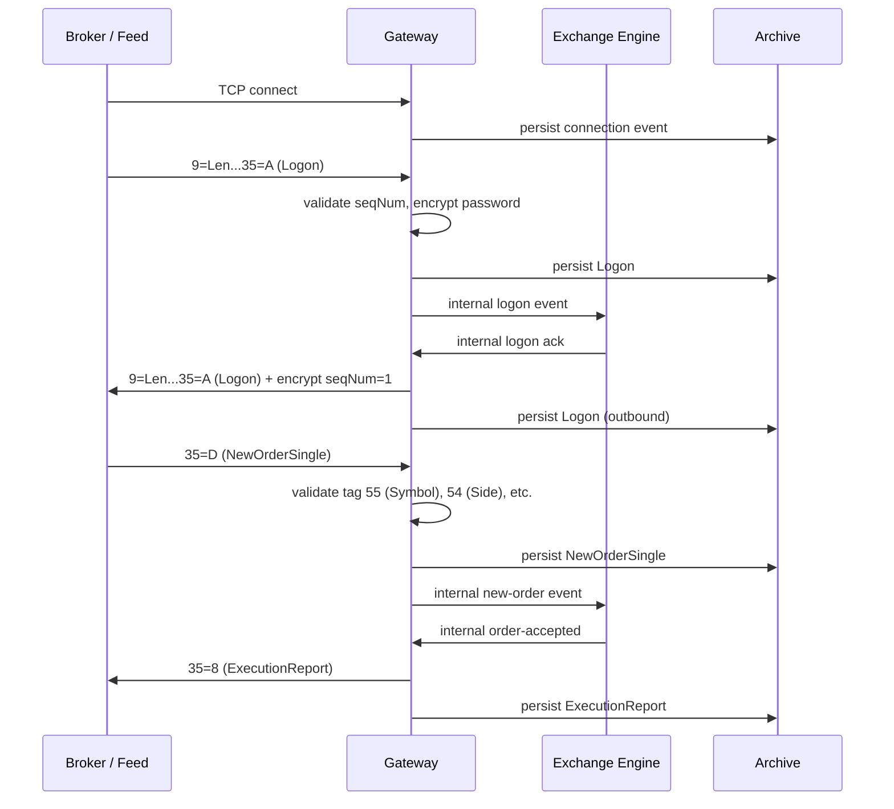
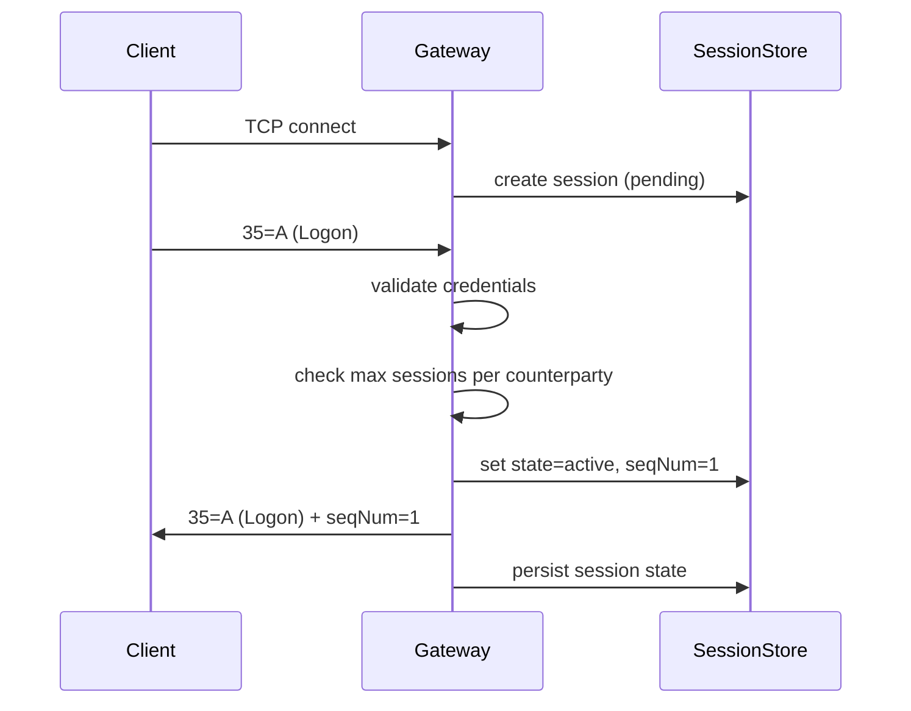
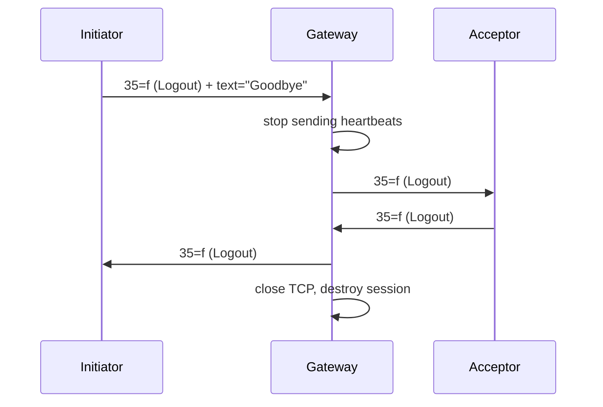

## Overview

VETA implements a **FIX 4.4** session layer on top of its internal event-driven
architecture. The gateway exposes a single TCP listener (`:9100`) that accepts
FIX sessions from external brokers, market data feeds, and the internal exchange
engine.

The gateway's role is threefold:

1. **Session management** — TCP keepalive, sequence number reconciliation,
   logon/logout, and reconnection handling.
2. **Message translation** — FIX → internal JSON → internal → FIX, with
   dictionary validation on both sides.
3. **Archive** — every inbound and outbound FIX message is persisted to the
   archive service for replay and audit.



## Wire format

FIX messages use the standard **tag=value** format with `0x01` (SOH / ASCII 1)
as the field separator. Every message begins with a length header:

```
9=|MessageLength|<SOH>8=|Timestamp|<SOH>35=|MsgType|<SOH>...
```

The gateway enforces the following constraints on all inbound messages:

- Maximum message length: **65 535 bytes** (configurable, default 32 KB)
- Required tags per message type (per FIX 4.4 spec)
- Sequence numbers must be monotonically increasing within a session
- No duplicate `MsgSeqNum` values
- `TargetCompID` must match a registered counterparty
- `HeartBtInt` must be between 10 and 120 seconds

### Tag dictionary

The gateway carries a **subset** of the FIX 4.4 dictionary. Only tags relevant
to the supported message types are validated. Unsupported tags are silently
stripped on outbound messages.

| Tag | Name | Type | Required? | Notes |
|-----|------|------|-----------|-------|
| 8 | BeginString | String | Always | `"FIX.4.4"` |
| 9 | BodyLength | int | Always | Length of message after this tag |
| 35 | MsgType | String | Always | `A`, `D`, `F`, `8`, `W`, etc. |
| 34 | MsgSeqNum | int | Always | Monotonically increasing |
| 43 | PossDupFlag | Boolean | Conditional | `Y` for replayed messages |
| 49 | SenderCompID | String | Always | VETA gateway ID |
| 50 | SenderSubID | String | Optional | Sub-account identifier |
| 52 | SendingTime | UTCTimestamp | Always | |
| 56 | TargetCompID | String | Always | Counterparty ID |
| 95 | PossResend | Boolean | Conditional | `Y` on resend request |
| 96 | EncryptMethod | int | Conditional | `0` = plaintext (production) |
| 108 | HeartBtInt | int | Conditional | Seconds between heartbeats |
| 123 | LastMsgSeqNumProcessed | int | Conditional | On gap-fill messages |
| 141 | ResetSequence | Boolean | Conditional | `Y` on logon for full reset |
| 453 | NoSides | int | Conditional | Number of legs in multi-leg orders |

### Supported message types

| MsgType | Name | Direction | Description |
|---------|------|-----------|-------------|
| A | Logon | Both | Session establishment |
| D | NewOrderSingle | Inbound | Client order submission |
| 8 | ExecutionReport | Outbound | Order fill / reject / cancel |
| W | CancelRequest | Inbound | Client order cancellation |
| 9 | CancelReject | Outbound | Rejected cancellation |
| F | OrderCancelReplaceRequest | Inbound | Replace an existing order |
| 5 | OrderCancelReject | Outbound | Rejected replace |
| 0 | Heartbeat | Both | Keepalive |
| 3 | ResendRequest | Both | Gap-fill request |
| 2 | SequenceReset | Both | Gap-fill / reset |
| 5f | Logout | Both | Session termination |

## Session management

### Logon flow



The gateway supports **one active session per counterparty**. If a new logon
arrives while a session is active, the old session is terminated with a Logout
and the new session takes its place.

### Sequence number reconciliation

The gateway tracks both `MsgSeqNum` (outbound) and `TargetMsgSeqNum`
(inbound) per session. On receipt of a message with an unexpected sequence
number:

1. If the gap is **≤ 1000**, the gateway sends a `ResendRequest` (35=3)
   covering the missing range.
2. If the gap is **> 1000**, the gateway sends a `SequenceReset` (35=2)
   with `PossDupFlag=N` and resets both sequence numbers to the received
   value.
3. If the received sequence is **behind** the expected value, the gateway
   sends a `GapFill` (35=2) with `LastMsgSeqNumProcessed` set to the
   received value and discards the out-of-order message.

### Heartbeat and keepalive

The gateway enforces a **3× heartbeat interval** timeout. If no message is
received within this window, the session is terminated and the TCP connection
is closed.

The gateway sends a Heartbeat (35=0) at **half the HeartBtInt interval**.
Clients must respond with a Heartbeat or any other message within the timeout
window.

### Logout flow



The gateway **does not** send a Logout on TCP close. It relies on the
heartbeat timeout to detect disconnections.

## Gateway routing

The gateway routes messages to internal services based on `MsgType`:

| MsgType | Internal service | Queue |
|---------|-----------------|-------|
| D (NewOrderSingle) | Order Management Service | `orders.inbound` |
| W (CancelRequest) | Order Management Service | `orders.inbound` |
| F (OrderCancelReplaceRequest) | Order Management Service | `orders.inbound` |
| 8 (ExecutionReport) | Portfolio Service | `portfolio.executions` |
| 5 (OrderCancelReject) | Order Management Service | `orders.inbound` |
| 35=2 (SequenceReset) | Session store | internal |
| 35=3 (ResendRequest) | Session store | internal |

### Internal message format

The gateway translates FIX messages to an internal JSON format before publishing
to the event bus:

```json
{
  "type": "new_order_single",
  "version": 1,
  "payload": {
    "clOrdId": "VETA-20260617-001",
    "symbol": "AAPL",
    "side": "Buy",
    "ordType": "Limit",
    "price": 185.50,
    "quantity": 100,
    "timeInForce": "Day",
    "senderCompID": "BROKER01",
    "targetCompID": "VETA",
    "msgSeqNum": 42,
    "timestamp": "2026-06-17T10:30:00.123Z"
  }
}
```

The reverse translation (internal → FIX) follows the same mapping in the
opposite direction, with required tags added and optional tags omitted if
unset.

## Archive service

Every FIX message that passes through the gateway is persisted to the archive
service. The archive provides:

- **Full message replay** — replay a session from any sequence number
- **Audit trail** — every order, fill, and cancellation with exact timestamps
- **Compliance** — regulatory retention (7 years for order data)
- **Debugging** — reproduce issues by replaying exact message sequences

### Archive storage

Messages are stored in **two** locations:

1. **Hot storage** — Redpanda topic `fix-messages` with 7-day retention.
   Provides sub-millisecond read latency for active replay.
2. **Cold storage** — S3-compatible object storage with 7-year retention.
   Messages are archived daily as compressed JSONL files partitioned by
   counterparty and date.

### Archive query API

The archive exposes a gRPC API for querying persisted messages:

```protobuf
service ArchiveService {
  rpc Replay(ReplayRequest) returns (stream FixMessage);
  rpc Search(SearchRequest) returns (stream FixMessage);
  rpc GetSessionState(SessionStateRequest) returns (SessionState);
}

message ReplayRequest {
  string sender_comp_id = 1;
  string target_comp_id = 2;
  uint32 from_seq_num = 3;
  uint32 to_seq_num = 4;
  google.protobuf.Timestamp from_time = 5;
  google.protobuf.Timestamp to_time = 6;
}

message SearchRequest {
  string sender_comp_id = 1;
  string target_comp_id = 2;
  string cl_ord_id = 3;
  google.protobuf.Timestamp from_time = 4;
  google.protobuf.Timestamp to_time = 5;
  uint32 page_size = 6;
}

message FixMessage {
  bytes raw_message = 1;
  uint32 seq_num = 2;
  google.protobuf.Timestamp timestamp = 3;
  string direction = 4; // "inbound" or "outbound"
}

message SessionState {
  string sender_comp_id = 1;
  string target_comp_id = 2;
  uint32 next_expected_seq_num = 3;
  uint32 last_received_seq_num = 4;
  google.protobuf.Timestamp last_logon = 5;
  google.protobuf.Timestamp last_logout = 6;
}
```

### Archive retention policy

| Data type | Hot retention | Cold retention |
|-----------|--------------|----------------|
| Order messages | 7 days | 7 years |
| Session state | 30 days | 7 years |
| Heartbeats | 1 day | 1 year |
| Sequence resets | 7 days | 7 years |

## Error handling

### FIX-level errors

The gateway sends FIX-level errors (35=5, OrderCancelReject) for:

- Invalid tag number (tag 321)
- Unknown MsgType (tag 354)
- Required tag missing (tag 353)
- Tag specified out of required group (tag 375)
- Incorrectly formatted value (tag 326)

### Internal errors

When an internal service is unavailable:

- **OMS down** — gateway publishes `orders.rejected` with reason
  `"OMS unavailable"` and sends a FIX ExecutionReport (35=8) with
  `OrdRejReason=5` (BrokerOption) and `Text="OMS unavailable"`
- **Risk engine down** — gateway publishes `orders.rejected` with reason
  `"Risk engine unavailable. All orders are blocked until the risk service
  is restored"`
- **Archive down** — gateway continues processing but logs warnings; messages
  are buffered in memory (max 10 000) until the archive recovers

### TCP-level errors

| Error | Action |
|-------|--------|
| TCP close from client | Send Logout, destroy session |
| TCP close from gateway | No Logout sent; client detects via heartbeat timeout |
| TCP connect failure | Retry with exponential backoff (1s → 30s max) |
| Read timeout | Terminate session, log error |
| Write timeout | Terminate session, log error |

## Security

### Authentication

Logon credentials are validated against a **hashed password store**. The
password is transmitted as plaintext (EncryptMethod=0) in production, but the
connection is always over TLS.

### TLS

The gateway accepts TLS connections on port `:9101` (in addition to plaintext
`:9100`). TLS configuration:

- Minimum TLS version: **1.2**
- Cipher suites: ECDHE-ECDSA-AES256-GCM-SHA384, ECDHE-RSA-AES256-GCM-SHA384
- Client certificate: **optional** (mTLS for high-value counterparties)
- Certificate rotation: automatic via Let's Encrypt (90-day certs)

### Rate limiting

Per-counterparty rate limits:

| Metric | Limit |
|--------|-------|
| Messages per second | 100 |
| New orders per second | 20 |
| Connections per counterparty | 1 |
| Messages per session | 1 000 000 (then force logout) |

### Audit logging

Every FIX message is logged to the audit trail with:

- Raw message bytes (hex)
- Parsed tag-value pairs
- Source/destination IP
- Session state at time of processing
- Processing latency (microseconds)

## Configuration

The gateway is configured via environment variables and a YAML config file:

```yaml
gateway:
  listen_addr: ":9100"
  tls_listen_addr: ":9101"
  tls_cert: "/etc/ssl/veta-gateway.crt"
  tls_key: "/etc/ssl/veta-gateway.key"
  heartbeat_interval: 30
  resend_window: 1000
  max_message_size: 32768
  max_sessions_per_counterparty: 1
  archive:
    hot_retention_days: 7
    cold_retention_years: 7
    s3_bucket: "veta-fix-archive"
    s3_prefix: "fix-messages"
  rate_limit:
    messages_per_second: 100
    new_orders_per_second: 20
  counterparties:
    - comp_id: "BROKER01"
      password_hash: "$2b$12$..."
      allowed_ips: ["203.0.113.0/24"]
      max_message_size: 65535
    - comp_id: "FEED01"
      password_hash: "$2b$12$..."
      allowed_ips: ["198.51.100.0/24"]
      max_message_size: 131072
```

## Testing

### Session tests

The gateway includes a comprehensive test suite for session management:

```typescript
describe("FIX session lifecycle", () => {
  it("completes logon with sequence reconciliation", async () => {
    const client = await connectToGateway();
    await client.logon({ senderCompID: "TEST", targetCompID: "VETA" });
    expect(client.session.state).toBe("active");
    expect(client.session.nextSeqNum).toBe(1);
  });

  it("rejects duplicate sessions from same counterparty", async () => {
    const c1 = await connectToGateway();
    const c2 = await connectToGateway();
    await c1.logon({ senderCompID: "DUP", targetCompID: "VETA" });
    await c2.logon({ senderCompID: "DUP", targetCompID: "VETA" });
    // c1 should be disconnected
    expect(c1.session.state).toBe("terminated");
  });

  it("handles gap-fill on sequence gap", async () => {
    const client = await connectToGateway();
    await client.logon({ senderCompID: "GAP", targetCompID: "VETA" });
    // Send message with seqNum=50 (gap from 1)
    await client.send({ msgType: "D", msgSeqNum: 50, symbol: "AAPL" });
    // Gateway should send ResendRequest for [2..49]
    const resend = await client.receiveNext();
    expect(resend.msgType).toBe("3"); // ResendRequest
  });
});
```

### Message validation tests

```typescript
describe("FIX message validation", () => {
  it("rejects message with missing required tag", async () => {
    const client = await connectToGateway();
    await client.logon({ senderCompID: "VAL", targetCompID: "VETA" });
    // NewOrderSingle without Symbol (tag 55)
    const msg = "8=FIX.4.4|9=...|35=D|34=2|49=VAL|56=VETA|52=...|";
    await client.sendRaw(msg);
    const reject = await client.receiveNext();
    expect(reject.msgType).toBe("8"); // ExecutionReport
    expect(reject.ordRejReason).toBe("3"); // Missing required tag
  });

  it("strips unsupported tags on outbound", async () => {
    const client = await connectToGateway();
    await client.logon({ senderCompID: "STRIP", targetCompID: "VETA" });
    // Gateway sends ExecutionReport with custom tag 9999
    const report = await client.receiveNext();
    expect(report.raw).not.toContain("9999=");
  });
});
```

## Deployment

The gateway runs as a single Docker container on the homelab. It is deployed
via the same compose stack as the other platform services:

```yaml
services:
  fix-gateway:
    image: veta/fix-gateway:latest
    ports:
      - "9100:9100"
      - "9101:9101"
    environment:
      - GATEWAY_CONFIG_PATH=/etc/veta/gateway.yaml
      - REDPANDA_BROKERS=redpanda-0:9092
      - ARCHIVE_S3_BUCKET=veta-fix-archive
    volumes:
      - ./gateway.yaml:/etc/veta/gateway.yaml:ro
      - ./tls.crt:/etc/ssl/veta-gateway.crt:ro
      - ./tls.key:/etc/ssl/veta-gateway.key:ro
    restart: unless-stopped
    depends_on:
      - redpanda
```

## See also

- [Edge architecture](/platform/edge-architecture) — how the gateway fits into the
  overall platform topology
- [Service map](/platform/services) — the gateway's position in the service mesh
- [Risk architecture](/platform/risk-architecture) — how the gateway integrates with
  pre-trade risk checks
- [Archive service](/platform/supporting-services) — the archive service that persists
  all FIX messages
