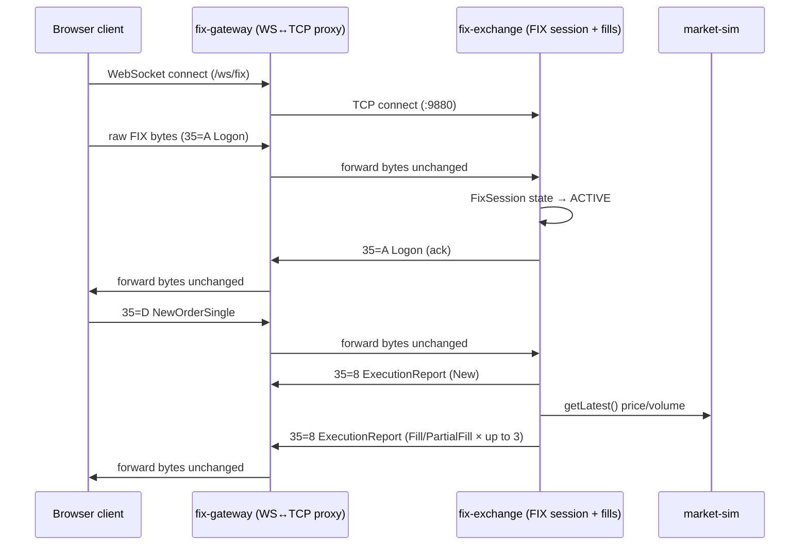
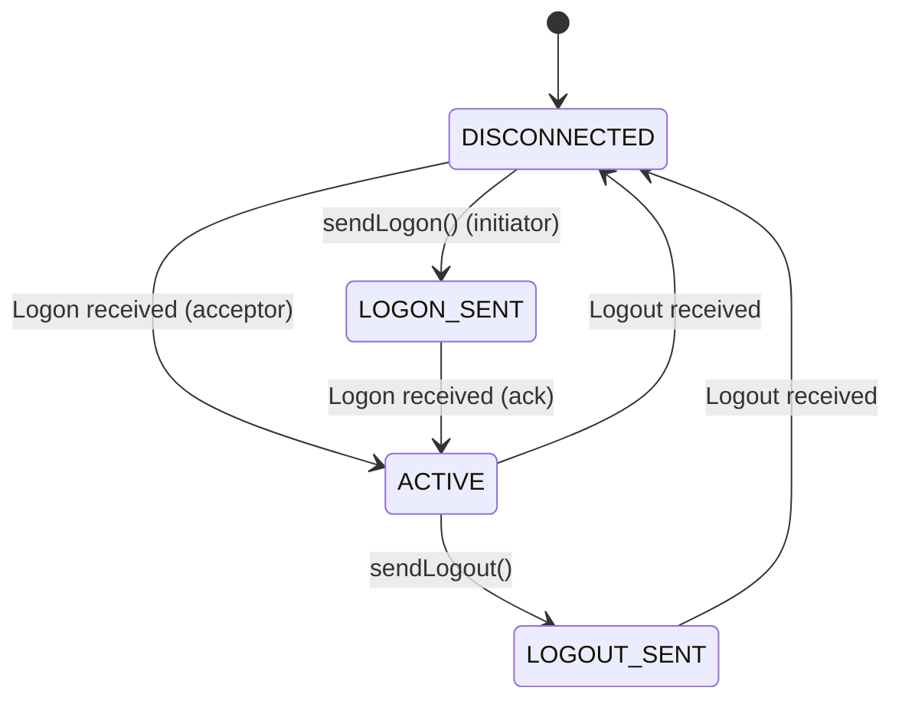

## Overview

VETA runs a small, self-contained FIX 4.4 stack as a second, parallel order-entry path
alongside the HTTP/OMS path used by the rest of the platform. It is three independent
services:

1. **`fix-gateway`** — a WebSocket-to-TCP proxy. It has no knowledge of FIX message
   content; it exists so a browser client can hold a TCP-like connection without a raw
   TCP socket.
2. **`fix-exchange`** — the actual FIX endpoint. It owns FIX session state (logon,
   heartbeat, sequence numbers) and processes `NewOrderSingle`, synthesizing fills from
   the live market-sim price feed.
3. **`fix-archive`** — a Postgres-backed store with an HTTP query API for FIX execution
   reports.



**This is deliberately not the architecture a production FIX gateway would have.** There
is no message translation layer, no dictionary validation at the gateway, and no
persistence of every message in transit. It is scoped to be a realistic-enough FIX 4.4
wire protocol for a client to practise against, backed by a simulated fill engine that
shares logic with `ems-server.ts`'s participation-cap model. See
[Known gaps](#known-gaps-and-not-yet-implemented) below for what a closer-to-production
version would need.

## Wire format

Standard FIX tag=value format with `0x01` (SOH) as the field separator, implemented in
`backend/src/fix/fix-parser.ts`:

```
8=FIX.4.4␁9=<BodyLength>␁35=<MsgType>␁...␁10=<CheckSum>␁
```

- `BodyLength` (tag 9) is computed as the byte length of everything between the tag-9
  field and the tag-10 field, per spec.
- `CheckSum` (tag 10) is the sum of all preceding bytes modulo 256, zero-padded to 3
  digits.
- `encode()`/`decode()` are pure functions with no external state — `decode()` returns a
  `Map<number, string>` of every tag present, `encode()` takes an ordered array of body
  tags and prepends/appends the header and checksum.

### Tag dictionary

`backend/src/fix/fix-dictionary.ts` defines a **minimal subset** of FIX 4.4 tags — only
what the session layer and `NewOrderSingle`/`ExecutionReport` flow need. There is no
tag-level validation (unknown tags are neither rejected nor stripped; `decode()` simply
includes whatever tags were present).

| Tag | Name | Used for |
| --- | --- | --- |
| 8 | BeginString | Always `FIX.4.4` |
| 9 | BodyLength | Computed by `encode()` |
| 35 | MsgType | See message types below |
| 34 | MsgSeqNum | Tracked per session by `FixSession` |
| 49 / 56 | SenderCompID / TargetCompID | Fixed to `EXCHANGE`/`GATEWAY` — see [Known gaps](#known-gaps-and-not-yet-implemented) |
| 52 | SendingTime | Set by `utcTimestamp()` on every outbound message |
| 108 | HeartBtInt | Defaults to 30s |
| 98 | EncryptMethod | Always `0` (none) — this is a simulator, not a production link |
| 112 | TestReqID | Round-tripped for heartbeat liveness checks |
| 7 / 16 | BeginSeqNo / EndSeqNo | Used in ResendRequest / gap-fill |
| 36 | NewSeqNo | Used in SequenceReset |
| 11 | ClOrdID | Client order ID, echoed on every ExecutionReport |
| 55 / 54 / 38 / 44 / 40 / 59 | Symbol / Side / OrderQty / Price / OrdType / TimeInForce | Order fields |
| 17 / 150 / 39 | ExecID / ExecType / OrdStatus | Execution report fields |
| 151 / 14 / 6 / 32 / 31 | LeavesQty / CumQty / AvgPx / LastQty / LastPx | Fill quantities |
| 100 / 21 / 1 | ExDestination / HandlInst / Account | **Defined but never read** — see [Known gaps](#known-gaps-and-not-yet-implemented) |

### Supported message types

| MsgType | Name | Direction | Handled by |
| --- | --- | --- | --- |
| A | Logon | Both | `FixSession` |
| 5 | Logout | Both | `FixSession` |
| 0 | Heartbeat | Both | `FixSession` |
| 1 | TestRequest | Both | `FixSession` (liveness probe) |
| 2 | SequenceReset | Both | `FixSession` (gap-fill) |
| 3 | ResendRequest | Both | `FixSession` |
| D | NewOrderSingle | Inbound only | `fix-exchange.ts`'s `handleApplicationMessage` |
| 8 | ExecutionReport | Outbound only | `fix-exchange.ts` |

Every other `MsgType` value is accepted at the parser level but produces no application
response — `handleApplicationMessage` returns immediately if `msgType !== NewOrderSingle`
(`fix-exchange.ts`). There is no `OrderCancelRequest`, `OrderCancelReplaceRequest`, or
`OrderCancelReject` handling despite tags/constants existing for some of these in earlier
drafts of the dictionary; a cancel sent today is silently ignored.

## Session management

`FixSession` (`backend/src/fix/fix-session.ts`) is a small state machine independent of
transport — it is constructed once per TCP connection in `fix-exchange.ts` and driven by
raw bytes via `handleInbound()`.



`fix-exchange.ts` always plays the acceptor role — every inbound TCP connection starts a
fresh `FixSession` in `DISCONNECTED` and transitions straight to `ACTIVE` on receiving the
client's Logon.

### Sequence numbers and gap-fill

- Inbound and outbound `MsgSeqNum` are tracked independently (`inSeq`/`outSeq`), starting
  at 1.
- If an inbound message's sequence number is **greater** than expected, `FixSession`
  sends a `ResendRequest` covering the gap and does not process the out-of-order message
  further.
- On receiving a `ResendRequest`, the session does not actually resend prior messages (it
  keeps no message history) — it responds with a `SequenceReset`/gap-fill jumping straight
  to the requested end sequence. This is sufficient to keep both sides' counters in sync
  but means a client that genuinely needs replay of missed application messages cannot get
  them from `fix-exchange` itself.
- `SequenceReset` on the inbound side simply overwrites `inSeq` to the new value with no
  further checks.

### Heartbeat and liveness

`startHeartbeat(intervalSecs)` runs on a `setInterval` at the negotiated `HeartBtInt`. Each
tick: if a `TestRequest` sent on the previous tick was never acknowledged, the session logs
a timeout and disconnects; otherwise it sends a fresh `TestRequest` and waits for the next
tick to check the reply arrived. There is no separate "send Heartbeat at half the interval"
behavior — liveness is entirely TestRequest/Heartbeat-response driven, once per
`heartBtInt`.

## fix-exchange: order handling and simulated fills

`fix-exchange.ts` listens on TCP `:9880` (configurable via `FIX_EXCHANGE_PORT`) and a
separate plain-HTTP health endpoint on `:9879` (hardcoded as `FIX_EXCHANGE_PORT - 1`).

On a `NewOrderSingle`:

1. Sends an immediate `ExecutionReport` with `ExecType=New`, `OrdStatus=New`,
   `LeavesQty=<full order qty>`.
2. Waits a randomized 10–50ms to simulate exchange latency.
3. Reads the current mid-price and volume for the order's symbol from
   `marketClient.getLatest()` — a live WebSocket connection to `market-sim`, the same
   `@veta/market-client` library every algo strategy and `ems-server.ts` use.
4. Synthesizes up to 3 partial fills via `computeFill()`, which caps each fill at
   `tickVolume × EMS_PARTICIPATION_CAP` (default 20%) and applies a market-impact price
   adjustment of `(filledQty / 1000) × EMS_IMPACT_PER_1000_BPS` basis points, worse for the
   order's side. This mirrors the participation-cap fill model used elsewhere in the
   platform's EMS, not a separate implementation.
5. Sends one `ExecutionReport` per fill slice (`ExecType=PartialFill` until the last,
   `Fill` on the slice that exhausts the order), with a 50–150ms gap between partials.

There is **no order book and no counterparty matching** — every fill is synthesized
against a snapshot price, not matched against another FIX client's resting order. Two
FIX clients trading the same symbol at the same time do not interact with each other.

## fix-archive

A Postgres-backed HTTP service (`fix_archive.executions` table) exposing:

- `GET /health` — includes a live row count.
- `GET /executions?symbol=&from=&to=&limit=` — filtered, time-ranged query, newest first.
- `GET /executions/:execId` — single execution lookup.

Writes are batched: it consumes the Kafka topic `fix.execution` and flushes up to 50
pending rows every 50ms in a single transaction, upserting on `exec_id` so a repeated
partial-fill update (same `execId`, later `ordStatus`/`leavesQty`) overwrites in place
rather than duplicating rows.

## Known gaps and not-yet-implemented

This is an honest list, not aspirational — each item below is confirmed absent from the
current implementation, not merely undocumented:

- **`fix-exchange` never publishes to `fix.execution`.** `fix-archive` is fully
  implemented and consumes that topic correctly, but nothing in `fix-exchange.ts` sends to
  it — the topic is currently populated by `rfq-service.ts`, `dark-pool-server.ts`, and
  `ems-server.ts` instead. FIX executions are not archived today. Wiring
  `fix-exchange.ts` to publish an `ExecReport`-shaped message to `fix.execution` after
  each fill would close this gap with no schema change needed on the archive side.
- **No risk-engine or OMS integration.** A `NewOrderSingle` accepted by `fix-exchange`
  never touches `risk-engine`'s pre-trade checks (fat-finger, position limits,
  concentration, etc.) or creates an OMS order record. It is a fully separate simulated
  venue from the HTTP order path, not a second entry point into the same risk-managed
  pipeline.
- **No market-hours or auction-session awareness**, matching the gap across the rest of
  the order-entry surface — see
  [ADR 0003: market-session and auction enforcement](../decisions/0003-market-session-and-auction-enforcement/).
  A `NewOrderSingle` is accepted and filled at any time, with no reference to
  `MarketPhase`/`sessionPhase`.
- **No per-client identity or venue routing.** Every session is hardcoded to
  `SenderCompID=EXCHANGE`/`TargetCompID=GATEWAY` — there is no counterparty table, no
  credential check on Logon, and no concept of routing a FIX session to a specific
  simulated venue (the frontend's `venue-capabilities.ts` registry has no FIX-side
  counterpart).
- **`ExDestination`, `HandlInst`, and `Account` tags are defined but never read.** A
  client can send them; `fix-exchange.ts` ignores them.
- **No cancel/replace handling.** `OrderCancelRequest`, `OrderCancelReplaceRequest`, and
  `OrderCancelReject` have no application-level handler — a cancel is silently dropped.
- **No backend test coverage.** There is no test file for any of the 6
  `backend/src/fix/*.ts` modules today.
- **No TLS.** The TCP listener and WebSocket bridge are both plaintext.
- **No rate limiting.** Nothing bounds messages-per-second or orders-per-second on a FIX
  session, unlike the HTTP gateway's IP-based rate limiter.

None of this is a defect relative to what the platform currently promises — the FIX stack
is explicitly a minimal, self-contained simulator, not a production gateway. This section
exists so future work starts from an accurate baseline rather than the previous version of
this page, which described a gRPC/S3-backed architecture that was never implemented.

## See also

- [Service map](../services/) — the FIX services' position in the service mesh.
- [Risk architecture](../risk-architecture/) — how the HTTP order path integrates
  pre-trade risk checks; the FIX path currently does not.
- [ADR 0003: market-session and auction enforcement](../decisions/0003-market-session-and-auction-enforcement/) —
  covers the FIX path's lack of session awareness alongside the rest of the order-entry
  surface.
