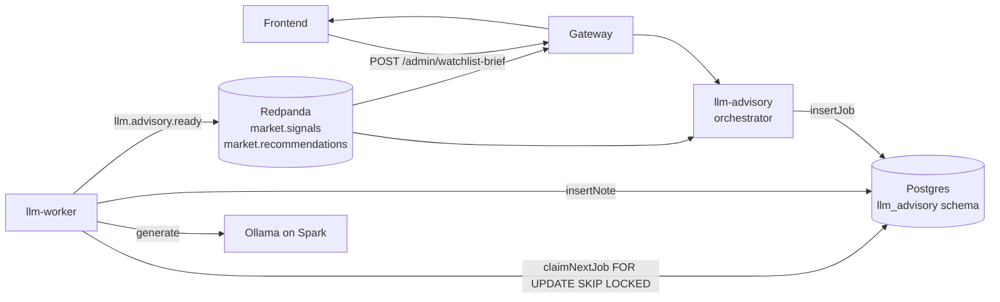

import { Aside } from "@astrojs/starlight/components";

LLM advisory generates short trade notes per symbol on demand, using a self-hosted Ollama instance on the [NVIDIA Spark](../supporting/nvidia-spark/) workstation. The service is two containers: an HTTP-facing **orchestrator** that triggers jobs, and a stateless **worker** that consumes them.

## Topology

The orchestrator subscribes to `market.signals`, `market.recommendations`, and `llm.worker.status`, and exposes a small admin HTTP surface (`/admin/state`, `/admin/watchlist-brief`, `/admin/trigger-worker`). Jobs live in `llm_advisory.jobs` in postgres. The worker idles cheaply when the queue is empty, polling every 2s.

## Restart policy

Both `llm-advisory` and `llm-worker` set `restart: unless-stopped` in [`compose.yml`](https://github.com/milesburton/veta-trading-platform/blob/main/compose.yml). Docker restarts the container on any non-zero exit, but respects explicit `docker compose stop` so manual maintenance still works as expected. Without this, the deno-medium x-anchor's default of `restart: no` left the worker offline indefinitely after any panic.

Recovery time end-to-end is typically under 10 seconds: process restart (~3s) plus the worker's startup checks (provider availability, idle-policy load, redpanda producer setup).

## Postgres retry policy

Every JobStore method that hits postgres is wrapped in `withPgRetry` in [`backend/src/llm-advisory/job-store.ts`](https://github.com/milesburton/veta-trading-platform/blob/main/backend/src/llm-advisory/job-store.ts). The wrapper retries on transient errors only — connection reset, connection refused, broken pipe, server-closed-connection. Non-transient errors (syntax, constraint violations, type mismatches) throw immediately.

Schedule: up to 3 attempts, base delay 250ms, exponential backoff (250ms → 500ms → 1000ms). Worst-case latency on a flapping postgres is ~1.75s before the call fails for real.

All 15 JobStore methods opt in. The retry label is included in log lines so a transient blip is identifiable from `[pg-retry] claimNextJob attempt 2/3` and similar.

## Concurrency-capped staleness refresh

Once a minute the orchestrator scans every tracked symbol to see whether its latest advisory note has gone stale. The naive shape — `Promise.all` over every symbol with two PG queries each — fired 574 concurrent operations against a pool of 12 connections (for ~287 symbols). The deno-postgres driver queued the excess against the same pool that HTTP handlers use, starving `/admin/state` and other endpoints during the scan window.

The scan now runs through a `mapWithConcurrency` helper that caps in-flight symbols at `STALENESS_QUERY_CONCURRENCY = 4`. Each symbol still issues its two PG calls in parallel (8 connections at most), leaving 4 free for HTTP. End-to-end scan time is similar (still gated on DB latency), but `/admin/state` p99 stays in the tens of ms during the scan instead of spiking into the seconds.

The cap is a compile-time constant. Tune in [`backend/src/llm-advisory/orchestrator.ts`](https://github.com/milesburton/veta-trading-platform/blob/main/backend/src/llm-advisory/orchestrator.ts) if the pool size changes.

## Configuration

| Env var | Where | Default | Purpose |
| --- | --- | --- | --- |
| `LLM_ENABLED` | orchestrator + worker | `false` | Master kill switch |
| `LLM_WORKER_ENABLED` | worker | `false` | Worker-only switch — orchestrator stays up to expose state |
| `LLM_PROVIDER` | both | `ollama` | `ollama` or `mock` |
| `LLM_OLLAMA_BASE_URL` | both | `http://ollama:11434` (local) / `http://<gpu-host>:11434` (homelab) | Ollama inference endpoint |
| `LLM_MODEL_ID` | both | `qwen2.5:3b` (local) / `qwen3-coder:30b` (Spark) | Model tag |
| `LLM_TRIGGER_MODE` | orchestrator | `on-demand-ui` | `manual` / `on-demand-ui` / `event-driven` |

Runtime policy is also stored in postgres (`llm_advisory.runtime_config`) and overrides env on a per-row basis. Migration `0019_llm_advisory_runtime_config_seed.sql` seeds defaults on first deploy.

## Troubleshooting

- **Worker exits immediately after start.** Check `LLM_ENABLED` and `LLM_WORKER_ENABLED` in the runtime config (`SELECT * FROM llm_advisory.runtime_config WHERE id=1;`). Both must be true.
- **No advisory notes generated even with jobs queued.** Worker can't reach Ollama. `docker exec veta-llm-worker-1 curl -sf $LLM_OLLAMA_BASE_URL/api/tags`. If it fails, fix the Ollama endpoint or model availability.
- **`/admin/state` slow during staleness scan.** Pool exhaustion. Reduce `STALENESS_QUERY_CONCURRENCY` further, or grow the pool size in `backend/src/lib/db.ts`.
- **All jobs failing with the same transient PG error.** `withPgRetry` exhausted. Postgres is unhealthy enough that retries don't help. Check the Postgres container and `pg_stat_activity` for connection storms.

See also: [Discord ticketing](../observability/ticketing/) — failed worker sessions surface as CRITICAL alerts that auto-create issues.
