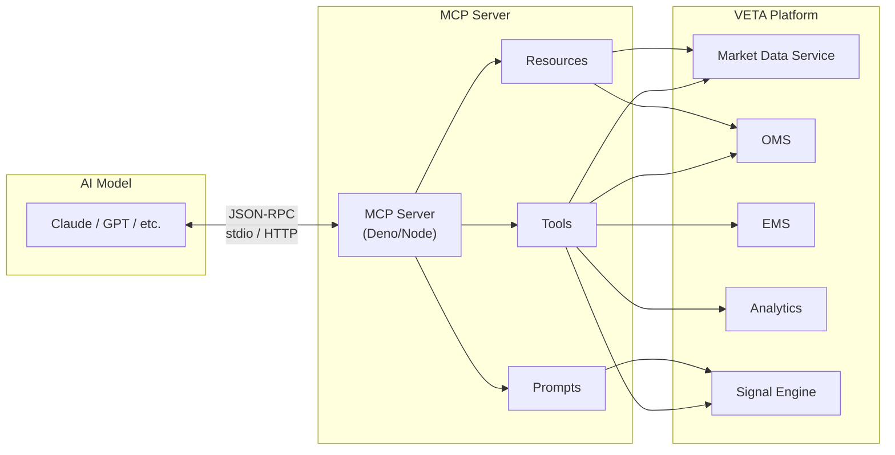

## Overview

The **MCP Server** is a Model Context Protocol (MCP) server that enables AI models to securely interact with the VETA trading platform. It provides standardised access to market data, order management, analytics, and trading signals.

**MCP (Model Context Protocol)** is an open standard that enables AI models to securely connect to external data sources and tools. It provides a standardised way for:

- **Tools** — Functions the AI can invoke (e.g., `get_market_data`, `calculate_option_price`)
- **Resources** — Data the AI can read (e.g., live market data, portfolio summaries)
- **Prompts** — Predefined conversation templates for common workflows

## Architecture



## Getting Started

### Prerequisites

- Deno 1.40+
- Node.js 18+ (optional, for npm dependencies)

### Installation

```bash
cd backend/mcp-server
deno install
```

### Running the Server

```bash
deno run --allow-all src/server.ts
```

The server will start and listen for MCP requests via stdio.

### Testing

```bash
deno test --allow-all tests/
```

## Available Tools

The MCP server exposes the following tools that AI models can invoke:

### 1. `get_market_data`

Get current market data for a trading symbol.

**Parameters:**

- `symbol` (string): Trading symbol (e.g., "AAPL", "GOOGL")

**Example:**

```json
{
  "name": "get_market_data",
  "arguments": {
    "symbol": "AAPL"
  }
}
```

**Response:**

```json
{
  "symbol": "AAPL",
  "bid": 178.50,
  "ask": 178.55,
  "last": 178.52,
  "volume": 45230000,
  "timestamp": "2024-01-01T00:00:00.000Z"
}
```

### 2. `list_orders`

List all orders with their current status.

**Parameters:** None

**Response:**

```json
[
  {
    "orderId": "ORD-001",
    "symbol": "AAPL",
    "side": "buy",
    "quantity": 100,
    "status": "filled",
    "fillPrice": 178.45
  }
]
```

### 3. `get_trading_signals`

Get current trading signals from the intelligence pipeline.

**Parameters:** None

**Response:**

```json
[
  {
    "symbol": "AAPL",
    "direction": "bullish",
    "confidence": 0.78,
    "reason": "Positive momentum with increasing volume"
  }
]
```

### 4. `calculate_option_price`

Calculate option price using the Black-Scholes model.

**Parameters:**

- `underlyingPrice` (number): Current price of the underlying asset
- `strikePrice` (number): Option strike price
- `timeToExpiry` (number): Time to expiry in years
- `volatility` (number): Annualised volatility (e.g., 0.25 for 25%)
- `riskFreeRate` (number): Risk-free interest rate (e.g., 0.05 for 5%)
- `optionType` (string): "call" or "put"

**Response:**

```json
{
  "optionType": "call",
  "underlyingPrice": 178.52,
  "strikePrice": 180,
  "timeToExpiry": 0.25,
  "volatility": 0.25,
  "riskFreeRate": 0.05,
  "theoreticalPrice": 5.23
}
```

## Available Resources

Resources allow AI models to read data without invoking a tool.

### 1. `veta://market_data/{symbol}`

Market data for a specific symbol.

**Example:**

```
GET veta://market_data/AAPL
```

### 2. `veta://portfolio_summary`

Summary of the trading portfolio.

**Example:**

```
GET veta://portfolio_summary
```

## Available Prompts

Prompts are predefined conversation templates.

### 1. `market_analysis`

Analyze market conditions for a given symbol.

**Parameters:**

- `symbol` (string): The trading symbol to analyze

**Usage:**

```
PROMPT market_analysis { symbol: "AAPL" }
```

## How MCP Benefits the VETA Platform

1. **Standardised AI Integration** — MCP provides a protocol-agnostic way to connect AI models to your trading infrastructure without custom integrations for each model.

2. **Security** — MCP enforces permission boundaries. You can control which AI models can access which tools and resources.

3. **Composability** — Multiple MCP servers can expose different domains (market data, risk, orders) independently.

4. **Future-Proof** — As AI models evolve, MCP ensures your platform remains compatible without code changes.

5. **Type Safety** — MCP uses JSON Schema for tool parameters, ensuring type safety and validation.

## Integration with VETA Panels

The MCP server can be integrated with VETA panels to provide AI-powered features:

- **`trade-recommendation`** panel: Use `get_trading_signals` to get AI-driven recommendations
- **`order-ticket`** panel: Use `calculate_option_price` to suggest optimal order parameters
- **`risk-dashboard`** panel: Use `list_orders` to monitor order risk
- **`market-ladder`** panel: Use `get_market_data` to display real-time data

## Extending the MCP Server

To add new tools, resources, or prompts:

### Adding a Tool

```typescript
server.tool(
  "tool_name",
  "Tool description",
  {
    param1: z.string().describe("Parameter description"),
  },
  async ({ param1 }) => {
    return {
      content: [
        {
          type: "text",
          text: JSON.stringify(result),
        },
      ],
    };
  }
);
```

### Adding a Resource

```typescript
server.resource(
  "resource_name",
  "veta://resource_name/{param}",
  async (uri) => {
    const param = uri.pathname.split("/").pop();
    return {
      contents: [
        {
          uri: uri.href,
          name: "Resource Name",
          mimeType: "application/json",
          text: JSON.stringify(data),
        },
      ],
    };
  }
);
```

### Adding a Prompt

```typescript
server.prompt(
  "prompt_name",
  "Prompt description",
  {
    param: {
      description: "Parameter description",
      required: true,
    },
  },
  ({ param }) => {
    return {
      messages: [
        {
          role: "user",
          content: {
            type: "text",
            text: `Analyze ${param}`,
          },
        },
      ],
    };
  }
);
```

## Transport Options

The server currently uses **stdio transport** (standard input/output), which is ideal for local tools. For production use, you can switch to **HTTP transport**:

```typescript
import { McpServer } from "@modelcontextprotocol/sdk/server/mcp.js";
import { Hono } from "hono";

const app = new Hono();
const server = new McpServer({ name: "veta", version: "1.0.0" });

app.post("/mcp", async (c) => {
  const body = await c.req.json();
  const response = await server.handleRequest(body);
  return c.json(response);
});

app.listen(3001);
```

## Licence

MIT
