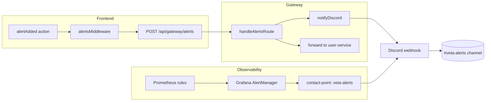

import { Aside } from "@astrojs/starlight/components";

VETA routes two classes of alerts to the same Discord channel:

- **Platform alerts** from Grafana, driven by Prometheus rules. Memory pressure, breaker activity, disk-fill warnings, service-down events.
- **User-level alerts** from the live trading UI, driven by `alertsMiddleware` in the frontend. Kill-switch activations, order rejections by the risk engine, workspace save failures.

Both classes hit the same webhook URL so a single channel is the on-call notification surface.

## Flow



## Severity filtering

The gateway only fans CRITICAL and WARNING out to Discord. INFO alerts (workspace-save failures, routine notifications) stay inside the in-app alert centre and are not surfaced to ops.

Grafana applies its own routing by `category` label: anything matched by `category=security` goes to the legacy `security-webhook` contact point so security alerts can be split out later if needed.

## Configuration

The webhook URL is injected at runtime via the `DISCORD_WEBHOOK_URL` environment variable. It is never committed to the repository.

| Service | Env var | Compose default |
|---|---|---|
| `gateway` | `DISCORD_WEBHOOK_URL` | empty string (notifier no-ops) |
| `grafana` | `DISCORD_WEBHOOK_URL` | `https://discord.com/api/webhooks/0/REPLACE_ME` (rejected by notifier) |

On the homelab, set the real URL in `/opt/stacks/veta/.env`:

```bash
DISCORD_WEBHOOK_URL=https://discord.com/api/webhooks/<id>/<token>
```

Then restart the consuming containers so they pick up the new value:

```bash
cd /opt/stacks/veta
docker compose up -d gateway
docker compose -f observability/docker-compose.lgtm.yml up -d grafana
```

## Verifying delivery

Smoke-test the webhook directly:

```bash
curl -sS -i -X POST \
  -H "Content-Type: application/json" \
  -d '{"username":"VETA Alerts","content":"smoke test"}' \
  "$DISCORD_WEBHOOK_URL"
```

A working webhook returns `HTTP/2 204` with empty body. A revoked or malformed URL returns `HTTP/2 401` or `404`.

End-to-end test through the platform:

1. As an admin, trigger the kill switch from the Mission Control panel
2. Watch the alert centre populate within ~200ms
3. Watch Discord receive the formatted message within ~1s

## Rotating the webhook

Discord webhook URLs are bearer credentials. Rotate immediately if the URL appears in chat logs, screenshots, or any context where it might leak.

1. Discord channel settings → Integrations → Webhooks → click the existing webhook
2. Either delete and recreate (creates a fresh URL) or copy the URL and regenerate the token from the same panel
3. SSH to the homelab and update `/opt/stacks/veta/.env`
4. `docker compose up -d gateway grafana` to apply
5. Smoke-test with the curl one-liner above
6. The old URL becomes inert immediately; no further cleanup needed

<Aside type="caution" title="Webhook tokens are bearer credentials">
Anyone with the webhook URL can post arbitrary messages to the channel as VETA Alerts. Treat the URL like an API key. Never commit it, never paste it in PR descriptions, and rotate after any exposure.
</Aside>

## Per-minute heartbeat

Independent of alerts, the gateway posts a per-minute status rollup of every monitored service to the same Discord webhook. This signals "the platform is alive" — without it, the channel only speaks when something has gone wrong, leaving operators without a positive liveness signal.

The message shape:

```
✅ **VETA** `a1b2c3d` (prod) — 32/32 services up · uptime 2d 14h 3m
🟢 `analytics` 🟢 `arrivalPriceAlgo` 🟢 `bus` 🟢 `ccpService` 🟢 `darkPool` 🟢 `ems` …
```

Header emoji switches by availability: ✅ all up, ⚠️ 1–2 down, 🚨 3+ down. Body lists every service with 🟢/🔴.

Implementation in [`backend/src/gateway/discord-notifier.ts`](https://github.com/milesburton/veta-trading-platform/blob/main/backend/src/gateway/discord-notifier.ts). The interval defaults to 60s; override via `DISCORD_HEARTBEAT_INTERVAL_MS` on the gateway. On a quiet day that's 1440 messages — set the env to e.g. `300000` (5 min) if the noise floor is too high. The first heartbeat fires immediately on boot so a successful deploy shows up in the channel within seconds.

Heartbeat reads from the same `cachedHealth` map populated by `refreshHealth()`, so there's no extra polling cost.

## Frontend memory metric

The gateway emits `frontend_memory_heap_used_max_bytes` as an OTEL gauge — the max `jsHeapSizeUsed` across all live browser sessions reporting via the `useFrontendMemoryTelemetry` hook. The metric flows via the existing OTLP plumbing → Alloy → Prometheus.

Two alert rules consume it:

| Rule | Threshold | Duration | Severity |
|---|---|---|---|
| `FrontendHeapHigh` | > 2 GiB | 10m | warning |
| `FrontendHeapCritical` | > 4 GiB | 2m | critical |

Hitting `Critical` typically precedes a frozen tab (Firefox starts swapping at 4 GiB). Get the affected user to hard-refresh and grab a heap snapshot from `about:memory` if you want to investigate further.

The metric is per-gateway (one value for "max across all users") rather than per-user. Cardinality stays bounded regardless of user count, but specific-user tracing requires looking at the raw POSTs to `/telemetry/frontend`.

## Adding new alert rules

Backend Prometheus rules live in [`observability/prometheus-rules.yml`](https://github.com/milesburton/veta-trading-platform/blob/main/observability/prometheus-rules.yml). They auto-load when Grafana boots; no migration step.

User-level alerts are dispatched by `alertsMiddleware` reacting to Redux actions. Add a new branch to the middleware to emit on additional event types. Severity ≥ WARNING reaches Discord automatically; CRITICAL also opens a [GitHub ticket](./ticketing).

## Troubleshooting

- **No messages in Discord, but the alert appears in-app**: check the gateway has `DISCORD_WEBHOOK_URL` set. `docker compose exec gateway env | grep DISCORD`.
- **Grafana alerts not arriving but Prometheus rules are firing**: check Grafana → Alerting → Contact points → veta-alerts and click "Test". If that fails, the webhook URL is wrong or revoked.
- **INFO alerts not appearing**: by design. Only CRITICAL/WARNING fan out. Change `notifyDiscord` severity filter if you want broader coverage.
- **Channel is silent during a known incident**: confirm the rule's `for:` duration. `ServiceMemoryGrowthSustained` requires 15 minutes of sustained growth before firing.
