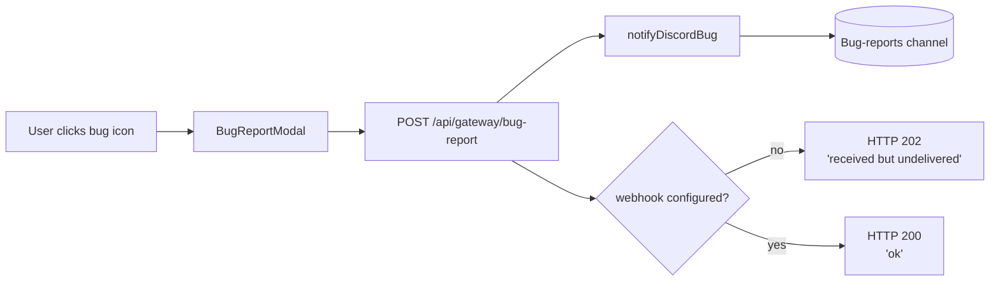

import { Aside } from "@astrojs/starlight/components";

Any signed-in user can submit a bug report from the bug icon in the header. Reports POST to the gateway, which forwards a formatted message to a dedicated Discord channel.

## Flow

## What gets sent

Each report carries:

- Username and display name of the signed-in user
- Title (up to 120 chars)
- Description (up to 2000 chars)
- Category (`ui` / `data` / `auth` / `performance` / `other`)
- The current page path
- The user-agent string

CRLF in user-supplied text is stripped before posting to Discord so the formatter can't be tricked into emitting fake bot lines.

<Aside type="caution" title="Don't paste secrets">
The modal explicitly tells the user not to include passwords or sensitive data. The backend doesn't redact, so anything the user pastes ends up in the Discord channel.
</Aside>

## Configuration

Routes through a dedicated webhook so bug reports don't drown the alerts channel. Falls back to the alerts webhook when the dedicated one is unset, so a single-channel deployment still works.

| Env var | Channel | Notes |
| --- | --- | --- |
| `DISCORD_BUG_WEBHOOK_URL` | bug-reports | Preferred. Set in `/opt/stacks/veta/.env` on the the server. |
| `DISCORD_WEBHOOK_URL` | alerts | Used as fallback if the bug webhook is unset. |

Both are validated at runtime: must start with `https://discord.com/api/webhooks/` and must not contain the literal `REPLACE_ME`. Anything else, or absent, causes the route to return HTTP 202 with `ok: false` — the UI surfaces this as "received but the channel isn't configured here".

## Rotation

Same procedure as the alerts webhook ([alert-routing](../alerts/)):

1. Discord channel settings → Integrations → Webhooks → delete or rotate
2. Update `DISCORD_BUG_WEBHOOK_URL` in the the server `.env`
3. Restart gateway: `docker compose up -d gateway`
4. Smoke-test by submitting a bug from the platform

## Future: ticketing integration

The current shape is a fire-and-forget Discord post. A ticketing service (Linear / Jira / GitHub issues) would slot in by adding a second sink in `notifyDiscordBug` keyed off a separate env var. The bug-report contract (title, description, category, url, user) is intentionally shaped to map cleanly to an issue tracker.
