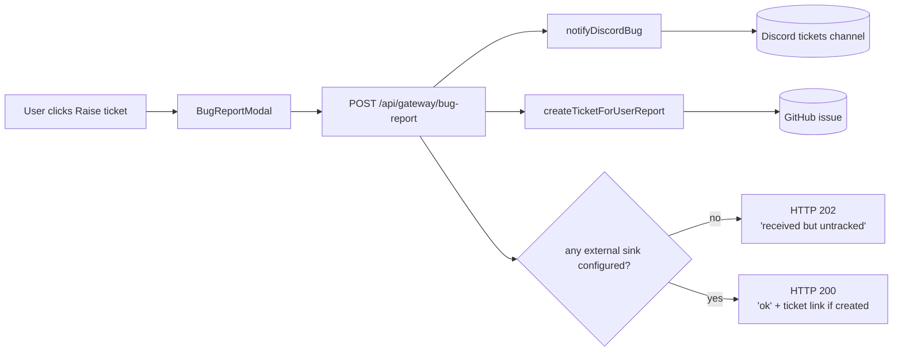

import { Aside } from "@astrojs/starlight/components";

Any signed-in user can raise a ticket from the status bar or Platform Status panel. Tickets can be a **bug**, **feature request**, or **comment**. The gateway posts a summary to Discord and, when `GITHUB_TICKETING_TOKEN` is configured, creates a GitHub issue as the durable ticket.

## Flow

The endpoint name is still `/bug-report` for backwards compatibility. The request body now carries `kind: "bug" | "feature" | "comment"`.

## What gets sent

Each report carries:

- Username and display name of the signed-in user
- Type (`bug` / `feature` / `comment`)
- Title (up to 120 chars)
- Description (up to 2000 chars)
- Category (`ui` / `data` / `auth` / `performance` / `other`)
- The current page path
- The user-agent string

CRLF in user-supplied title and metadata is stripped before posting to Discord or GitHub so the formatter can't be tricked into emitting fake bot lines.

<Aside type="caution" title="Don't paste secrets">
The modal explicitly tells the user not to include passwords or sensitive data. The backend doesn't redact, so anything the user pastes can end up in Discord and in the GitHub issue.
</Aside>

## Configuration

Discord routes through a dedicated webhook so user tickets don't drown the alerts channel. It falls back to the alerts webhook when the dedicated one is unset, so a single-channel deployment still works.

| Env var | Channel | Notes |
| --- | --- | --- |
| `DISCORD_BUG_WEBHOOK_URL` | bug-reports | Preferred. Set in `/opt/stacks/veta/.env` on the server. |
| `DISCORD_WEBHOOK_URL` | alerts | Used as fallback if the bug webhook is unset. |

Both are validated at runtime: must start with `https://discord.com/api/webhooks/` and must not contain the literal `REPLACE_ME`.

GitHub issue creation uses the same env vars as prod alert ticketing:

| Env var | Purpose |
| --- | --- |
| `GITHUB_TICKETING_TOKEN` | Fine-grained PAT with `issues:write` on the target repo. |
| `GITHUB_TICKETING_REPO` | `owner/name` repo to create tickets in. Defaults to `milesburton/veta-trading-platform`. |

If neither Discord nor GitHub ticketing is configured, the route returns HTTP 202 with `ok: false`. The UI explains that the gateway received the submission but no external ticket sink is configured.

## How Users Raise A Ticket

1. Sign in to VETA.
2. Click **Raise ticket** in the status bar or Platform Status panel.
3. Pick the type: **Bug**, **Feature**, or **Comment**.
4. Add a short title and enough detail for an operator or maintainer to act.
5. Submit. If GitHub ticketing is configured, the success state links to the created issue.

Use **Bug** for broken behaviour, **Feature** for new workflows or capabilities, and **Comment** for general feedback or questions.

## Rotation

Same procedure as the alerts webhook ([alert-routing](../alerts/)):

1. Discord channel settings → Integrations → Webhooks → delete or rotate
2. Update `DISCORD_BUG_WEBHOOK_URL` in the server `.env`
3. Restart gateway: `docker compose up -d gateway`
4. Smoke-test by raising a ticket from the platform
