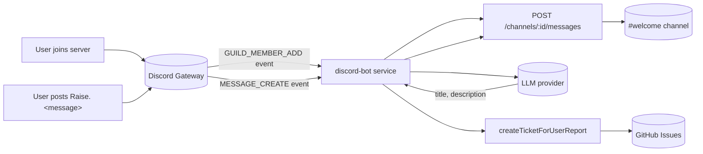

import { Aside } from "@astrojs/starlight/components";

The `discord-bot` service connects to the Discord Gateway, posts a welcome message whenever someone joins the VETA Discord server, and triages `Raise. <message>` posts in any channel it can read into GitHub tickets via an LLM. This is a separate integration from [alert routing](../alerts/) and [ticketing](../ticketing/): those use outbound-only webhooks, but greeting new members on join and reading channel messages both require a real bot with a persistent connection, since webhooks cannot observe server membership or message events.

## Flow



The service opens a websocket to the Discord Gateway on startup, identifies with the `GUILD_MEMBERS`, `GUILD_MESSAGES`, and `MESSAGE_CONTENT` privileged intents, and reconnects automatically if the connection drops.

## Creating the bot application

This is a one-time setup you do yourself in the Discord Developer Portal; it can't be automated from this repo.

1. Go to the [Discord Developer Portal](https://discord.com/developers/applications) and create a **New Application**.
2. Under **Bot**, click **Add Bot**.
3. Under **Bot > Privileged Gateway Intents**, enable **Server Members Intent** and **Message Content Intent**. Without the first, the bot connects but never receives `GUILD_MEMBER_ADD` events; without the second, `Raise.` messages arrive with an empty `content` field and can't be triaged.
4. Under **Bot**, click **Reset Token** and copy it. This is `DISCORD_BOT_TOKEN`. Treat it like any other credential; it grants full control of the bot identity.
5. Under **OAuth2 > URL Generator**, select the `bot` scope and the **View Channels** + **Send Messages** + **Read Message History** permissions, then open the generated URL to invite the bot to your server.
6. In Discord, right-click the welcome channel and **Copy Channel ID** (enable Developer Mode under User Settings > Advanced if the option isn't visible). This is `DISCORD_WELCOME_CHANNEL_ID`.

## Configuration

| Var | Purpose | Default |
| --- | --- | --- |
| `DISCORD_BOT_TOKEN` | Bot token from the Developer Portal | empty (bot disabled) |
| `DISCORD_WELCOME_CHANNEL_ID` | Channel ID to post welcome messages in | empty (bot disabled) |
| `DISCORD_TRIAGE_ENABLED` | Turn `Raise.` triage on or off | `true` |
| `LLM_PROVIDER` | `ollama`, `anthropic`, or unset for a disabled mock provider | `mock` |
| `LLM_MODEL_ID` | Model id passed to the provider | `mock-v1` |
| `LLM_OLLAMA_BASE_URL` | Ollama base URL, when `LLM_PROVIDER=ollama` | `http://localhost:11434` |
| `GITHUB_TICKETING_TOKEN_FILE` / `GITHUB_TICKETING_TOKEN` | GitHub token used to file the resulting issue, same credential as [ticketing](../ticketing/) | unset (ticket creation skipped) |

`DISCORD_BOT_TOKEN` and `DISCORD_WELCOME_CHANNEL_ID` are required for the bot to start at all; the service logs a warning and stays idle if either is missing. The LLM and ticketing vars only gate the triage feature: with `LLM_PROVIDER` unset the bot still greets new members, but replies to any `Raise.` message with a "triage is unavailable" note instead of filing a ticket. Inject via the server's `.env`:

```bash
# /opt/stacks/veta/.env
DISCORD_BOT_TOKEN=your_bot_token_here
DISCORD_WELCOME_CHANNEL_ID=your_channel_id_here
```

Then restart the service:

```bash
cd /opt/stacks/veta
docker compose up -d discord-bot
```

<Aside type="caution" title="Bot token vs webhook URL">
`DISCORD_BOT_TOKEN` is a different credential type to `DISCORD_WEBHOOK_URL` / `DISCORD_BUG_WEBHOOK_URL` used elsewhere in the platform. A webhook URL can only post to one fixed channel. A bot token authenticates a persistent identity that can read Gateway events. Treat it with the same care as a database credential, not a webhook URL.
</Aside>

## Welcome message

```
👋 Welcome @newuser to the VETA community! Type `Raise. <what's wrong>` in this channel, or use the in-app "Raise a ticket" button, if you hit a bug.
```

The message is static aside from the member mention. Implementation in [`backend/src/discord-bot/discord-bot.ts`](https://github.com/milesburton/veta-trading-platform/blob/main/backend/src/discord-bot/discord-bot.ts).

## Raise. ticket triage

Any non-bot message starting with `Raise.` (case-insensitive, e.g. `Raise. the candlestick chart shows blank bars when I change symbol`) is sent to the configured LLM provider with a prompt constrained to return a short `title` and `description`. On success, the bot files a GitHub issue through the same [`createTicketForUserReport`](https://github.com/milesburton/veta-trading-platform/blob/main/backend/src/gateway/ticketing.ts) path the in-app "Raise a ticket" modal uses, labelled `user-ticket`/`auto-created`, with the description linking back to the source Discord message. It then replies in-channel with either the issue URL or a reason it couldn't file one.

Each user is limited to 3 triage attempts per 10 minutes; further attempts get an in-channel rate-limit notice rather than being silently dropped. The LLM only decides how to phrase the ticket, not whether to create one: an explicit `Raise.` prefix is the trigger, so ordinary conversation in the channel is never sent to the model.

## Verifying

Check the service health endpoint:

```bash
curl -sf http://localhost:5034/health
```

`configured: true` confirms both env vars are set. `connected: true` confirms the Gateway websocket is currently open. Join the server with a test account (or have a colleague join) and confirm the welcome message appears in the configured channel within a few seconds.

## Troubleshooting

- **`configured: false` in `/health`.** `DISCORD_BOT_TOKEN` or `DISCORD_WELCOME_CHANNEL_ID` is unset. Check the server `.env`.
- **`connected: false` but `configured: true`.** The Gateway connection failed or dropped. Check service logs for `gateway websocket error` or `gateway websocket closed`; the service retries every 5 seconds.
- **Bot is connected but no message appears on join.** Confirm **Server Members Intent** is enabled in the Developer Portal, this is the most common cause. Also confirm the bot has **Send Messages** permission in the welcome channel specifically, not just server-wide.
- **401 on Gateway connect.** The token is invalid or was reset in the Developer Portal. Regenerate and update `.env`.
- **`Raise.` messages get no reply at all.** Confirm **Message Content Intent** is enabled in the Developer Portal; without it the bot receives `MESSAGE_CREATE` events but `content` is always empty, so the `Raise.` prefix never matches. Check service logs for `message triage failed`.
- **Reply says "triage is unavailable".** `LLM_PROVIDER` is unset, or the configured provider's `isAvailable()` check failed (Ollama unreachable, or `ANTHROPIC_API_KEY` empty). Check the `ollama` service's health if using `LLM_PROVIDER=ollama`.
- **Ticket triages successfully but no GitHub issue appears.** `GITHUB_TICKETING_TOKEN_FILE` / `GITHUB_TICKETING_TOKEN` is unset or invalid; see [ticketing](../ticketing/) for the same credential used by the in-app form.

<Aside type="tip" title="Rotating the token">
Discord Developer Portal → your application → Bot → Reset Token → update `DISCORD_BOT_TOKEN` on the server → `docker compose up -d discord-bot`. The old token becomes inert immediately.
</Aside>
