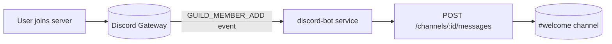

import { Aside } from "@astrojs/starlight/components";

The `discord-bot` service connects to the Discord Gateway and posts a welcome message whenever someone joins the VETA Discord server. This is a separate integration from [alert routing](../alerts/) and [ticketing](../ticketing/): those use outbound-only webhooks, but greeting new members on join requires a real bot with a persistent connection, since webhooks cannot observe server membership events.

## Flow



The service opens a websocket to the Discord Gateway on startup, identifies with the `GUILD_MEMBERS` privileged intent, and reconnects automatically if the connection drops.

## Creating the bot application

This is a one-time setup you do yourself in the Discord Developer Portal; it can't be automated from this repo.

1. Go to the [Discord Developer Portal](https://discord.com/developers/applications) and create a **New Application**.
2. Under **Bot**, click **Add Bot**.
3. Under **Bot > Privileged Gateway Intents**, enable **Server Members Intent**. Without this, the bot will connect but never receive `GUILD_MEMBER_ADD` events.
4. Under **Bot**, click **Reset Token** and copy it. This is `DISCORD_BOT_TOKEN` — treat it like any other credential; it grants full control of the bot identity.
5. Under **OAuth2 > URL Generator**, select the `bot` scope and the **View Channels** + **Send Messages** permissions, then open the generated URL to invite the bot to your server.
6. In Discord, right-click the welcome channel and **Copy Channel ID** (enable Developer Mode under User Settings > Advanced if the option isn't visible). This is `DISCORD_WELCOME_CHANNEL_ID`.

## Configuration

| Var | Purpose | Default |
| --- | --- | --- |
| `DISCORD_BOT_TOKEN` | Bot token from the Developer Portal | empty (bot disabled) |
| `DISCORD_WELCOME_CHANNEL_ID` | Channel ID to post welcome messages in | empty (bot disabled) |

Both are required; the service logs a warning and stays idle if either is missing. Inject via the server's `.env`:

```bash
# /opt/stacks/veta/.env
DISCORD_BOT_TOKEN=your_bot_token_here
DISCORD_WELCOME_CHANNEL_ID=your_channel_id_here
```

Then restart the service:

```bash
cd /opt/stacks/veta
docker compose up -d discord-bot
```

<Aside type="caution" title="Bot token vs webhook URL">
`DISCORD_BOT_TOKEN` is a different credential type to `DISCORD_WEBHOOK_URL` / `DISCORD_BUG_WEBHOOK_URL` used elsewhere in the platform. A webhook URL can only post to one fixed channel. A bot token authenticates a persistent identity that can read Gateway events — treat it with the same care as a database credential, not a webhook URL.
</Aside>

## Message shape

```
👋 Welcome @newuser to the VETA community! Check out #support if you hit a bug or want to raise a ticket.
```

The message is static aside from the member mention. Implementation in [`backend/src/discord-bot/discord-bot.ts`](https://github.com/milesburton/veta-trading-platform/blob/main/backend/src/discord-bot/discord-bot.ts).

## Verifying

Check the service health endpoint:

```bash
curl -sf http://localhost:5034/health
```

`configured: true` confirms both env vars are set. `connected: true` confirms the Gateway websocket is currently open. Join the server with a test account (or have a colleague join) and confirm the welcome message appears in the configured channel within a few seconds.

## Troubleshooting

- **`configured: false` in `/health`.** `DISCORD_BOT_TOKEN` or `DISCORD_WELCOME_CHANNEL_ID` is unset. Check the server `.env`.
- **`connected: false` but `configured: true`.** The Gateway connection failed or dropped. Check service logs for `gateway websocket error` or `gateway websocket closed`; the service retries every 5 seconds.
- **Bot is connected but no message appears on join.** Confirm **Server Members Intent** is enabled in the Developer Portal — this is the most common cause. Also confirm the bot has **Send Messages** permission in the welcome channel specifically, not just server-wide.
- **401 on Gateway connect.** The token is invalid or was reset in the Developer Portal. Regenerate and update `.env`.

<Aside type="tip" title="Rotating the token">
Discord Developer Portal → your application → Bot → Reset Token → update `DISCORD_BOT_TOKEN` on the server → `docker compose up -d discord-bot`. The old token becomes inert immediately.
</Aside>
