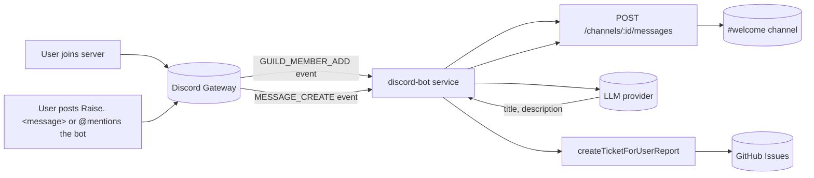

import { Aside } from "@astrojs/starlight/components";

The `discord-bot` service connects to the Discord Gateway, posts a welcome message whenever someone joins the VETA Discord server, and triages `Raise. <message>` or `@VETA <message>` posts in any channel it can read into GitHub tickets via an LLM. This is a separate integration from [alert routing](../alerts/) and [ticketing](../ticketing/): those use outbound-only webhooks, but greeting new members on join and reading channel messages both require a real bot with a persistent connection, since webhooks cannot observe server membership or message events.

## Flow


```mermaid
flowchart LR
  U[User joins server] --> D[(Discord Gateway)]
  D -->|GUILD_MEMBER_ADD event| B[discord-bot service]
  B --> P[POST /channels/:id/messages]
  P --> C[(#welcome channel)]

  M["User posts Raise. &lt;message&gt; or @mentions the bot"] --> D
  D -->|MESSAGE_CREATE event| B
  B --> L[(LLM provider)]
  L -->|title, description| B
  B --> T[createTicketForUserReport]
  T --> G[(GitHub Issues)]
  B --> P
```

The service opens a websocket to the Discord Gateway on startup, identifies with the `GUILD_MEMBERS`, `GUILD_MESSAGES`, and `MESSAGE_CONTENT` privileged intents, and reconnects automatically if the connection drops.

## Creating the bot application

This is a one-time setup you do yourself in the Discord Developer Portal; it can't be automated from this repo.

1. Go to the [Discord Developer Portal](https://discord.com/developers/applications) and create a **New Application**.
2. Under **Bot**, click **Add Bot**.
3. Under **Bot > Privileged Gateway Intents**, enable **Server Members Intent** and **Message Content Intent**. Without the first, the bot connects but never receives `GUILD_MEMBER_ADD` events; without the second, `Raise.` messages arrive with an empty `content` field and can't be triaged.
4. Under **Bot > Authorization Flow**, make sure **Requires OAuth2 Code Grant** is off. With it on, the invite link in step 6 fails with "Integration requires code grant".
5. Under **Bot**, click **Reset Token** and copy it. This is `DISCORD_BOT_TOKEN`. Treat it like any other credential; it grants full control of the bot identity.
6. Under **OAuth2 > URL Generator**, select the `bot` scope and the **View Channels** + **Send Messages** + **Read Message History** permissions, then open the generated URL while signed in as a member with **Manage Server** to add the bot to your server. The equivalent hand-built URL is `https://discord.com/oauth2/authorize?client_id=<application id>&scope=bot&permissions=68608`. A bot cannot be added from the server's **Invite People** dialog: that only searches friends and existing members, so a bot's id returns no results there.
7. In Discord, right-click the welcome channel and **Copy Channel ID** (enable Developer Mode under User Settings > Advanced if the option isn't visible). This is `DISCORD_WELCOME_CHANNEL_ID`.

## Configuration

| Var | Purpose | Default |
| --- | --- | --- |
| `DISCORD_BOT_TOKEN` | Bot token from the Developer Portal | empty (bot disabled) |
| `DISCORD_WELCOME_CHANNEL_ID` | Channel ID to post welcome messages in | empty (bot disabled) |
| `DISCORD_TRIAGE_ENABLED` | Turn ticket triage (both triggers) on or off | `true` |
| `LLM_PROVIDER` | `ollama`, `anthropic`, or unset for a disabled mock provider | `mock` |
| `LLM_MODEL_ID` | Model id passed to the provider | `mock-v1` |
| `LLM_OLLAMA_BASE_URL` | Ollama base URL, when `LLM_PROVIDER=ollama` | `http://localhost:11434` |
| `GITHUB_TICKETING_TOKEN_FILE` / `GITHUB_TICKETING_TOKEN` | GitHub token used to file the resulting issue, same credential as [ticketing](../ticketing/) | unset (ticket creation skipped) |
| `DISCORD_MOTD_ENABLED` | Turn the recurring message of the day on or off | `true` |
| `DISCORD_MOTD_INTERVAL_MS` | How often the message of the day reposts | `3600000` (1 hour) |
| `VETA_DOCS_URL` | Docs link included in the message of the day | `https://milesburton.github.io/veta-trading-platform/` |
| `VETA_PLATFORM_URL` | Live platform link included in the message of the day | `https://veta.mnetcs.com` |

`DISCORD_BOT_TOKEN` and `DISCORD_WELCOME_CHANNEL_ID` are required for the bot to start at all; the service logs a warning and stays idle if either is missing. The LLM and ticketing vars only gate the triage feature: with `LLM_PROVIDER` unset the bot still greets new members, but replies to any triage-triggering message with a "triage is unavailable" note instead of filing a ticket. Store the token in [OpenBao](/veta-trading-platform/development/deployment/#secrets) at `secret/veta/platform`. The channel ID is not a secret and can stay in the server's `.env`:

```bash
read -rs v && printf %s "$v" | bao kv patch secret/veta/platform DISCORD_BOT_TOKEN=-
echo "DISCORD_WELCOME_CHANNEL_ID=your_channel_id_here" >> /opt/stacks/veta/.env
```

Then restart the service:

```bash
cd /opt/stacks/veta
scripts/veta-compose.sh up -d discord-bot
```

<Aside type="caution" title="Bot token vs webhook URL">
`DISCORD_BOT_TOKEN` is a different credential type to `DISCORD_WEBHOOK_URL` / `DISCORD_BUG_WEBHOOK_URL` used elsewhere in the platform. A webhook URL can only post to one fixed channel. A bot token authenticates a persistent identity that can read Gateway events. Treat it with the same care as a database credential, not a webhook URL.
</Aside>

## Welcome message

```
👋 Welcome @newuser to the VETA community! Type `Raise. <what's wrong>` in this channel, or use the in-app "Raise a ticket" button, if you hit a bug.
```

The message is static aside from the member mention. Implementation in [`backend/src/discord-bot/discord-bot.ts`](https://github.com/milesburton/veta-trading-platform/blob/main/backend/src/discord-bot/discord-bot.ts).

## Message of the day

Alongside the welcome message, a second, non-personalised message posts on every join and again on a fixed interval (`DISCORD_MOTD_INTERVAL_MS`, default one hour), so members who don't happen to catch the welcome message still see how to use the bot:

```
📌 VETA quick guide

Type `Raise. <what's wrong>` or @mention this bot with a description to file a bug as a GitHub ticket, no need to leave Discord.
📖 User guide: https://milesburton.github.io/veta-trading-platform/
💻 Trade on the real platform: https://veta.mnetcs.com
```

The interval timer is armed once, in `start()`, guarded by `DISCORD_MOTD_ENABLED`; it is independent of the Gateway reconnect loop, so a dropped and re-established Gateway connection does not reset or duplicate the timer.

## Ticket triage

A message triggers triage in either of two ways:

- Starting with `Raise.` (case-insensitive, e.g. `Raise. the candlestick chart shows blank bars when I change symbol`).
- @-mentioning the bot anywhere in the message (e.g. `@VETA the candlestick chart shows blank bars when I change symbol`). The mention is stripped from the message before the remaining text is used.

Either way, the free text after the trigger is sent to the configured LLM provider with a prompt constrained to return a short `title` and `description`. On success, the bot files a GitHub issue through the same [`createTicketForUserReport`](https://github.com/milesburton/veta-trading-platform/blob/main/backend/src/gateway/ticketing.ts) path the in-app "Raise a ticket" modal uses, labelled `user-ticket`/`auto-created`, with the description linking back to the source Discord message. It then replies in-channel with either the issue URL or a reason it couldn't file one.

Each user is limited to 3 triage attempts per 10 minutes across both triggers; further attempts get an in-channel rate-limit notice rather than being silently dropped. The LLM only decides how to phrase the ticket, not whether to create one: an explicit trigger (the prefix or a mention) is required, so ordinary conversation in the channel is never sent to the model. The @-mention trigger uses the bot's own user id, learned from the Gateway's `READY` payload on connect; it needs no extra Developer Portal permission beyond **Message Content Intent**, already required for the prefix trigger.

## Verifying

Check the service health endpoint:

```bash
curl -sf http://localhost:5034/health
```

`configured: true` confirms both env vars are set. `connected: true` confirms the Gateway websocket is currently open. Neither proves the bot can post: Discord accepts a Gateway connection from any valid token, even one whose bot belongs to no server. Confirm membership and channel access with the bot's own token, without printing it:

```bash
docker exec veta-discord-bot-1 sh -c 'for p in users/@me/guilds channels/$DISCORD_WELCOME_CHANNEL_ID; do curl -s -H "Authorization: Bot $DISCORD_BOT_TOKEN" https://discord.com/api/v10/$p; echo; done'
```

The first call should list the VETA server and the second should return the welcome channel. An empty list `[]` or `{"message": "Missing Access", "code": 50001}` means the bot has not been added to the server or cannot see the channel.

Join the server with a test account (or have a colleague join) and confirm the welcome message appears in the configured channel within a few seconds.

## Troubleshooting

- **`configured: false` in `/health`.** `DISCORD_BOT_TOKEN` or `DISCORD_WELCOME_CHANNEL_ID` is unset. Check OpenBao for the token and the server `.env` for the channel ID.
- **`connected: false` but `configured: true`.** The Gateway connection failed or dropped. Check service logs for `gateway websocket error` or `gateway websocket closed`; the service retries every 5 seconds.
- **Bot is connected but no message appears on join.** Confirm **Server Members Intent** is enabled in the Developer Portal, this is the most common cause. Also confirm the bot has **Send Messages** permission in the welcome channel specifically, not just server-wide.
- **`failed to post MOTD to welcome channel` with `status: 403` while `/health` shows `connected: true`.** The bot is not a member of the server, or cannot see the welcome channel. Run the membership check under [Verifying](#verifying). If the guild list is empty, add the bot with the OAuth2 URL from step 6 of [Creating the bot application](#creating-the-bot-application). This happens whenever the token is replaced with one from a new Developer Portal application: the new application has never been added to the server, even though its token is valid.
- **"Integration requires code grant" when opening the invite URL.** **Requires OAuth2 Code Grant** is on under **Bot > Authorization Flow**. Turn it off and open the URL again.
- **401 on Gateway connect.** The token is invalid or was reset in the Developer Portal. Regenerate it and update `DISCORD_BOT_TOKEN` in OpenBao.
- **`Raise.` or @mention messages get no reply at all.** Confirm **Message Content Intent** is enabled in the Developer Portal; without it the bot receives `MESSAGE_CREATE` events but `content` is always empty, so neither trigger ever matches. Check service logs for `message triage failed`.
- **@mentioning the bot never triggers triage, but `Raise.` works fine.** The bot only knows its own user id after the Gateway sends `READY`; if the bot just (re)connected, wait for that to complete. If it persists, check service logs around connect time for a `READY` payload missing a `user.id` field.
- **Reply says "triage is unavailable".** `LLM_PROVIDER` is unset, or the configured provider's `isAvailable()` check failed (Ollama unreachable, or `ANTHROPIC_API_KEY` empty). Check the `ollama` service's health if using `LLM_PROVIDER=ollama`.
- **Ticket triages successfully but no GitHub issue appears.** `GITHUB_TICKETING_TOKEN_FILE` / `GITHUB_TICKETING_TOKEN` is unset or invalid; see [ticketing](../ticketing/) for the same credential used by the in-app form.
- **Container shows `healthy` in `docker ps` but `Raise.`/@mention messages get no reply and no log lines appear at all.** The Docker healthcheck only proves the HTTP port is serving `/health`; it does not prove the Discord Gateway websocket is currently connected. The reconnect loop can occasionally leave the socket dead without the container's own health probe noticing. Don't trust `docker ps` alone here: check `curl -sf http://localhost:5034/health` for `connected: true`, and check log recency (`docker logs veta-discord-bot-1 --since 1h`) for a `gateway ready` line within the last hour or so, that gap is the real liveness signal. If the connection is stale, `docker restart` the service to force a fresh Gateway handshake.

<Aside type="tip" title="Rotating the token">
Discord Developer Portal → your application → Bot → Reset Token → update `DISCORD_BOT_TOKEN` in OpenBao → `scripts/veta-compose.sh up -d discord-bot`. The old token becomes inert immediately. Resetting the token keeps the bot in the server; creating a new application instead does not, and the new bot must be added with the OAuth2 URL before it can post. Update `DISCORD_WELCOME_CHANNEL_ID` at the same time if the channel changed.
</Aside>
