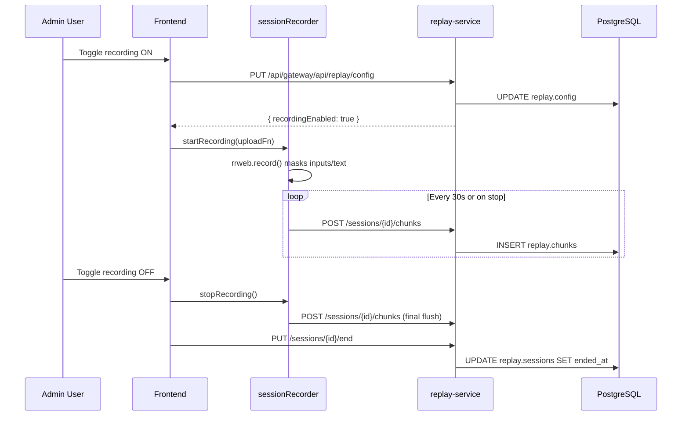

import Svc from "@docs/components/Svc.astro";
import External from "@docs/components/External.astro";

The <Svc name="replay-service" /> records full browser sessions via <External href="https://www.rrweb.io/" label="rrweb" /> when an admin enables recording. Each row in the Session Replay panel offers three exports:

- **Play**: open the rrweb player inline.
- **JSON**: download the raw event stream (replays in any rrweb player).
- **Video**: render a WebM in the browser using `MediaRecorder`.

## Architecture



### Components

| Component | Location | Responsibility |
|---|---|---|
| `sessionRecorder` | [`frontend/src/lib/sessionRecorder.ts`](https://github.com/milesburton/veta-trading-platform/blob/main/frontend/src/lib/sessionRecorder.ts) | Wraps `rrweb.record()`, masks sensitive inputs, buffers events, flushes every 30 s, auto-stops after 30 min |
| `replayVideoExport` | [`frontend/src/lib/replayVideoExport.ts`](https://github.com/milesburton/veta-trading-platform/blob/main/frontend/src/lib/replayVideoExport.ts) | Client-side WebM renderer — steps through rrweb events at 10 fps, snapshots via `html-to-image`, encodes with `MediaRecorder` (VP9 → VP8 fallback) |
| `SessionReplayPanel` | [`frontend/src/components/SessionReplayPanel.tsx`](https://github.com/milesburton/veta-trading-platform/blob/main/frontend/src/components/SessionReplayPanel.tsx) | Lists sessions, triggers Play/JSON/Video exports, manages rrweb-player inline playback |
| `replayApi` | [`frontend/src/store/replayApi.ts`](https://github.com/milesburton/veta-trading-platform/blob/main/frontend/src/store/replayApi.ts) | RTK Query slice with endpoints for config, sessions, chunks, events, and deletion |
| `replay-service` | [`backend/src/replay/replay-service.ts`](https://github.com/milesburton/veta-trading-platform/blob/main/backend/src/replay/replay-service.ts) | Deno/PostgreSQL REST API — stores session metadata and event chunks |

## Data model

PostgreSQL schemas under the `replay` schema:

```sql
-- replay.config (singleton, id = 1)
CREATE TABLE replay.config (
  id          integer PRIMARY KEY DEFAULT 1,
  recording_enabled boolean NOT NULL DEFAULT false,
  updated_by  text,
  updated_at  timestamptz DEFAULT now()
);

-- replay.sessions (one row per recording)
CREATE TABLE replay.sessions (
  id          text PRIMARY KEY,
  user_id     text NOT NULL,
  user_name   text,
  user_role   text,
  started_at  timestamptz DEFAULT now(),
  ended_at    timestamptz,
  duration_ms numeric,
  metadata    jsonb DEFAULT '{}'::jsonb
);

-- replay.chunks (event batches per session)
CREATE TABLE replay.chunks (
  session_id  text REFERENCES replay.sessions(id),
  seq         integer,
  events      jsonb NOT NULL,
  PRIMARY KEY (session_id, seq)
);
```

- `session_id` is a UUID generated client-side before recording starts.
- `seq` is a monotonically increasing integer per session, starting at 0.
- `events` is a JSON array of `rrweb.eventWithTime` objects.
- `duration_ms` is computed server-side when `ended_at` is set.

## API reference

All endpoints are proxied through the gateway at `/api/gateway/api/replay`.

### Configuration

| Method | Path | Description |
|---|---|---|
| `GET` | `/config` | Returns `{ recordingEnabled, updatedBy, updatedAt }` |
| `PUT` | `/config` | Body: `{ enabled: boolean, userId?: string }` — toggles recording globally |

### Sessions

| Method | Path | Description |
|---|---|---|
| `GET` | `/sessions?limit=50&offset=0` | Paginated list of sessions (ordered by `started_at DESC`) |
| `POST` | `/sessions` | Create a session. Body: `{ id, userId, userName?, userRole?, metadata? }` |
| `PUT` | `/sessions/{id}/end` | Mark session as ended. Sets `ended_at` and `duration_ms` |
| `DELETE` | `/sessions/{id}` | Delete session metadata. Returns `409` if chunks still exist (FK enforces compliance retention — delete chunks first). |

### Chunks & Events

| Method | Path | Description |
|---|---|---|
| `POST` | `/sessions/{id}/chunks` | Upload event batch. Body: `{ seq, events }` — upserts by `(session_id, seq)` |
| `GET` | `/sessions/{id}/events` | Returns `{ events }` — concatenates all chunks ordered by `seq` |

## Client-side video rendering

The WebM exporter (triggered by the **Video** button) runs entirely in the browser:

1. Fetches the session events via `GET /sessions/{id}/events`.
2. Creates a hidden `<canvas>` sized to the viewport from the session metadata.
3. Steps through events at 10 fps, pausing the rrweb `Replayer` at each timestamp.
4. Renders the iframe DOM to a canvas via `html-to-image` and draws it onto the recording canvas.
5. Captures the canvas stream with `MediaRecorder` (VP9 preferred, VP8 fallback).
6. Emits progress updates every frame so the UI shows a percentage bar.

The exported WebM plays in every modern browser, Slack, and most video tools, so the rendered file works for incident write-ups without an extra conversion step.

> **Note:** The operator's tab must stay open during rendering. If the tab is backgrounded or closed, the render aborts. Use the **AbortController** (click the button again) to cancel mid-render.

## Security & privacy

| Concern | Mitigation |
|---|---|
| Sensitive input data | `sessionRecorder` calls `rrweb.record({ maskAllInputs: true, maskTextClass: "veta-mask", maskTextSelector: "[data-mask]" })` — all `<input>` values are replaced with `*` |
| Text masking | CSS class `veta-mask` and `data-mask` attributes on elements hide text content |
| Recording toggle | Only users with `admin` or `compliance` roles can enable/disable recording via the toggle in the Session Replay panel |
| Session deletion | Only `admin` and `compliance` users see the **Delete** button; it removes session metadata. The database FK (`ON DELETE RESTRICT`) blocks deletion while chunks exist, so event data is retained for compliance. A `409` is returned if chunks are still present. |
| CORS | `replay-service` returns `corsOptions()` on `OPTIONS` preflight requests |

## Troubleshooting

| Symptom | Cause | Fix |
|---|---|---|
| Recording never starts | `recordingEnabled` is `false` in `replay.config` | Toggle the switch in the Session Replay panel (admin only) |
| Events not appearing in list | `replay.chunks` table is empty or `replay.sessions` insert failed | Check `replay-service` logs; verify `REPLAY_PORT` and DB connection |
| Video render stuck at 0% | Tab was backgrounded; `requestAnimationFrame` paused | Keep the tab in the foreground; click the button again to abort and retry |
| Video render fails with `AbortError` | User clicked the Video button twice | This is expected; click once to start a new render |
| `MediaRecorder is not defined` | Older browser or insecure context | Use a modern browser over HTTPS or `localhost` |

## Where to find it

- **Session Replay panel**: Sidebar → **Session Replay** (under the Observability section)
- **rrweb-player**: Installed via `npm` as `rrweb-player`; loaded dynamically in `SessionPlayer`
- **WebM exporter**: [`frontend/src/lib/replayVideoExport.ts`](https://github.com/milesburton/veta-trading-platform/blob/main/frontend/src/lib/replayVideoExport.ts) — imported dynamically in `SessionReplayPanel`
- **replay-service**: [`backend/src/replay/replay-service.ts`](https://github.com/milesburton/veta-trading-platform/blob/main/backend/src/replay/replay-service.ts) — runs on port `5031` (configurable via `REPLAY_PORT`)


