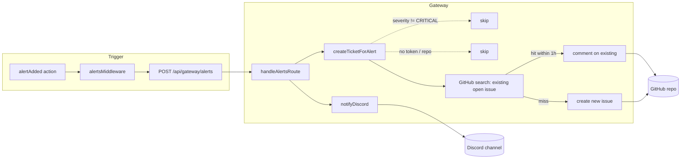

import { Aside } from "@astrojs/starlight/components";

CRITICAL alerts in the Discord channel are mirrored as GitHub issues so on-call has a single tracked artefact per incident. Less severe alerts (WARNING, INFO) stay Discord-only.

## Flow



The gateway runs `notifyDiscord` and `createTicketForAlert` in parallel via `Promise.allSettled`, so one failing path doesn't block the other.

## Configuration

Two env vars on the gateway:

| Var | Purpose | Default |
| --- | --- | --- |
| `GITHUB_TICKETING_TOKEN` | PAT or fine-grained token with `issues:write` on the target repo | empty (ticketing no-ops) |
| `GITHUB_TICKETING_REPO` | `owner/name` of the repo to open issues in | `milesburton/veta-trading-platform` |

The token is a bearer credential. Inject via the the server's `.env`:

```bash
# /opt/stacks/veta/.env
GITHUB_TICKETING_TOKEN=github_pat_...
GITHUB_TICKETING_REPO=milesburton/veta-trading-platform
```

Then restart the gateway:

```bash
cd /opt/stacks/veta
docker compose up -d gateway
```

## Token scopes

Use a **fine-grained PAT** scoped to the single target repository with the minimum scopes:

- **Repository access**: only the target repo
- **Issues**: read and write
- **Metadata**: read (required by all fine-grained PATs)

Avoid classic PATs unless absolutely necessary; they grant blanket access to every repo you own.

## Issue shape

Title:

```
[CRITICAL] <source>: <first 100 chars of message>
```

Body (markdown):

```markdown
**Severity:** CRITICAL
**Source:** `kill-switch`
**Triggered at:** 2026-05-19T20:14:33.000Z
**Triggered by:** u-1234

**Message:** Kill switch fired by admin

**Detail:**
```

all-traders block, reason="risk breach"

```

---
_Auto-created from a Discord platform alert._
```

Labels: `prod-issue`, `auto-created`, `severity:critical`, plus `source:<name>` when the alert names one.

## Duplicate suppression

Before opening, the gateway searches GitHub for an open issue with the same title created within the last hour. If found, it adds a comment to that issue rather than opening a duplicate. This keeps a flapping alert on one ticket so on-call can see escalation history in one place.

The search query is exact-title within the configured repo. Dedupe is best-effort; transient GitHub search failures fall through to creating a new issue. The 1h window is set in [`backend/src/gateway/ticketing.ts`](https://github.com/milesburton/veta-trading-platform/blob/main/backend/src/gateway/ticketing.ts) as `DEDUPE_WINDOW_MS`.

## Verifying

Trigger an end-to-end test by raising a CRITICAL alert through the platform: as an admin, fire the kill switch in Mission Control. Within ~1s the alert hits Discord. Within ~3s the gateway logs `[ticketing] issue created` with the issue number, and the GitHub issue appears with both labels.

Confirm token scoping is working:

```bash
ssh <user>@<the server-host>.lan 'docker exec veta-gateway-1 sh -c \
  "curl -sf -H \"Authorization: Bearer \$GITHUB_TICKETING_TOKEN\" \
       https://api.github.com/repos/\$GITHUB_TICKETING_REPO | head"'
```

A 200 with the repo metadata confirms the token reaches the right repo. A 404 means the token can't see the repo (wrong scope or wrong repo name).

## On-call workflow

1. Discord channel pings with a 🚨 CRITICAL alert
2. Gateway opens a GitHub issue labelled `prod-issue` `auto-created` `severity:critical`
3. On-call acknowledges the issue by self-assigning it
4. Adds an `incident:in-progress` label as they investigate
5. Once resolved, closes the issue with a short post-mortem comment
6. If multiple instances fire while the issue is open, they auto-comment on the same ticket

The labels are filterable in the GitHub Issues list, so the on-call view is `is:issue is:open label:prod-issue`.

## Troubleshooting

- **Alert hit Discord but no issue appeared.** Check the gateway logs for `[ticketing]` lines. If absent, the severity wasn't CRITICAL. If `[ticketing] reason=no-token`, the env var is missing or under 20 chars. If `[ticketing] reason=github-api-failed`, the token is invalid or rate-limited.
- **Multiple duplicate issues for the same alert.** Dedupe failed — the title might be drifting (e.g. message contains a changing timestamp). Stabilise the message so the title is stable across firings.
- **Issue created but no labels.** Token lacks `issues:write` scope. GitHub silently drops labels on insufficient scopes but the create succeeds.
- **Comments instead of new issues forever.** Once an issue is open for >1h, dedupe stops matching and a fresh one opens. If on-call wants to keep dedupe alive, they can edit the issue title to refresh `created_at` — but it's usually better to close and let a fresh one open.

<Aside type="tip" title="Rotating the token">
Tokens have an expiry. Renew before they lapse: GitHub → Settings → Developer settings → Fine-grained tokens → regenerate → update `.env` on the the server → `docker compose up -d gateway`. The old token becomes inert immediately.
</Aside>
