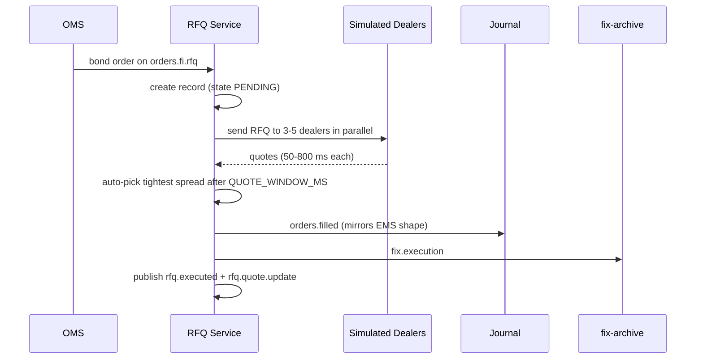

import Svc from "../../../components/Svc.astro";

The RFQ service implements a dealer-driven workflow for fixed-income orders. Bonds rarely have continuous lit liquidity, so traders request quotes from a panel of dealers and execute against the best one. The platform's RFQ service simulates that flow end-to-end.

## Why RFQ exists alongside the EMS

The EMS routes orders that can be matched against a continuous order book (equities, futures, derivatives). For bonds, that book usually doesn't exist: liquidity is fragmented across a dealer network, and prices are negotiated rather than discovered. The OMS detects bond orders and forwards them to `orders.fi.rfq` instead of `orders.routed`, where the RFQ service picks them up.

## Flow

## Auto-execution policy

After `QUOTE_WINDOW_MS` the service picks the tightest spread among the responses and executes against that dealer. Anything still unanswered is timed out. Operators can override the auto-pick by calling `POST /rfq/:id/execute` with the dealer id of their choice; this is used by sales workflows that prefer a specific relationship over the cheapest tick.

## Outputs

Each successful execution fans out across four streams so downstream consumers don't need an RFQ-specific path:

- `rfq.executed` — full trade record with dealer panel and chosen quote
- `orders.filled` — mirrors the EMS fill shape so the journal and gateway treat it like any other fill
- `fix.execution` — picked up by [fix-archive](../supporting/db-migrate/) for execution-report persistence
- `rfq.quote.update` — real-time stream for the frontend RFQ panel

The fan-out is the reason the [CCP](./post-trade-ccp/) can clear RFQ trades through the same pipeline as lit and dark fills.

## HTTP surface

| Path | Purpose |
|------|---------|
| `GET /health` | liveness |
| `GET /rfq/:id` | fetch a single RFQ including all dealer quotes |
| `GET /rfq` | recent RFQs (last 100) |
| `POST /rfq/:id/execute` | manually select a specific dealer quote |

## Source

`backend/src/rfq/rfq-service.ts`
