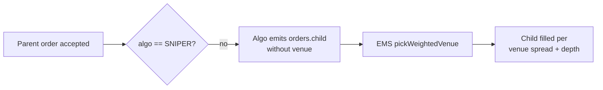

import { Aside } from "@astrojs/starlight/components";

VETA simulates a US equity venue topology. Child orders generated by the execution algorithms (TWAP, POV, VWAP, IS, MOMENTUM, ICEBERG, ARRIVAL_PRICE) route through the **EMS** which assigns a venue via weighted-random selection. The **SNIPER** algorithm routes its own children with a different strategy: best-price selection across the top N venues simultaneously.

This page documents both routing paths.

## Venue topology

Seven US venues with weighting, spread multiplier, and depth multiplier. Defined once in [`backend/src/ems/fill-math.ts`](https://github.com/milesburton/veta-trading-platform/blob/main/backend/src/ems/fill-math.ts) and consumed by both the EMS and the SNIPER algorithm.

| MIC | Weight | Spread mult | Depth mult | Notes |
|---|---:|---:|---:|---|
| `XNAS` | 30% | 1.00 | 1.00 | Nasdaq; baseline reference for spread and depth |
| `XNYS` | 25% | 1.05 | 1.20 | NYSE; deepest book, slightly wider spread |
| `ARCX` | 15% | 1.08 | 0.85 | Arca; widest simulated spread |
| `BATS` | 12% | 0.95 | 0.90 | Cboe BZX; tightest spread, maker-bias rebate |
| `EDGX` | 8% | 0.98 | 0.75 | Cboe EDGX; tight spread, low depth, maker-bias rebate |
| `IEX` | 6% | 1.02 | 0.95 | IEX; slightly wider spread (the famous 350-µs delay is not modelled) |
| `MEMX` | 4% | 0.97 | 0.65 | MEMX; lowest depth |

Spread and depth multipliers drive realistic fill behaviour: BATS gets the tightest fills, MEMX runs out of book first.

## Mode 1: EMS weighted-random (default)

When a child order arrives at the EMS without an explicit venue, [`pickWeightedVenue()`](https://github.com/milesburton/veta-trading-platform/blob/main/backend/src/ems/fill-math.ts) selects one weighted by the table above. The weights approximate published US equity market-share numbers.

Every other algorithm flows through this path. The user does not pick a venue.

## Mode 2: SNIPER best-price routing

[SNIPER](https://github.com/milesburton/veta-trading-platform/blob/main/backend/src/algo/sniper-strategy.ts) does its own routing inside the algorithm. On each price trigger:

1. Score every venue's `effectivePrice` from its order-book top-of-book for the side
2. Pick the top **`maxVenues`** (1-3, default 2) by best price
3. Split **`aggressionPct`%** (default 80) of the remaining quantity across those venues simultaneously
4. Enforce a **2-second cooldown** between routing events

This produces measurable maker-rebate capture on BATS/EDGX when prices line up and rotates venues as the order book moves.

### Parameters surfaced in the order ticket

| Param | Default | Range | Effect |
|---|---:|---:|---|
| `aggressionPct` | 80 | 1-100 | Percentage of remaining quantity routed per trigger. Higher = closer to TWAP behaviour. |
| `maxVenues` | 2 | 1-3 | How many venues to split across. 1 = single best, 3 = always spread three ways. |

The 2-second cooldown is a hard-coded constant (`COOLDOWN_MS` in `sniper-strategy.ts`); not user-tunable.

## Fill mechanics

Once a child order lands on a venue, [`computeFill`](https://github.com/milesburton/veta-trading-platform/blob/main/backend/src/ems/fill-math.ts) determines what fills:

- `filledQty = min(orderQty, tickVolume * participationCap * venueDepthMult)`
- `participationCap` is 20% by default (`EMS_PARTICIPATION_CAP` env override)
- Market impact in basis points: `(filledQty / 1000) * impactPer1000 * spreadMult`
- BATS and EDGX have a 65% chance of being marked MAKER (vs 40% elsewhere), which awards the `MAKER_REBATE_PER_SHARE` rebate

## Liquidity flag distribution

Every fill carries a `MAKER` / `TAKER` / `CROSS` flag, surfaced in the AlgoMonitor's performance card. The distribution is biased per venue to reflect rebate structure:

- BATS, EDGX: 65% MAKER, ~30% TAKER, ~5% CROSS
- All other venues: 40% MAKER, ~55% TAKER, ~5% CROSS

A SNIPER child specifically routed to BATS will, in aggregate, capture more maker rebates than a TWAP child routed at random.

<Aside type="note" title="Not a real SOR">
This is a simulation. Real production SORs handle order-protection compliance (Reg NMS), latency arbitrage, dark-pool routing, and venue-side rejections. The VETA model exists to make execution analytics meaningful, not to be a regulated routing engine.
</Aside>

## Source map

- [`backend/src/ems/fill-math.ts`](https://github.com/milesburton/veta-trading-platform/blob/main/backend/src/ems/fill-math.ts): venue table, weighted-random picker, fill math, liquidity-flag generator
- [`backend/src/ems/ems-server.ts`](https://github.com/milesburton/veta-trading-platform/blob/main/backend/src/ems/ems-server.ts): consumes child orders, applies venue + fill + impact
- [`backend/src/algo/sniper-strategy.ts`](https://github.com/milesburton/veta-trading-platform/blob/main/backend/src/algo/sniper-strategy.ts): SNIPER's best-price routing across the same venue set
