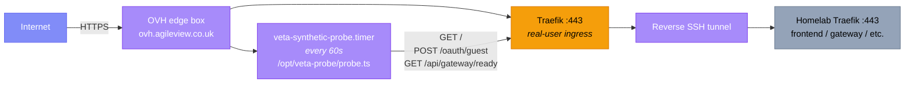

The synthetic probe is a small Deno binary that simulates a user every
60 seconds. It is the source of truth for "is `veta.mnetcs.com` actually up
right now". Distinct from per-container healthchecks (which only know about
themselves) and Prometheus alert rules (which fire on metric thresholds),
the probe exercises the full user journey end-to-end.

## Where it runs



The probe runs on the **same machine that handles real traffic**,
so its `fetch()` call traverses the same Traefik, tunnel, and homelab path
real users do. A probe on the homelab itself would always think the
platform was fine because it would skip the tunnel hop.

## What it checks (v1)

Three HTTP steps per cycle. Total wall-clock budget: ~10 s; current p50 is
~700 ms.

| # | Step | Expected |
| --- | --- | --- |
| 1 | `GET /` | HTTP 200, body contains `__version` or `VETA` markers |
| 2 | `POST /api/gateway/api/user-service/oauth/guest` | HTTP 200, `Set-Cookie: veta_user=…` |
| 3 | `GET /api/gateway/ready` (with cookie) | HTTP 200, `{"ready":true}` |

Step 2 uses the public-guest-trading endpoint from [PR #234](https://github.com/milesburton/veta-trading-platform/pull/234)
so the probe does not need long-lived credentials. If the platform's guest
mode is disabled (`PUBLIC_GUEST_TRADING=false`) step 2 returns 403 and the
probe correctly fails, which is a meaningful signal (someone disabled the
public path).

## What it catches

- Edge Traefik dead or mis-configured
- Reverse SSH tunnel down
- Homelab Traefik dead
- Homelab gateway or user-service dead
- `PUBLIC_GUEST_TRADING` flag flipped off
- TLS cert expired or mis-issued

## What it does not catch (yet)

- WebSocket-only outages (no frame counting in v1)
- OMS pipeline regressions (no order submit + cancel in v1)
- Market data stalled (no candle/tick freshness check)

These are queued for v2 and are intentionally absent in v1: the simpler the
probe, the less likely it produces false positives that train people to
ignore the alert.

## Output

One JSON line per step to journald. Example successful run:

```json
{"service":"synthetic-probe","ts":"2026-05-15T10:13:06.515Z","event":"step","step":1,"name":"root","outcome":"ok","durationMs":560.04,"status":200}
{"service":"synthetic-probe","ts":"2026-05-15T10:13:06.720Z","event":"step","step":2,"name":"guest_login","outcome":"ok","durationMs":201.45,"status":200}
{"service":"synthetic-probe","ts":"2026-05-15T10:13:06.771Z","event":"step","step":3,"name":"gateway_ready","outcome":"ok","durationMs":48.46,"status":200}
{"service":"synthetic-probe","ts":"2026-05-15T10:13:06.772Z","event":"probe_done","outcome":"ok","totalMs":818.11}
```

The service exits 0 if all steps green, 1 on any failure.

## Alerting

systemd `OnFailure=` invokes `/opt/veta-probe/alert.sh failure` on every
non-zero exit. The script maintains a counter at
`/var/lib/veta-probe/consecutive_failures` and POSTs a webhook on the Nth
failure (default 3, so ~3 minutes detection lag). After recovery, the next
green run triggers `alert.sh recovery` which POSTs a recovery webhook and
resets the counter.

| Env var (in `/etc/veta-probe.env`) | Default | Effect |
| --- | --- | --- |
| `ALERT_WEBHOOK_URL` | empty | If unset, alerts are logged to journald only |
| `FAIL_THRESHOLD` | `3` | Consecutive failures before alerting (3 × 60 s ≈ 3 min) |
| `PROBE_BASE_URL` | `https://veta.mnetcs.com` | Override for testing |
| `PROBE_TIMEOUT_MS` | `10000` | Per-step timeout |

## CI mirror

`.github/workflows/post-deploy-probe.yml` runs the same probe binary from
a GitHub Actions runner after every push to `main`. It:

1. Waits ~6 minutes for the homelab auto-pull timer to pick up the commit
   and roll out the new images.
2. Runs `synthetic-probe/probe.ts` against `https://veta.mnetcs.com` with
   up to 3 retries (30 s apart) to absorb deploy jitter.
3. Fails the workflow on persistent failure, so the standard GH email goes
   out.

This is a **third independent vantage point** on top of (a) the OVH probe
and (b) per-container healthchecks. If the OVH probe and the CI probe
disagree, the divergence itself is signal. For example, an OVH-local network
issue would show up on the OVH probe only, while a TLS or DNS issue would
show up everywhere.

## Daily use

```bash
ssh ubuntu@ovh.agileview.co.uk

# When does it next run?
systemctl list-timers veta-synthetic-probe.timer

# Recent results
sudo journalctl -u veta-synthetic-probe.service -n 40 --no-pager

# Only failures
sudo journalctl -u veta-synthetic-probe.service --no-pager \
  | grep -E '"outcome":"fail"|"failedAtStep"'

# Force a run now (useful while debugging an outage)
sudo systemctl start veta-synthetic-probe.service

# Pause (maintenance window)
sudo systemctl stop veta-synthetic-probe.timer
sudo systemctl start veta-synthetic-probe.timer

# Reset the consecutive-failure counter
sudo rm /var/lib/veta-probe/consecutive_failures
```

## Operating cost

- ~3 HTTPS requests per minute against `veta.mnetcs.com`
- ~1 KB JSON written to journald per cycle
- One Deno cold start per cycle (no daemon)
- Total: negligible on the OVH box (single-digit MB RSS during the probe
  run, idle the rest of the minute)

## Future work

- **Loki shipping**: ship the journald lines from OVH to the homelab Loki
  so probe history is queryable in Grafana alongside service logs. Needs
  an alloy / vector / promtail sidecar on the OVH box.
- **SLO dashboard**: once Loki shipping is in place, build a Grafana
  panel for rolling 24 h / 7 d / 30 d availability.
- **v2 checks**: WS frame count, order submit + cancel, market-data
  freshness. Each adds coverage at the cost of more flakiness surface;
  add them one at a time after v1 has a track record.

## Source

- `synthetic-probe/probe.ts`: Deno binary
- `synthetic-probe/alert.sh`: failure / recovery handler
- `synthetic-probe/deploy/`: systemd units
- `synthetic-probe/README.md`: install instructions
- `.github/workflows/post-deploy-probe.yml`: CI mirror
